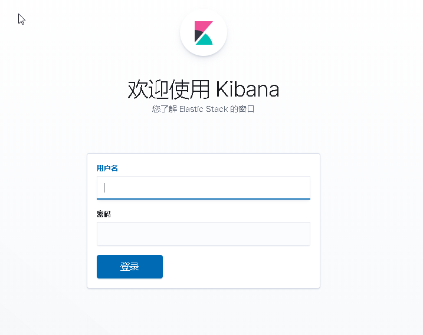

[:house: 主页](../README.md) 
 
### 目录 
- [节点说明](#节点说明)
- [Yum配置](#yum配置)
- [系统配置](#系统配置)
- [Kafka&ZK集群部署](#kafkazk集群部署)
- [Elasticsearch安装与配置](#elasticsearch安装与配置)
- [Kibana安装配置](#kibana安装配置)
- [X-pack白金许可证破解](#x-pack白金许可证破解)

----

#### 节点说明

 | 内网IP        | HOSTNAME          | SOFTWARE                |
 | ------------- | ----------------- | ----------------------- |
 | 192.168.1.27  | elk1.stack kafka1 | ES、kafka、zk           |
 | 192.168.1.112 | elk2.stack kafka2 | ES、logstash、kafka、zk |
 | 192.168.1.58  | elk3.stack kafka3 | ES、kibana、kafka、zk   |

----

#### Yum配置
- [返回目录 :leftwards_arrow_with_hook:](#目录)

<details>
<summary>Yum配置</summary>
 
**elk-stack** yum文件: **elk.repo**

```ini
[elk-7.x]
name=Elastic repository for 7.x packages
baseurl=https://artifacts.elastic.co/packages/7.x/yum
gpgcheck=1
gpgkey=https://artifacts.elastic.co/GPG-KEY-elasticsearch
enabled=1
autorefresh=1
type=rpm-md
```
**zookeeper** yum文件: **mesosphere.repo**

```ini
[mesosphere]
name=Mesosphere Packages for EL 7 - $basearch
baseurl=http://repos.mesosphere.io/el/7/$basearch/
enabled=1
gpgcheck=0
[mesosphere-noarch]
name=Mesosphere Packages for EL 7 - noarch
baseurl=http://repos.mesosphere.io/el/7/noarch/
enabled=1
gpgcheck=0

[mesosphere-source]
name=Mesosphere Packages for EL 7 - $basearch - Source
baseurl=http://repos.mesosphere.io/el/7/SRPMS/
enabled=0
gpgcheck=0
```
**安装epel yum源，并更新系统**

```shell
yum install epel-release -y
yum clean all
yum makecache
yum update -y
```

**JDK安装**

```shell
yum install java-1.8.0-openjdk -y
```

</details>

- [返回目录 :leftwards_arrow_with_hook:](#目录)

----

#### 系统配置

<details>
<summary>系统配置</summary>
 
```shell
vim /etc/security/limits.conf
* hard nofile 65536
* soft nofile 65536
* soft nproc  65536
* hard nproc  65536

ulimit -n 65535

vim /etc/sysctl.conf
vm.max_map_count = 262144
net.core.somaxconn=65535
net.ipv4.ip_forward = 1

sysctl -p

swapoff -a
```

</details>
 
- [返回目录 :leftwards_arrow_with_hook:](#目录)
 
----

#### Kafka&ZK集群部署

<details>
<summary>安装配置zookeeper集群</summary>

```shell
# 安装zk
yum install mesosphere-zookeeper -y

# 修改配置
vim /etc/zookeeper/conf/zoo.cfg
maxClientCnxns=50
tickTime=2000
initLimit=10
syncLimit=5
dataDir=/var/lib/zookeeper
clientPort=2181
server.1=kafka1:2888:3888
server.2=kafka2:2888:3888
server.3=kafka3:2888:3888

# 每个节点设置不同的id
kafka1# echo 1 > /var/lib/zookeeper/myid
kafka2# echo 2 > /var/lib/zookeeper/myid
kafka3# echo 3 > /var/lib/zookeeper/myid

# 设置开机启动 启动服务
systemctl enable zookeeper
systemctl start zookeeper

# 查看端口监听
lsof -i:2181
COMMAND  PID USER   FD   TYPE DEVICE SIZE/OFF NODE NAME
java    2017 root   23u  IPv6  22946      0t0  TCP *:eforward (LISTEN)
```

</details>

- [返回目录 :leftwards_arrow_with_hook:](#目录)

<details>
<summary>安装配置kafka集群</summary>
 
```shell
#下载安装
cd /opt
wget http://mirror.rise.ph/apache/kafka/2.4.0/kafka_2.12-2.4.0.tgz && mv 
tar xvf kafka_2.12-2.4.0.tgz && mv kafka_2.12-2.4.0 kafka && cd kafka

# 修改配置
vim config/server.properties
broker.id=1  # 节点间的数字不一样即可
listeners=PLAINTEXT://192.168.1.27:9092 # IP为本机IP
num.network.threads=3
num.io.threads=8
socket.send.buffer.bytes=102400
socket.receive.buffer.bytes=102400
socket.request.max.bytes=104857600
log.dirs=/opt/kafka/logs/kafka-logs
num.partitions=1
num.recovery.threads.per.data.dir=1
offsets.topic.replication.factor=1
transaction.state.log.replication.factor=1
transaction.state.log.min.isr=1
log.retention.hours=168
log.segment.bytes=1073741824
log.retention.check.interval.ms=300000
zookeeper.connect=kafka1:2181,kafka2:2181,kafka3:2181
zookeeper.connection.timeout.ms=6000
group.initial.rebalance.delay.ms=0

# 启动服务
./bin/kafka-server-start.sh -daemon /opt/kafka/config/server.properties

# 查看服务
lsof -i:9092
COMMAND    PID USER   FD   TYPE  DEVICE SIZE/OFF NODE NAME
filebeat 25779 root    6u  IPv4 8517817      0t0  TCP elk1.stack:41220->elk1.stack:XmlIpcRegSvc (ESTABLISHED)
java     31778 root  121u  IPv6 8515337      0t0  TCP elk1.stack:XmlIpcRegSvc (LISTEN)
java     31778 root  137u  IPv6 8518920      0t0  TCP elk1.stack:41214->elk1.stack:XmlIpcRegSvc (ESTABLISHED)
java     31778 root  138u  IPv6 8511083      0t0  TCP elk1.stack:XmlIpcRegSvc->elk1.stack:41214 (ESTABLISHED)
java     31778 root  142u  IPv6 8520966      0t0  TCP elk1.stack:47010->elk3.stack:XmlIpcRegSvc (ESTABLISHED)
java     31778 root  146u  IPv6 8517806      0t0  TCP elk1.stack:57336->elk2.stack:XmlIpcRegSvc (ESTABLISHED)
java     31778 root  202u  IPv6 8511093      0t0  TCP elk1.stack:XmlIpcRegSvc->58.82.247.197:52590 (ESTABLISHED)
java     31778 root  203u  IPv6 8518953      0t0  TCP elk1.stack:XmlIpcRegSvc->elk1.stack:41220 (ESTABLISHED)
```
</details>

<details>
<summary>kafka配置详解</summary>
 
```ini
#当前机器在集群中的唯一标识，和zookeeper的myid性质一样
broker.id=1
#当前kafka对外提供服务的端口默认是9092
port=19092
#这个参数默认是关闭的，在0.8.1有个bug，DNS解析问题，失败率的问题。
host.name=192.168.1.224
#这个是borker进行网络处理的线程数
num.network.threads=3
#这个是borker进行I/O处理的线程数
num.io.threads=8
#消息存放的目录，这个目录可以配置为“，”逗号分割的表达式，上面的num.io.threads要大于这个目录的个数这个目录，如果配置多个目录，新创建的topic他把消息持久化的地方是，当前以逗号分割的目录中，那个分区数最少就放那一个
log.dirs=/usr/local/kafka/kafka_2.11-0.9.0.1/kafka_log
#发送缓冲区buffer大小，数据不是一下子就发送的，先回存储到缓冲区了到达一定的大小后在发送，能提高性能
socket.send.buffer.bytes=102400
#kafka接收缓冲区大小，当数据到达一定大小后在序列化到磁盘
socket.receive.buffer.bytes=102400
#这个参数是向kafka请求消息或者向kafka发送消息的请请求的最大数，这个值不能超过java的堆栈大小
socket.request.max.bytes=104857600
#默认的分区数，一个topic默认1个分区数
num.partitions=1
#默认消息的最大持久化时间，168小时，7天
log.retention.hours=168
#消息保存的最大值5M
message.max.byte=5242880
#kafka保存消息的副本数，如果一个副本失效了，另一个还可以继续提供服务
default.replication.factor=2
#取消息的最大直接数
replica.fetch.max.bytes=5242880
#这个参数是：因为kafka的消息是以追加的形式落地到文件，当超过这个值的时候，kafka会新起一个文件
log.segment.bytes=1073741824
#每隔300000毫秒去检查上面配置的log失效时间（log.retention.hours=168 ），到目录查看是否有过期的消息如果有，删除
log.retention.check.interval.ms=300000
#是否启用log压缩，一般不用启用，启用的话可以提高性能
log.cleaner.enable=false
#设置zookeeper的连接端口
zookeeper.connect=192.168.1.224:2181,192.168.1.225:2181,192.168.1.226:2181
```

</details>

----

#### Elasticsearch安装与配置

<details>
<summary>安装elasticsearch</summary>

```shell
yum install elasticsearch -y

systemctl enable elasticsearch.service

mkdir /home/elasticsearch

chown elasticsearch:elasticsearch /home/elasticsearch/
```

**修改JVM堆大小为内存的一半**

```she
vim /etc/elasticsearch/jvm.options
-Xms8g
-Xmx8g
```

**增加systemctl配置**

```shell
vim /usr/lib/systemd/system/elasticsearch.service
```
```ini
[Service]
LimitMEMLOCK=infinity
```
```shell
# 重新载入
systemctl daemon-reload
```
**修改Elasticsearch配置**
```yaml
## 节点1 ##
# 集群名称，多集群节点依据相同名称自动加入到集群
cluster.name: elk-stack
# 节点名称，同一个集群中的每个节点名称不能一样
node.name: elk1.stack
# 是否为主节点，选项为true或false，当为true时在集群启动时该节点为主节点，在宕机或任务挂掉之后会选举新的主节点，恢复后该节点依然为主节点
node.master: true
# 是否为数据节点，选项为true或false。负责数据的相关操作
node.data: true
# 数据存储路径
path.data: /home/elasticsearch
# 日志存储路径
path.logs: /var/log/elasticsearch
# 内存锁
bootstrap.memory_lock: true
# 服务暴露的IP
network.host: 192.168.1.27
# 服务监听端口
http.port: 9200
# 发现集群的节点
discovery.seed_hosts: ["192.168.1.27", "192.168.1.112","192.168.1.58"]
# 集群初始化时master节点
cluster.initial_master_nodes: ["elk1.stack"]
gateway.recover_after_nodes: 1
action.destructive_requires_name: true
# 支持跨域访问
http.cors.enabled: true
http.cors.allow-origin: "*"
```

**启动服务，查看集群状态**
```shell
curl 192.168.1.58:9200/_cat/health
1582011786 07:43:06 elk-stack green 3 3 0 0 0 0 0 0 - 100.0%
```
返回```green```表示集群正常

</details>

- [返回目录 :leftwards_arrow_with_hook:](#目录)

----

#### Kibana安装配置

<details>
<summary>安装elasticsearch</summary>
 
```shell
# 安装kibana
yum install kibana -y
systemctl enable kibana

# 修改配置
vim /etc/kibana/kibana.yml
server.port: 5601
server.host: "0.0.0.0"
elasticsearch.hosts:
  - "http://192.168.1.27:9200"
  - "http://192.168.1.112:9200"
  - "http://192.168.1.58:9200"
kibana.index: ".kibana"
i18n.locale: "zh-CN"

# 启动
systemctl start kibana.service
```

</details>

- [返回目录 :leftwards_arrow_with_hook:](#目录)

----

#### X-pack白金许可证破解

**ES配置**

```shell
# ES生成证书
/usr/share/elasticsearch/bin/elasticsearch-certutil ca
/usr/share/elasticsearch/bin/elasticsearch-certutil cert --ca elastic-stack-ca.p12

# 设置证书文件的权限
chgrp elasticsearch /usr/share/elasticsearch/elastic-certificates.p12 /usr/share/elasticsearch/elastic-stack-ca.p12

chmod 640 /usr/share/elasticsearch/elastic-certificates.p12 /usr/share/elasticsearch/elastic-stack-ca.p12

# 移动到ES配置目录，把证书文件复制到其他master节点并赋予相关的权限。
mv /usr/share/elasticsearch/elastic-* /etc/elasticsearch/

# 三台服务器都要操作
# ES增加配置
xpack.security.enabled: false
xpack.security.transport.ssl.enabled: true
xpack.security.transport.ssl.verification_mode: certificate
xpack.security.transport.ssl.keystore.path: /etc/elasticsearch/elastic-certificates.p12
xpack.security.transport.ssl.truststore.path: /etc/elasticsearch/elastic-certificates.p12

# 复制破解后的X-pack包到ES模块目录
cp /root/x-pack-core-7.6.0.jar /usr/share/elasticsearch/modules/x-pack-core/

# 重启整个ES集群
systemctl restart elasticsearch.service

# 上传许可证信息到集群
curl -XPUT -u elastic 'http://192.168.1.27:9200/_xpack/license' -H "Content-Type: application/json" -d @license.json

# 修改ES配置然后重启集群
xpack.security.enabled: true

# 生成用户密码
/usr/share/elasticsearch/bin/elasticsearch-setup-passwords auto
PASSWORD apm_system = GP5ab69FQUZXBXXr5gG9
PASSWORD kibana = 1DKGjq2DX5sGlORgEVTQ
PASSWORD logstash_system = aGkcCh2gqNa9MOoeNbTO
PASSWORD beats_system = HxyjDTdvgrgH0iIIbUWH
PASSWORD remote_monitoring_user = VRI4kHYjmlVMI8CWFTDu
# elastic 是整个elk-stack 管理员账号密码
PASSWORD elastic = hD7uPvigYS3y6ceuQiFy 
```
- 下载
  - [:arrow_double_down: x-pack-core-7.6.0.jar](download/x-pack-core-7.6.0.jar)
  - [:arrow_double_down: x-pack-core-7.6.1.jar](download/x-pack-core-7.6.1.jar)
  - [:arrow_double_down: license.json](download/license.json)

```shell
# 验证许可证状态 active 表示激活， 过期时间 "expiry_date" : "2049-12-31T16:00:00.999Z"**
curl -XGET -u elastic:hD7uPvigYS3y6ceuQiFy http://192.168.1.27:9200/_license
```
```json
{
  "license" : {
    "status" : "active",
    "uid" : "537c5c48-c1dd-43ea-ab69-68d209d80c32",
    "type" : "platinum",
    "issue_date" : "2019-05-17T00:00:00.000Z",
    "issue_date_in_millis" : 1558051200000,
    "expiry_date" : "2049-12-31T16:00:00.999Z",
    "expiry_date_in_millis" : 2524579200999,
    "max_nodes" : 1000,
    "issued_to" : "pyker",
    "issuer" : "Web Form",
    "start_date_in_millis" : 1558051200000
  }
```

**Kibana配置**
```shell
# 配置kibana使用账密登录
vim /etc/kibana/kibana.yml
elasticsearch.username: "elastic"
elasticsearch.password: "hD7uPvigYS3y6ceuQiFy"

# 重启kibana 再次登录需要输入账号密码
systemctl restart kibana
```




**成功登录后，查看证书状态**


- [返回目录 :leftwards_arrow_with_hook:](#目录)
