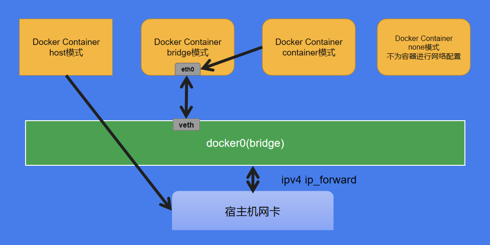
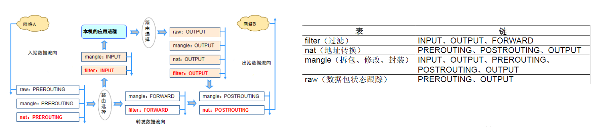
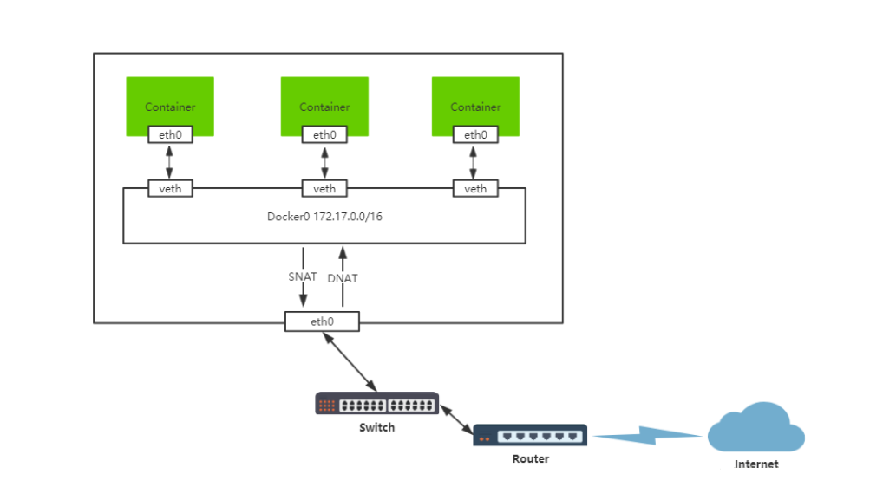

## docker网络模式
---
> 网络是虚拟化技术中最复杂的部分，也是Docker应用中的一个重要环节。
> Docker中的网络主要解决容器与容器、容器与外部网络、外部网络与容器之间的相互通信的问题。
> 默认情况下，Docker使用网桥（bridge）+NAT的通信模式
> docker的网络模式大致可以分成五种类型


### bridge

Bridge桥接模式的实现步骤主要如下：
  - Docker Daemon利用veth pair技术，在宿主机上创建两个虚拟网络接口设备，假设为veth0和veth1。而veth pair技术的特性可以保证无论哪一个veth接收到网络报文，都会将报文传输给另一方。

  - Docker Daemon将veth0附加到Docker Daemon创建的docker0网桥上。保证宿主机的网络报文可以发往veth0。
  - Docker Daemon将veth1添加到Docker Container所属的namespace下，并被改名为eth0。如此一来，保证宿主机的网络报文若发往veth0，则立即会被eth0接收，实现宿主机到Docker Container网络的联通性；同时，也保证Docker Container单独使用eth0，实现容器网络环境的隔离性。

  >同时Docker采用NAT（Network Address Translation，网络地址转换）的方式(可自行查询实现原理)，让宿主机以外的世界可以主动将网络报文发送至容器内部。

### host

该模式将禁用Docker容器的网络隔离。因为容器共享了宿主机的网络命名空间，直接暴露在公共网络中。

优势：
  - 可以直接使用宿主机的IP地址与外界进行通信，若宿主机的eth0是一个公有IP，那么容器也拥有这个公有IP。
  - 同时容器内服务的端口也可以使用宿主机的端口，无需额外进行NAT转换。

缺陷：
  - 最明显的是Docker Container网络环境隔离性的弱化，即容器不再拥有隔离、独立的网络栈。
  - 使用host模式的Docker Container虽然可以让容器内部的服务和传统情况无差别、无改造的使用，但是由于网络隔离性的弱化，该容器会与宿主机共享竞争网络栈的使用；
  - 容器内部将不再拥有所有的端口资源，原因是部分端口资源已经被宿主机本身的服务占用，还有部分端口已经用以bridge网络模式容器的端口映射。

### container

  Docker Container的container网络模式在实现过程中，不涉及网桥，同样也不需要创建虚拟网卡veth pair。
  完成container网络模式的创建只需要两个步骤：
   - 查找container（即需要被共享网络环境的容器）的网络namespace；
   - 将新创建的Docker Container（也是需要共享其他网络的容器）的namespace，使用container的namespace

优势：
  - 在这种模式下的Docker Container可以通过localhost来访问namespace下的其他容器，传输效率较高。
  - 虽然多个容器共享网络环境，但是多个容器形成的整体依然与宿主机以及其他容器形成网络隔离。
  - 这种模式还节约了一定数量的网络资源。

缺陷：
  - 没有改善容器与宿主机以外世界通信的情况。

### none

获取独立的network namespace，但不为容器进行任何网络配置，之后用户可以自己进行配置，容器内部只能使用loopback网络设备，不会再有其他的网络资源。
none网络就是什么都没有的网络。挂在这个网络下的容器除了lo，没有其他任何网卡。容器run时，可以通过添加--network=none参数来指定该容器使用none网络。

用途
  - none网络应用与隔离场景，一些对安全性要求高并且不需要联网的应用可以使用none网络。
  - 比如某个容器的唯一用途是生成随机密码，就可以放到none网络中避免密码被窃取。

### user-defined

有时候可能用户需要指定自己的网络，以此来适应某些配置，如ip地址规划等等。自定义网桥，默认与bridge网络一样。
Docker提供三种user-defined网络驱动：bridge，overlay和macvlan。overlay和macvlan用于创建跨主机的网络

创建bridge自定义网络
```bash
docker network create -d bridge --subnet 172.10.0.0/24 --gateway 172.10.0.1 my_net
docker network inspect my_net
docker run -it --network my_net --ip 172.10.0.3 busybox
```
---
## 容器网络访问原理
---
### Docker主要通过netfilter/iptables实现网络通信。

iptables由netfilter和iptables组成，netfilter组件是Linux内核集成的信息包过滤系统，它维护一个信息包过滤表，这个表用于控制信息包过滤处理的规则集。而iptables只是一个在用户空间的工具，用于增删改查这个过滤表的规则。

### 容器访问外部

容器默认是能访问外部网络的。通过NAT，docker实现了容器对外网（此处外网不一定是互联网）的访问。
容器将数据报发送给容器网关，即docker0虚拟网桥，然后虚拟网桥再转发到实际的网卡并由实际网卡转发到物理网关，然后向目标进行层层转发直到抵达目标地址。

### 外部访问容器

通过端口映射的方式实现外部网络访问容器，即通过-p参数实现将容器的端口映射到外部端口。
容器通过将服务的实际端口在宿主机上进行端口映射，外部客户端通过连接宿主机的映射端口来访问容器内的服务。

---
## 容器之间互通
---

### IP 通信

IP通信就是直接用IP地址来进行通信，根据上面的分析需要保证两个容器处于同一个网络，那么如果不在同一个网络如何处理呢？
容器同理，只需要为其中一个容器添加另外一个容器的网络就可以了。
使用如下命令：
```bash
docker network connect my_net httpd
```
> connect命令能够为httpd容器再添加一个my_net网络（假设httpd原来只有默认的bridge网络）。这样前面创建的busybox容器就能与此次connect的httpd容器进行通信。

### Docker DNS Server

通过 IP 访问容器虽然满足了通信的需求，但还是不够灵活。
因为我们在部署应用之前可能无法确定IP，部署之后再指定要访问的IP会比较麻烦。对于这个问题，可以通过docker自带的DNS服解决。
从Docker 1.10 版本开始，docker daemon 实现了一个内嵌的DNS server，使容器可以直接通过“容器名”通信。
方法很简单，只要在启动时用--name为容器命名就可以了。
下面的命令启动两个容器bbox1和bbox2：
```bash
docker run -it --network=my_net --name=bbox1 busybox
docker run -it --network=my_net --name=bbox2 busybox
```
> 然后，bbox2就可以直接ping到bbox1了，但是使用docker DNS有个限制，只能在user-defined网络中使用。默认的bridge网络是无法使用的。

### joined 容器

joined 容器是另一种实现容器间通信的方式。
joined 容器非常特别，它可以使两个或多个容器共享一个网络栈，共享网卡和配置信息，joined容器之间可以通过127.0.0.1直接通信。
host网络使得容器与宿主机共用同一个网络，而jointed是使得两个容器共用同一个网络。

请看下面的例子：
```bash
docker run -d -it --name=web1 httpd
docker run -it --network=container:web1 busybox
```
> 这样busybox和web1的网卡mac地址与IP完全一样，它们共享了相同的网络栈。busybox 可以直接用127.0.0.1访问web1的http服务。
其实也很容易理解，之前的--network参数指定了默认网络或者自定义网络
而此处是指定了一个容器，那么当然意思就是使用这个容器的网络。

joined 容器非常适合以下场景：
• 不同容器中的程序希望通过loopback高效快速地通信，比如web server与app server。
• 希望监控其他容器的网络流量，比如运行在独立容器中的网络监控程序。
其实就是应用于即需要独立而又需要两个容器网络高度一致的场景。
---
## docker网络管理
---
### 网络空间虚拟化

Docker网络虚拟化是基于Linux下的网络命名空间（net namespace）实现的。
使用ip netns命令，可以创建自己的虚拟网络环境。
```bash
ip netns add net0
ip netns list
ip netns exec net0 ip addr add 172.17.42.99/16 dev eth0
```
>ip netns exec 为net0网络空间中的网络设备eth0设置IP地址

### 网络设备虚拟化
> 网络接口和网络设备不一定是物理设备，也可以是虚拟设备，比如系统中的lo回环接口就是一个虚拟的网络接口。当我们在主机上启动Docker服务时，Docker引擎会在系统上创建一个名为docker0的虚拟以太网桥，并且为之随机分配一个未使用的私有IP地址和子网掩码。这个网桥将连接在它上面的所有容器组织成一个虚拟子网，并提供数据包转发功能。可以认为这个虚拟网桥是连接容器、容器和主机之间的路由中枢。Docker容器的网络互联依赖Linux底层的veth机制。每当启动一个容器时，Docker引擎会在主机上创建一个虚拟的以太网卡接口,并且会将这个接口一端放在主机网络空间并连接到docker0网桥，另一端放入Docker容器的网络空间中。容器退出时，虚拟网卡也会被销毁，下次启动容器时将创建一个新的虚拟网络接口并和docker0重新连接。

```bash
brctl show
bridge name         bridge id	        STP enabled	    interfaces
br-cbbf4d484374	8000.024280209839	    no	        vethd0189db
docker0	        8000.024294252b81	    no
```

### 容器运行4种网络模式

> --net=bridge，容器默认的网络模式（连接到docker0网桥上）。可以通过DOCKER_OPTS='-b=docker1'参数来指定默认网桥，docker1必须是合法的网桥。
--net=host，必会拥有自己的网络空间，与主机共享网络。
--net=container:NAME_or_ID，指定已经创建好的容器网络环境。两个容器将共享IP地址及端口等网络资源，可通过本地回环进行访问。
--net=none，不会配置网络环境，没有任何网络访问能力。可以手动配置一个网络环境。

### 主机名配置
> -h，修改容器/etc/hostname文件，同时也会修改/etc/hosts主机的ip对应的主机名

### DNS配置
> --dns=IP，修改容器/etc/resolv.conf文件

### 容器互联配置
> --icc=<true|false>,true使用ACCEPT策略进行配置。false使用DROP策略进行配置。该参数可通过DOCKER_OPTS="--icc=(true|false)"来默认添加。
-P|--publish-all=<true|false>,Dockerfile文件中EXPOSE命令所指定的端口随机映射到主机49153~65535的端口范围。
-p SPEC|--publish=SPEC,指定可访问的端口。
--ip-forward=<true|false>,Docker服务每次启动时，都会修改/proc/sys/net/ipv4/ip_forward为1。如果是false，则不修改。大多数是true，以确保与外部网络以及其他容器正常通信。
