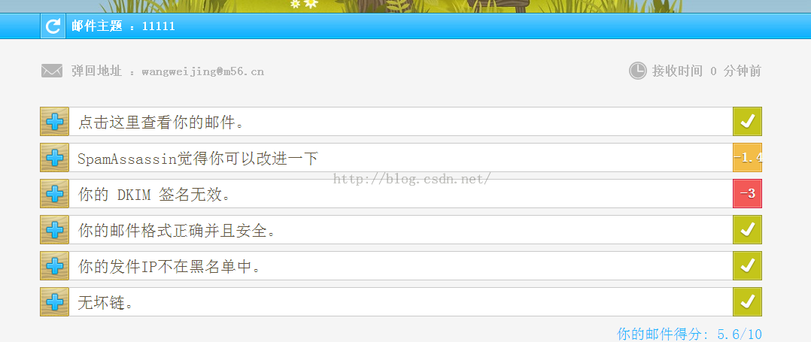
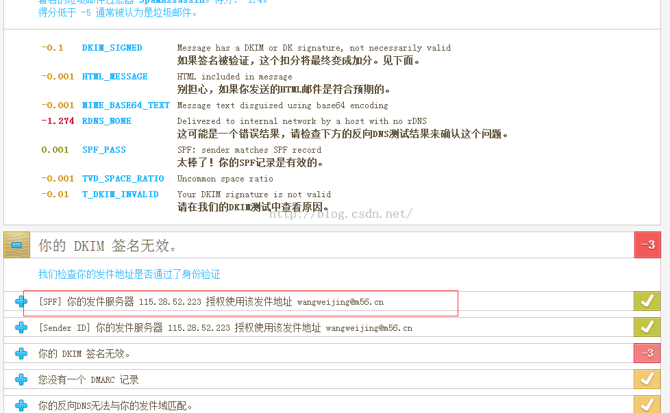
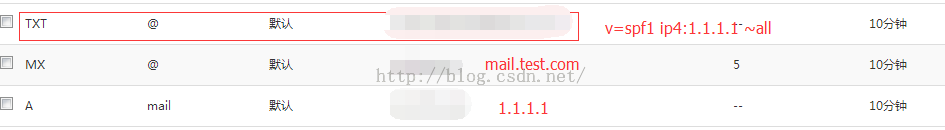

今天在群里看到群友给的，给大家分享一下，主要是用来检测您搭建的邮件服务器发邮件的时候是否会被其他邮件服务器拒绝，同时也能检测到您所做的配置是否生效，非常棒的一个网页工具，进入正题：

打开检测页面：http://www.mail-tester.com/

用你的邮件服务器发送一封邮件到web-YesX8G@mail-tester.com后，点击“查看你的邮件得分” 这个过程有点慢 他要整理检测你的邮件服务器 稍等过后出现结果

最上边会出现你的邮件服务器评分，最开始我的邮件服务器是0分......悲剧。。。

这里会告诉你具体的评分标准以及配置是否生效，根据这个提示可以真针对性的去修改，上图红色部分是我在DNS上面加了SPF设置，具体配置如下图；

此外这里还提到了 DKIM 正向反向解析 都是用来为你的邮件服务器增加安全性的 可以参考如下网址

http://blog.csdn.net/wwj_905/article/details/48807701
