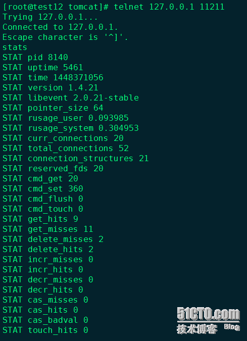

Memcached作为一个内存key-value存储容器有非常优秀的性能，但是在上次的使用中确发现大量的数据丢失情况发生，导致cache的功能基本消失。具体的检测方式如下：检测命中率

检测命中率是一个最基本的、最宏观的方式，使用telnet连接到memcached服务器，然后执行stats命令就可以看到宏观的一些信息，如下图。


这个命令中比较关键的属性是get_hits和get_misses，get_hits表示读取cache命中的次数，get_misses是读取失败的次数，即尝试读取不存在的缓存数据。

命中率=get_hits / (get_hits + get_misses)

命中率越高说明cache起到的缓存作用越大。但是在实际使用中，这个命中率不是有效数据的命中率，有些时候get操作可能只是检查一个key存在不存在，这个时候miss也是正确的，这就像用memcached作为一种定时器，将一些临时数据在memcache中存放特定时间长度，业务逻辑会根据cache是否存在而作不同的逻辑，这种数据其实已经不是单纯的缓存了，也不应该统计到命中率中。再者，这个命中率是从memcached启动开始所有的请求的综合值，不能反映一个时间段内的情况，所以要排查memcached的性能问题，还需要更详细的数值。但是高的命中率还是能够反映出memcached良好的使用情况，突然下跌的命中率能够反映大量cache丢失的发生。


stats ：转储所连接的memcached 实例的当前统计数据。

flush_all：用于清理缓存中的所有名称/值对。如果您需要将缓存重置到干净的状态，则flush_all 能提供很大的用处。

查看memcached状态的基本命令，通过这个命令可以看到如下信息：
```
STAT pid 22459                             进程ID
STAT uptime 1027046                        服务器运行秒数
STAT time 1273043062                       服务器当前unix时间戳
STAT version 1.4.4                         服务器版本
STAT pointer_size 64                       操作系统字大小(这台服务器是64位的)
STAT rusage_user 0.040000                  进程累计用户时间
STAT rusage_system 0.260000                进程累计系统时间
STAT curr_connections 10                   当前打开连接数
STAT total_connections 82                  曾打开的连接总数
STAT connection_structures 13              服务器分配的连接结构数
STAT cmd_get 54                            执行get命令总数
STAT cmd_set 34                            执行set命令总数
STAT cmd_flush 3                           指向flush_all命令总数
STAT get_hits 9                            get命中次数
STAT get_misses 45                         get未命中次数
STAT delete_misses 5                       delete未命中次数
STAT delete_hits 1                         delete命中次数
STAT incr_misses 0                         incr未命中次数
STAT incr_hits 0                           incr命中次数
STAT decr_misses 0                         decr未命中次数
STAT decr_hits 0                           decr命中次数
STAT cas_misses 0    cas未命中次数
STAT cas_hits 0                            cas命中次数
STAT cas_badval 0                          使用擦拭次数
STAT auth_cmds 0
STAT auth_errors 0
STAT bytes_read 15785                      读取字节总数
STAT bytes_written 15222                   写入字节总数
STAT limit_maxbytes 1048576                分配的内存数（字节）
STAT accepting_conns 1                     目前接受的链接数
STAT listen_disabled_num 0                
STAT threads 4                             线程数
STAT conn_yields 0
STAT bytes 0                               存储item字节数
STAT curr_items 0                          item个数
STAT total_items 34                        item总数
STAT evictions 0                           为获取空间删除item的总数
```

Stats items

Stats items命令可以查看每个slab中存储的item的一些详细信息，具体可以见下图。

关键属性有：

最后被剔除的数据在cache中存放的时间，以秒为单位
stats items可以详细的观察各slab的数据对象的情况，因为memcached的内存分配策略导致一旦memcached的总内存达到了设置的最大内存，代表所有的slab能够使用的page都已经固定，这个时候如果还有数据放入，将开始导致memcached使用LRU策略剔除数据。而LRU策略不是针对所有的slabs，而是只针对新数据应该被放入的slab，例如有一个新的数据要被放入slab 3，则LRU只对slab 3进行。通过stats items就可以观察到这些剔除的情况。

具体分析如下：

evicted属性
如果一个slab的evicted属性不是0，则说明当前slab出现了提前剔除数据的情况，这个slab可能是你需要注意的。evicted_time属性
如果evicted不为0，则evicited_time就代表最后被剔除的数据时间缓存的时间。并不是发生了LRU就代码memcached负载过载了，因为有些时候在使用cache时会设置过期时间为0，这样缓存将被存放30天，如果内存慢了还持续放入数据，而这些为过期的数据很久没有被使用，则可能被剔除。需要注意的是，最后剔除的这个数据已经被缓存的时间，把evicted_time换算成标准时间看下是否已经达到了你可以接受的时间，例如：你认为数据被缓存了2天是你可以接受的，而最后被剔除的数据已经存放了3天以上，则可以认为这个slab的压力其实可以接受的；但是如果最后被剔除的数据只被缓存了20秒，不用考虑，这个slab已经负载过重了。age属性
age属性反应了当前还在缓存的数据中最久的时间，它的大小和evicted_time没有必然的大小关系，因为可能时间最久的数据确实频繁被读取的，这时候不会被LRU清理掉，但是如果它小于evicted_time的话，则说明数据在被下去读取前就被清理了，或者存放了很多长时间但是不被使用的缓存对象。Stats slabs


从Stats items中如果发现有异常的slab，则可以通过stats slabs查看下该slab是不是内存分配的确有问题。
Stats slabs结果如下图


Stats slabs的属性说明如下：

chunk_size当前slab每个chunk的大小
chunk_per_page每个page能够存放的chunk数
total_pages分配给当前slab的page总数
total_chunks当前slab最多能够存放的chunk数，应该等于chunck_per_page * total_page
used_chunks已经被占用的chunks总数
free_chunks过期数据空出的chunk里还没有被使用的chunk数
free_chunks_end新分配的但是还没有被使用的chunk数
这个命令的信息量很大，所有属性都很有价值。下面一一解释各属性：


综合上面的数据，可以发现造成memcached的内存使用率降低的属性有：


chunk_size, chunk_per_page
这两个属性是固定的，但是它反映当前slab存储的数据大小，可以供你分析缓存数据的散列区间，通过调整增长因子可以改变slab的区间分布，从而改变数据散列到的区域。如果大量的230byte到260byte的数据，而刚好一个slab大小是250byte，则250byte到260byte的数据将被落到下一个slab，从而导致大量的空间浪费。total_pages
这个是当前slab总共分配大的page总数，如果没有修改page的默认大小的情况下，这个数值就是当前slab能够缓存的数据的总大小（单位为M）。如果这个slab的剔除非常严重，一定要注意这个slab的page数是不是太少了。
我上次处理的那个项目因为和另外的一个项目共用的memcache，而且memcache已经运行了很长时间，导致page都已经全部被分配完，而刚好两个项目的缓存数据大小差别很多，导致新项目数据最多的slab 4竟然只有一个page，所以数据缓存不到22s就被替换了，完全失去了缓存的意义。
针对我遇到的那个情况，解决方案是重新分配page，或者重启memcache服务。但是page reassign方法从1.2.8版已经完全移除了，所以现在没有办法在线情况下重新分配page了。另外一种有些时候是不可以接受的，因为一次缓存服务器的重启将导致所有缓存的数据将重新从DB取出，这个可能造成db的压力瞬间增大。而且有的缓存数据时不入库的，这个时候我们就需要做memcache的导入和导出了。在下篇文章中我会总结下memcache的dump操作。total_chunks
这个的作用和total_pages基本相同，不过这个属性可以更准确的反应实际可以存放的缓存对象总数。used_chunks, free_chunks, free_chunks_end
这三个属性相关度比较高，从数值上来看它们满足：
                total_chunks = used_chunks + free_chunks + free_chunks_end
used_chunks就是字面的意思，已经使用的chunk数；free_chunks却不是所有的未被使用的chunk数，而是曾经被使用过但是因为过期而被回收的chunk数；free_chunks_end是page中从来没有被使用过的chunk数。


      从上图可以看出，slab 1只放了一个对象，但是已经申请了一整个page，这个时候used_chunks为1，但是free_chunks却为0，因为还没有任何回收的空间，而free_chunks_end却等于10081，说明这么多的chunk从来没有被使用过。下图就是这个数据过期后的stats slabs数据，可以发现free_chunks有值了，就是过期的那个chunk，所以是1，used_chunks为0，free_chunks_end不变。
