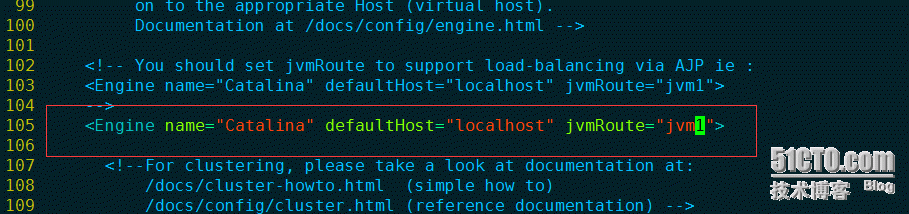
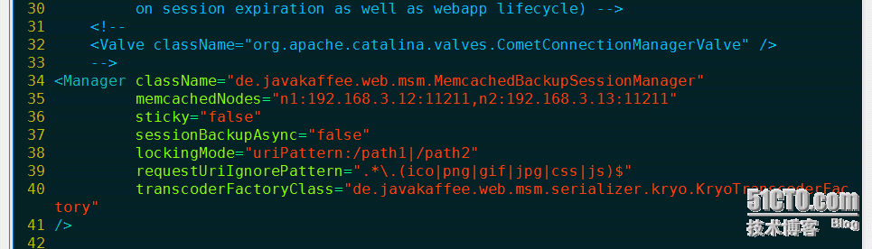

# 实验目的
利用nginx反向代理功能实现tomcat的负载集群、利用memcached实现session共享

# 实验环境
```
虚拟机centOS6.6_x89_64  Minal模式 3台虚拟机
test12  IP:192.168.3.12   #tomcat
test13  IP:192.168.3.13   #tomcat
test14  IP:192.168.3.14   #nginx
```

# 软件版本
```
apache-tomcat-7.0.64.tar.gz
jdk-7u45-linux-x64.tar.gz
libevent-2.0.21-stable.tar.gz
memcached-1.4.21.tar.gz以及和tomcat版本相对经的jar包
nginx-1.6.3
```

实验前先关闭seLinux和防火墙
```
setenfor 0
service iptables stop
```

本次实验还会用到一些基础依赖包如果觉得没安装好 可以运行一下命令 防止后面编译报错
```
yum groupinstall -y Development tools
```

好了  不废话  Go!Go!Go!

# 实验步骤
test12机器：
## 准备相关包
所有文件包都放在/usr/local/src/
```
[root@test13 ~]# cd /usr/local/src/
[root@test13 src]# ll
总用量 144688
-rw-r--r-- 1 root root   8858187 11月 24 19:39 apache-tomcat-7.0.64.tar.gz
-rw-r--r-- 1 root root 138094686 11月 24 19:40 jdk-7u45-linux-x64.tar.gz
-rw-r--r-- 1 root root    850772 11月 24 19:39 libevent-2.0.21-stable.tar.gz
-rw-r--r-- 1 root root    345892 11月 24 19:39 memcached-1.4.21.tar.gz
drwxr-xr-x 2 root root      4096 11月 24 19:40 serssion-jar
```

## 安装jdk
安装java并配置环境变量、检测jdk版本
```
[root@test13 src]# tar zxvf jdk-7u45-linux-x64.tar.gz
[root@test13 src]# mv jdk1.7.0_45/ /usr/local/jdk7
[root@test13 src]# vim /etc/profile
..........................................................
export JAVA_HOME=/usr/local/jdk7
export JRE_HOME=/usr/local/jdk7
export PATH=$JAVA_HOME/bin:$JRE_HOME/bin:$PATH
export CLASSPATH=.:$JAVA_HOME/lib:$JRE_HOME/lib
..........................................................
```

如下图所示：


```
[root@test13 src]# source /etc/profile
[root@test13 src]# java -version
java version "1.7.0_45"
Java(TM) SE Runtime Environment (build 1.7.0_45-b18)
Java HotSpot(TM) 64-Bit Server VM (build 24.45-b08, mixed mode)
```

## 安装tomcat
```
[root@test13 src]# tar zxvf apache-tomcat-7.0.64.tar.gz
[root@test13 src]# mv apache-tomcat-7.0.64 /usr/local/tomcat
[root@test13 src]# vim /usr/local/tomcat/bin/catalina.sh
..........................................................
JAVA_HOME=/usr/local/jdk7
CATALINA_HOME=/usr/local/tomcat
JAVA_OPTS="-server -XX:PermSize=128M -XX:MaxPermSize=512M -Xms1024m -Xmx1024m -Duser.timezone=Asia/Shanghai -Djava.awt.headless=true"
..........................................................
```

如下图所示：

```
[root@test13 src]# /usr/local/tomcat/bin/startup.sh    //启动tomcat
Using CATALINA_BASE:   /usr/local/tomcat
Using CATALINA_HOME:   /usr/local/tomcat
Using CATALINA_TMPDIR: /usr/local/tomcat/temp
Using JRE_HOME:        /usr/local/jdk7
Using CLASSPATH:       /usr/local/tomcat/bin/bootstrap.jar:/usr/local/tomcat/bin/tomcat-juli.jar
Tomcat started.
[root@test13 src]# ps aux |grep tomcat  //可以看到tomcat已经启动成功

root      1237  2.0 73.8 2335144 174376 pts/0  Sl   21:05   0:04 /usr/local/jdk7/bin/java -Djava.util.logging.config.file=/usr/local/tomcat/conf/logging.properties -Djava.util.logging.manager=org.apache.juli.ClassLoaderLogManager -server -XX:PermSize=128M -XX:MaxPermSize=512M -Xms1024m -Xmx1024m -Duser.timezone=Asia/Shanghai -Djava.awt.headless=true -Djava.endorsed.dirs=/usr/local/tomcat/endorsed -classpath /usr/local/tomcat/bin/bootstrap.jar:/usr/local/tomcat/bin/tomcat-juli.jar -Dcatalina.base=/usr/local/tomcat -Dcatalina.home=/usr/local/tomcat -Djava.io.tmpdir=/usr/local/tomcat/temp org.apache.catalina.startup.Bootstrap start
root      1271  0.0  0.3 103248   880 pts/0    S+   21:09   0:00 grep tomcat
```

[root@test13 src]# curl localhost:8080   //测试tomcat可以看到 没有问题
```

<!DOCTYPE html>
<html lang="en">
    <head>
        <title>Apache Tomcat/7.0.64</title>
        <link href="favicon.ico" rel="icon" type="image/x-icon" />
        <link href="favicon.ico" rel="shortcut icon" type="image/x-icon" />
        <link href="tomcat.css" rel="stylesheet" type="text/css" />
    </head>
```

## 编译安装memcached
```
[root@test13 src]# cp serssion-jar/* /usr/local/tomcat/lib/   //将msm依赖的jar包放到$TOMCAT_HOME/lib下
[root@test13 src]# tar zxvf libevent-2.0.21-stable.tar.gz
[root@test13 src]# cd libevent-2.0.21-stable
[root@test13 libevent-2.0.21-stable]# ./configure --prefix=/usr/local/libevent
[root@test13 libevent-2.0.21-stable]# make && make install
#每次编译最好用 echo $?  查看下编译是否成功

[root@test13 libevent-2.0.21-stable]# cd ..
[root@test13 src]# tar zxvf memcached-1.4.21.tar.gz
[root@test13 src]# cd memcached-1.4.21
[root@test13 memcached-1.4.21]# ./configure --prefix=/usr/local/memcached --with-libevent=/usr/local/libevent
[root@test13 memcached-1.4.21]# make && make install
[root@test13 memcached-1.4.21]# echo $?
0
```

## 修改tomcat的配置文件
```
[root@test13 memcached-1.4.21]# cd /usr/local/tomcat/
[root@test13 tomcat]# vim conf/server.xml
..........................................................
<Engine name="Catalina" defaultHost="localhost" jvmRoute="jvm1">
#如果要配置通一台机器上的多个tomcat、那么jvmRoute的标签要改成不同的
..........................................................
```
如图所示：


```
[root@test13 tomcat]# vim conf/context.xml
..........................................................
<Manager className="de.javakaffee.web.msm.MemcachedBackupSessionManager"
memcachedNodes="n1:192.168.3.12:11211,n2:192.168.3.13:11211"
sticky="false"
                 sessionBackupAsync="false"
lockingMode="uriPattern:/path1|/path2"
requestUriIgnorePattern=".*\.(ico|png|gif|jpg|css|js)$" transcoderFactoryClass="de.javakaffee.web.msm.serializer.kryo.KryoTranscoderFactory"
/>
#memcachedNodes="n1:10.164.24.246:11211,n2:10.164.4.154:11211"
#这个地方 如果是一台mem服务器 那么就写n1:IP:PORT 如果多台就n1..,n2..,n3..
..........................................................
```
如图所示这里以一台为例：


## 启动memcached
```
[root@test13 tomcat]# cd /usr/local/memcached/
[root@test13 memcached]# bin/memcached -d -m 256 -p 11211 -u root
```

## 重启tomcat
```
[root@test13 memcached]# ps aux |grep tomcat
root      1237  0.4 54.6 2336172 129032 pts/0  Sl   21:05   0:08 /usr/local/jdk7/bin/java -Djava.util.logging.config.file=/usr/local/tomcat/conf/logging.properties -Djava.util.logging.manager=org.apache.juli.ClassLoaderLogManager -server -XX:PermSize=128M -XX:MaxPermSize=512M -Xms1024m -Xmx1024m -Duser.timezone=Asia/Shanghai -Djava.awt.headless=true -Djava.endorsed.dirs=/usr/local/tomcat/endorsed -classpath /usr/local/tomcat/bin/bootstrap.jar:/usr/local/tomcat/bin/tomcat-juli.jar -Dcatalina.base=/usr/local/tomcat -Dcatalina.home=/usr/local/tomcat -Djava.io.tmpdir=/usr/local/tomcat/temp org.apache.catalina.startup.Bootstrap start
[root@test13 memcached]# kill -9 1237
[root@test13 memcached]# /usr/local/tomcat/bin/startup.sh
Using CATALINA_BASE:   /usr/local/tomcat
Using CATALINA_HOME:   /usr/local/tomcat
Using CATALINA_TMPDIR: /usr/local/tomcat/temp
Using JRE_HOME:        /usr/local/jdk7
Using CLASSPATH:       /usr/local/tomcat/bin/bootstrap.jar:/usr/local/tomcat/bin/tomcat-juli.jar
```

如下图可以看出  端口已被监听
```
[root@test13 memcached]# netstat -lnp |grep mem
tcp        0      0 0.0.0.0:11211               0.0.0.0:*                   LISTEN      8207/bin/memcached  
tcp        0      0 :::11211                    :::*                        LISTEN      8207/bin/memcached  
udp        0      0 0.0.0.0:11211               0.0.0.0:*                               8207/bin/memcached  
udp        0      0 :::11211                    :::*                                    8207/bin/memcached  


[root@test13 memcached]# netstat -lnp |grep java
tcp        0      0 ::ffff:127.0.0.1:8005       :::*                        LISTEN      8225/java           
tcp        0      0 :::8009                     :::*                        LISTEN      8225/java           
tcp        0      0 :::8080                     :::*                        LISTEN      8225/java
```

## 测试memcached
```
[root@test13 memcached]# yum install -y telnet
[root@test13 tomcat]# telnet 127.0.0.1 11211
Trying 127.0.0.1...
Connected to 127.0.0.1.
Escape character is '^]'.
```

status   //查看memcached状态


quit   退出

**为了更直观的看到实验效果给tomcat加了一个jsp页面、步骤如下：**
```
[root@test13 tomcat]# vim /usr/local/tomcat/webapps/ROOT/test.jsp
..........................................................
SessionID:<%=session.getId()%>
<BR>
SessionIP:<%=request.getServerName()%>
<BR>
SessionPort:<%=request.getServerPort()%>
<%
out.println("This is Tomcat Server tomcat1");
%>
..........................................................


[root@test13 tomcat]# vim /usr/local/tomcat/conf/web.xml  //修改默红色字体默认test.jsp
..........................................................
4656
4657     <welcome-file-list>
4658         <welcome-file>index.html</welcome-file>
4659         <welcome-file>index.htm</welcome-file>
4660         <welcome-file>test.jsp</welcome-file>
4661     </welcome-file-list>
4662
4663 </web-app>
..........................................................
```

重新启动tomcat 看以看到成功页面


test13机器:
同上 只是在做jsp页面的时候  最后一行 随便改一下 为了区分两台机器


test14机器：

## 编译安装nginx
```
[root@test14 src]# pwd
/usr/local/src
[root@test14 src]# wget http://nginx.org/download/nginx-1.6.3.tar.gz
[root@test14 src]# cd nginx-1.6.3
[root@test14 nginx-1.6.3]# yum install -y gcc gcc-c++ ncurses-devel perl pcre pcre-devel openssl openssl-devel zlib
[root@test14 nginx-1.6.3]# ./configure --with-http_stub_status_module --with-http_ssl_module --prefix=/usr/local/nginx
#--with-http_stub_status_module用于查看nginx状态信息 /usr/local/nginx/sbin/nginx –V
[root@test14 nginx-1.6.3]# make && make install
[root@test14 nginx-1.6.3]# /usr/local/nginx/sbin/nginx
#/usr/local/nginx/sbin/nginx -t -c /usr/local/nginx/conf/nginx.conf
#对于Nginx0.8.x之前的版本 kill -HUP `cat /usr/local/nginx/nginx.pid`
#对于Nginx 0.8.x之后的版本 /usr/local/webserver/nginx/sbin/nginx -s reload
[root@test14 nginx-1.6.3]# ps aux |grep nginx
root      5285  0.0  0.4  45032  1152 ?        Ss   19:48   0:00 nginx: master process /usr/local/nginx/sbin/nginx
nobody    5286  0.0  0.7  45460  1736 ?        S    19:48   0:00 nginx: worker process      
root      5288  0.0  0.3 103252   884 pts/0    S+   19:48   0:00 grep nginx
```
```
[root@test14 nginx-1.6.3]# sbin/iptables -I INPUT -p tcp --dport 80 -j ACCEPT
```
```
[root@test14 nginx-1.6.3]# vim /etc/init.d/nginx  //编辑nginx启动脚本 这个可以不做直接/usr/local/nginx/sbin/nginx   启动也可以
#!/bin/bash
# chkconfig: - 30 21
# description: http service.
# Source Function Library
. /etc/init.d/functions
# Nginx Settings
NGINX_SBIN="/usr/local/nginx/sbin/nginx"
NGINX_CONF="/usr/local/nginx/conf/nginx.conf"
NGINX_PID="/usr/local/nginx/logs/nginx.pid"
RETVAL=0
prog="Nginx"
start() {
        echo -n $"Starting $prog: "
        mkdir -p /dev/shm/nginx_temp
        daemon $NGINX_SBIN -c $NGINX_CONF
        RETVAL=$?
        echo
        return $RETVAL
}
stop() {
        echo -n $"Stopping $prog: "
        killproc -p $NGINX_PID $NGINX_SBIN -TERM
        rm -rf /dev/shm/nginx_temp
        RETVAL=$?
        echo
        return $RETVAL
}
reload(){
        echo -n $"Reloading $prog: "
        killproc -p $NGINX_PID $NGINX_SBIN -HUP
        RETVAL=$?
        echo
        return $RETVAL
}
restart(){
        stop
        start
}
configtest(){
    $NGINX_SBIN -c $NGINX_CONF -t
    return 0
}
case "$1" in
  start)
        start
        ;;
  stop)
        stop
        ;;
  reload)
        reload
        ;;
  restart)
        restart
        ;;
  configtest)
        configtest
        ;;
  *)
        echo $"Usage: $0{start|stop|reload|restart|configtest}"
        RETVAL=1
esac
exit $RETVAL
[root@test14 nginx-1.6.3]# chmod a+x /etc/init.d/nginx
[root@test14 nginx-1.6.3]# chkconfig --add nginx
[root@test14 nginx-1.6.3]# chkconfig nginx on
[root@test14 nginx-1.6.3] curl localhosh:80
```

## 配置反向代理
```
[root@test14 local]# vim nginx/conf/nginx.conf
 35     #upstream_test
 36     upstream test123 {
 37         #ip_hash;
 38          server 192.168.3.12:8080 weight=10 max_fails=2 fail_timeout=20s;
 39          server 192.168.3.13:8080 weight=10 max_fails=2 fail_timeout=20s;
 40          }
#配置负载集群  weight=10 max_fails=2 fail_timeout=20s; 此处可以不加
也可以使用其他模式  根据需求 自己修改
如图所示：


```
 50         location / {
 51             root   html;
 52             index  index.html index.htm;
 53             proxy_next_upstream http_502 http_504 http_404 error timeout invalid_header;
 54             proxy_pass http://test123;
 55         }
#开启proxy_pass模块
```

如图所示：


保存退出、重启nginx
```
[root@test14 local]# /usr/local/nginx/sbin/nginx -s reload
```

到此、大功告成 看效果  访问nginx反向代理到2台tomcat  

反复刷新  可以看到SessionID不变  SessionPort在2台tomcat之间切换


