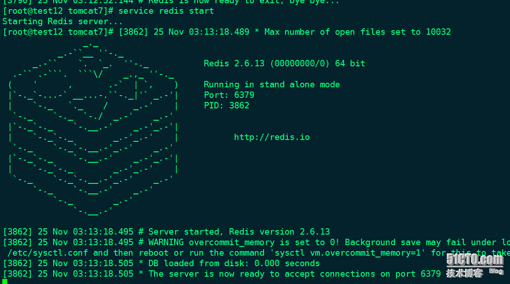
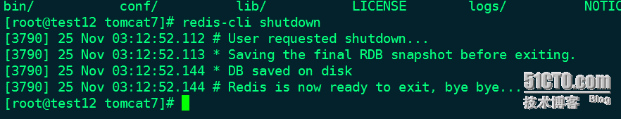
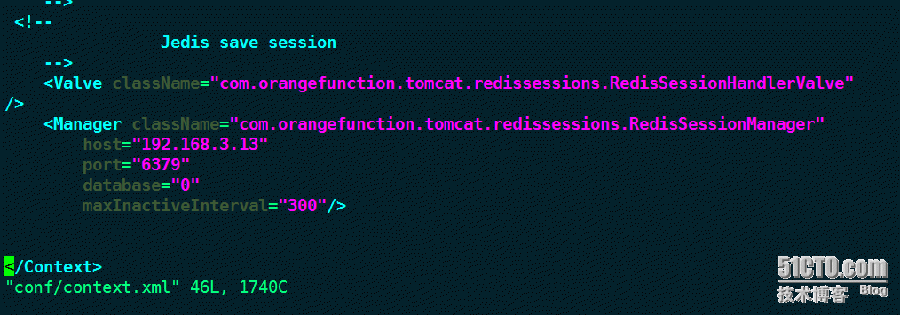
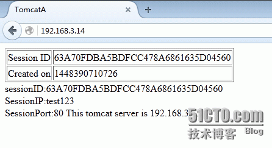
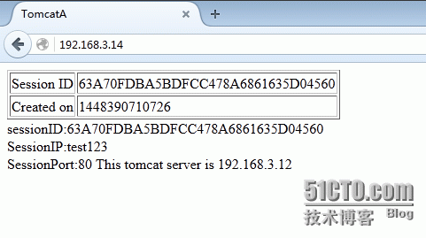
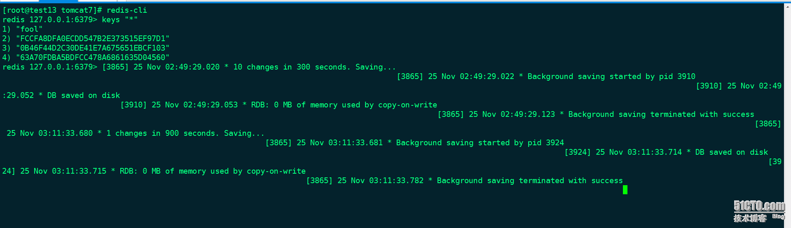

# 实验环境
实验环境：3台虚拟机

(pc1:nginx1.6.3,pc2:tomcat7+redis2.6.13,pc3:tomcat7+redis2.6.13)

# 实验目的
通过redis实现session的共享

```
cd /usr/local/src
tar zxvf redis-2.6.13.tar.gz
cd redis-2.6.13
make PREFIX=/usr/local/redis  install

如果make失败一般是你们系统中gcc还未安装 yum install -y gcc  

安装成功后/usr/loca/redis/bin会有这5个文件
[root@test12 redis-2.6.13]# ls /usr/local/redis/bin/
redis-benchmark redis-check-aof redis-check-dump redis-cli redis-server

redis-server：Redis服务器的daemon启动程序
redis-cli：Redis命令行操作工具。当然，你也可以用telnet根据其纯文本协议来操作
redis-benchmark：Redis性能测试工具，测试Redis在你的系统及你的配置下的读写性能
redis-check-aof：数据修复
redis-check-dump：检查导出工具
此处、如果不做启动脚本可以直接这样启动：/usr/loca/redis/bin/redis-server
cp /usr/local/src/redis-2.6.13/utils/redis_init_script /etc/init.d/redis//复制启动脚本
```
```
[root@test12 redis-2.6.13]# chkconfig --add redis
[root@test12 redis-2.6.13]# chkconfig redis on

redis 服务不支持 chkconfig
```
```
vim /etc/init.d/redis
#!/bin/sh
# chkconfig: 2345 80 90   //解决服务不支持chkconfig问题
# Simple Redis init.d script conceived to work on Linux systems
# as it does use of the /proc filesystem.

REDISPORT=6379
EXEC=/usr/local/redis/bin/redis-server            //修改路径
CLIEXEC=/usr/local/redis/bin/redis-cli            //修改路径

PIDFILE=/var/run/redis_${REDISPORT}.pid
CONF="/etc/redis/${REDISPORT}.conf"


case "$1" in
    start)
        if [ -f $PIDFILE ]
        then
                echo "$PIDFILE exists, process is already running or crashed"
        else
                echo "Starting Redis server..."
                nohup $EXEC $CONF &            //加入&放在后台执行
        fi
        ;;
    stop)
        if [ ! -f $PIDFILE ]
        then
                echo "$PIDFILE does not exist, process is not running"
        else
                PID=$(cat $PIDFILE)
                echo "Stopping ..."
                $CLIEXEC -p $REDISPORT shutdown
                while [ -x /proc/${PID} ]
                do
                    echo "Waiting for Redis to shutdown ..."
                    sleep 1
                done
                echo "Redis stopped"
        fi
        ;;
    *)
        echo "Please use start or stop as first argument"
        ;;
esac
```
将redis配置文件拷贝到/etc/redis/${REDISPORT}.conf
```
mkdir /etc/redis   
cp /usr/local/src/redis-2.6.13/redis.conf /etc/redis/6379.conf
```

解析来需要自己定义redis的配置文件
```
mkdir /usr/local/redis/etc/
mkdir /usr/local/redis/var/
vim  /usr/local/redis/etc/redis.conf
.............................................................
daemonize yes
pidfile /usr/local/redis/var/redis.pid
port 6379
timeout 300
loglevel debug
logfile /usr/local/redis/var/redis.log
databases 16
save 900 1
save 300 10
save 60 10000
rdbcompression yes
dbfilename dump.rdb
dir /usr/local/redis/var/
appendonly no
appendfsync always
.............................................................
```
启动的时候指定配置文件 /usr/local/redis/bin/redis-server
```
/usr/loca/redis/etc/redis.conf
```

conf的主要配置参数的意义：
- daemonize：是否以后台daemon方式运行
- pidfile：pid文件位置
- port：监听的端口号
- timeout：请求超时时间
- loglevel：log信息级别
- logfile：log文件位置
- databases：开启数据库的数量
- save * ：保存快照的频率，第一个*表示多长时间，第三个*表示执行多少次写操作。在一定时间内执行一定数量的写操作时，自动保存快照。可设置多个条件。
- rdbcompression：是否使用压缩
- dbfilename：数据快照文件名（只是文件名，不包括目录）
- dir：数据快照的保存目录（这个是目录）
- appendonly：是否开启appendonlylog，开启的话每次写操作会记一条log，这会提高数据抗风险能力，但影响效率。
- appendfsync：appendonlylog如何同步到磁盘（三个选项，分别是每次写都强制调用fsync、每秒启用一次fsync、不调用fsync等待系统自己同步）

```
chkconfig --add redis
chkconfig redis on
service redis start
```

将Redis的命令所在目录添加到系统参数PATH中
```
vim /etc/profile
export PATH="$PATH:/usr/local/redis/bin"  
source /etc/profile
```

启动redis
```
/usr/local/redis/bin/redis-server /usr/local/redis/etc/redis.conf
```


关闭redis
```
redis-cli shutdown
```


调用redis-cli的命令测试
```
[root@test12 redis-2.6.13]# redis-cli
redis 127.0.0.1:6379> auth nihao123!   //对用户增加了验证
OK
redis 127.0.0.1:6379> ping
PONG
redis 127.0.0.1:6379> set foo bar
OK
redis 127.0.0.1:6379> get foo
"bar"
redis 127.0.0.1:6379> keys "*"  //看以看到session信息 实验结果可以用这个测试
```

**对Redis增加用户验证2种方法**

1、修改配置文件redis.conf
```
vim /etc/redis/6379.conf
260 requirepass nihao123!    //260指的是行号   
service redis stop;start
```

2、通过config命令可以设置密码以及获取当前用户密码
```
1.  redis 127.0.0.1:6379[1]> config set requirepass 123456  
2. OK  
3.  redis 127.0.0.1:6379[1]> config get requirepass  
4. 1) "requirepass"  
5. 2) "123456"
[注：]设置验证密码之后，redis服务关闭需要密码验证通过之后才能关闭，因此命令修改为：
redis-cli –a 123456 shutdown
```

> PS：截止到2015-05-12前redis是不支持Tomcat8的
>
>详情见官网：https://github.com/jcoleman/tomcat-redis-session-manager


配置Tomcat的conf目录下的context.xml文件：
```
 <!-- Jedis save session -->
    <Valve className="com.orangefunction.tomcat.redissessions.RedisSessionHandlerValve" />
        <Manager className="com.orangefunction.tomcat.redissessions.RedisSessionManager"
        host="82b5635ae84a41aa.m.cnqda.kvstore.aliyuncs.com"   
        port="6379"
        database="0"
        maxInactiveInterval="60"/>
```

1> 单点Reids配置
```
先拷贝jar包到$tomcat/lib下
 <!--
    Jedis save session
    -->
    <Valve className="com.orangefunction.tomcat.redissessions.RedisSessionHandlerValve" />        
    <Manager className="com.orangefunction.tomcat.redissessions.RedisSessionManager"
        host="localhost"   //填写你要指定做redis服务的域名或IP 82b5635ae84a41aa.m.cnqda.kvstore.aliyuncs.com/192.168.1.2
        port="6379"
        database="0"
        maxInactiveInterval="60"/>    //从性能上考虑，应用服务器一般都不是立即删除，而是定期回收。但每次访问session之前都会做超时检测，也就是说，只要超过60秒，即便应用服务器还没真的回收这个session，但也会立即将其作废掉
```
如图：



2> Sentinel集群配置：
```
       <!-- Sentinel 配置 -->
     <Valve className="com.orangefunction.tomcat.redissessions.RedisSessionHandlerValve" />        
    <Manager className="com.orangefunction.tomcat.redissessions.RedisSessionManager"
        maxInactiveInterval="60"
        sentinelMaster="mymaster"
        sentinels="127.0.0.1:26379,127.0.0.1:26380,127.0.0.1:26381,127.0.0.1:26382"
        />
```

**集群配置没验证 后续文档会把这个做上**

> 从Tomcat6开始默认开启了Session持久化设置，测试时可以关闭本地Session持久化，在Tomcat的conf目录下的context.xml文件中，取消注释下面那段配置即可：
```
    <!-- Uncomment this to disable session persistence across Tomcat restarts -->
    <!--
    <Manager pathname="" />
    -->
```

redis异常解决：jedis.exceptions.JedisDataException: ERR Client sent AUTH, but no password is set

redis通过属性requirepass 设置访问密码，但没有设置该属性时，客户端向服务端发送AUTH请求，服务端就好返回异常：ERR Client sent AUTH, but no password is set 注释掉redis配置文件requirepass即可。


Tomcat为了方便看到测试结果、从新写一段java代码
```
vim /usr/local/tomcat7/webapps/Root/index.jsp
.........................................................................
<%@ page language="java" %>
<html>
  <head><title>TomcatA</title></head>
  <body>
    <table align="centre" border="1">
      <tr>
        <td>Session ID</td>
        <td><%= session.getId() %></td>
      </tr>
      <tr>
        <td>Created on</td>
        <td><%= session.getCreationTime() %></td>
     </tr>
    </table>
  </body>
</html>
sessionID:<%=session.getId()%>
<br>
SessionIP:<%=request.getServerName()%>
<br>
SessionPort:<%=request.getServerPort()%>
<%
out.println("This tomcat server is 192.168.3.12");
%>
.........................................................................
```

**两台tomcat都是如此 、、为了区分  最后的IP地址 自己修改一下**

配置nginx反向代理、参考开头部分提到的网址

启动redis、tomcat、nginx

可以看到效果：




