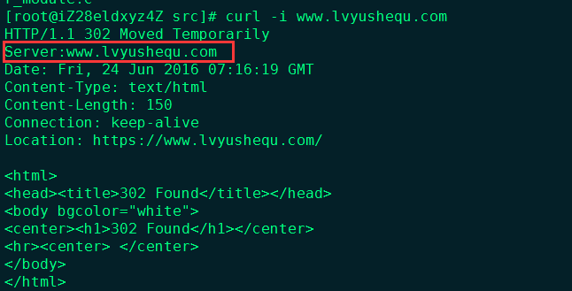

今天我们来说说，如何修改Nginx其内部默认名称。这对安全或者装逼都是非常实用的。

我们都知道一般Nginx有哪些内部名称展示，如有通过HTTP Response

Header中的Server、错误页的footer、FPM-FastCGI等。

一般来说修改3个位置，一个是nginx.h、另一个是ngx_http_header_filter_module.c、还有一个ngx_http_special_response.c

__以下修改需要在编译安装Nginx之前进行，修改之后再编译(经过测试只需要修改前2个配置即可)__

修改后的效果：



修改src/core/nginx.h（Nginx内部名称的）  ngx_oprenresty路径：ngx_openresty-1.7.4.1/bundle/nginx-1.7.4/src/core/nginx.h
```
#define NGINX_VERSION      "1.8.0"
#define NGINX_VER          "NGINX/" NGINX_VERSION
NGINX_VERSION是版本号，NGINX_VER是名称  改成想要显示的名称  或者空格
```
修改src/http/ngx_http_header_filter_module.c（HTTP ResponseHeader）
```
static char ngx_http_server_string[] = "Server: openresty" CRLF;
static char ngx_http_server_full_string[] = "Server: " NGINX_VER CRLF;
```
修改src/http/ngx_http_special_response.c（修改错误页的底部Footer）
```
static u_char ngx_http_error_tail[] ="
<hr><center>nginx</center>" CRLF"
</body>" CRLF"
</html>" CRLF
```
为什么不修改安装后的Nginx Config下的fastcgi.conf呢？

因为现在外部已经是无法了解我们的服务器名称，已经达到我们的目的了。

而且我们常用的一些程序，可能会对你的前端（反向代理服务器）做判断，毕竟Nginx不同于Apache，无法动态规则。

特别是Wordpress的缓存插件，大多会通过判断你是否Nginx，如果是的话，提醒你添加一些规则语句。

这时fastcgi.conf就起作用的，其中的fastcgi_param SERVER_SOFTWARE
nginx/$nginx_version;可以使得PHP与Nginx内部之间的互相了解。

所以我的建议，还是不修改fastcgi.conf，当然你非要改，也可以的。
