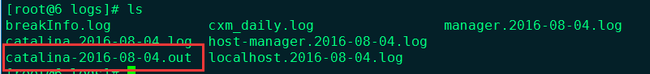

# cronolog
http://www.voidcn.com/article/p-aqailrrh-bro.html

```
0 3 * * * /bin/find /opt/tomcat -mtime +7 -type f -name" manager.*.log" -exec /bin/rm -rf {} \;
```

# log4j
https://blog.csdn.net/Lyndon18/article/details/76020671
http://www.cnblogs.com/yjmyzz/p/tomcat8-split-catalina-log.html


Tomcat 下日志文件 catalina.out 过大，几百兆或几个G，进而造成再也无法写入更多的日志内容，至使 Tomcat 无法处理请求。下面介绍2中切割方案：
# 使用log4j将分割日志
tomcat默认使用java.util.logging记录日志，默认只记录tomcat的日志，不记录应用的日志，配置方法如下：
- 更新最新的tomcat_juli.jar包到$tomcat/bin/目录下；
- 拷贝log4j.jar,lo4j.properties到$tomcat/lib目录下;
- 删除$tomcat/conf/logging.properties
- 重启tomcat
```
log4j配置样本、Xhtml代码 ：
log4j.rootLogger=INFO,CATALINA  log4j.logger.com.danga.MemCached.MemCachedClient=WARN,CATALINA   #log4j.appender.CONSOLE = org.apache.log4j.ConsoleAppender  #log4j.appender.CONSOLE.layout = org.apache.log4j.PatternLayout  #log4j.appender.CONSOLE.encoding = UTF-8  #log4j.appender.CONSOLE.layout.conversionPattern =[%p-%d{yyyy/MM/dd/HH\:mm\:ss}]%c{1}.(%L) - %m%n

# Define CATALINA appenders  log4j.appender.CATALINA = org.apache.log4j.DailyRollingFileAppender  log4j.appender.CATALINA.file = ${catalina.base}/logs/catalina.out  log4j.appender.CATALINA.DatePattern ='.'yyyy-MM-dd  log4j.appender.CATALINA.layout = org.apache.log4j.PatternLayout  log4j.appender.CATALINA.layout.conversionPattern = [%p-%d{yyyy/MM/dd/HH\:mm\:ss}]%c{1}.(%L) - %m%n   log4j.appender.CATALINA.append = true  lo4j
```
自动在午夜切割catalina.out成catalina.out.yyyy-mm-dd

#　Linux 下使用 cronolog工具来切分catalina.out
## 下载安装cronolog。
```
yum install -y cronolog
```

## 修改$tomcat/bin/catalina.sh文件。
注释373行；删除387、397行；添加388、398行；如下图：
```
373   #touch "$CATALINA_OUT"   //注释掉
374   if [ "$1" = "-security" ] ; then
375     if [ $have_tty -eq 1 ]; then
376       echo "Using Security Manager"
377     fi
378     shift
379     eval "\"$_RUNJAVA\"" "\"$LOGGING_CONFIG\"" $LOGGING_MANAGER $JAVA_OPTS $CATALINA_OPTS \
380       -Djava.endorsed.dirs="\"$JAVA_ENDORSED_DIRS\"" -classpath "\"$CLASSPATH\"" \
381       -Djava.security.manager \
382       -Djava.security.policy=="\"$CATALINA_BASE/conf/catalina.policy\"" \
383       -Dcatalina.base="\"$CATALINA_BASE\"" \
384       -Dcatalina.home="\"$CATALINA_HOME\"" \
385       -Djava.io.tmpdir="\"$CATALINA_TMPDIR\"" \
386       org.apache.catalina.startup.Bootstrap "$@" start \
387       >> "$CATALINA_OUT" 2>&1 "&"   //删除此行
388       2>&1 |/usr/sbin/cronolog "$CATALINA_BASE"/logs/catalina-%Y-%m-%d.out &   /添加此行
389
390   else
391     eval "\"$_RUNJAVA\"" "\"$LOGGING_CONFIG\"" $LOGGING_MANAGER $JAVA_OPTS $CATALINA_OPTS \
392       -Djava.endorsed.dirs="\"$JAVA_ENDORSED_DIRS\"" -classpath "\"$CLASSPATH\"" \
393       -Dcatalina.base="\"$CATALINA_BASE\"" \
394       -Dcatalina.home="\"$CATALINA_HOME\"" \
395       -Djava.io.tmpdir="\"$CATALINA_TMPDIR\"" \
396       org.apache.catalina.startup.Bootstrap "$@" start \
397       >> "$CATALINA_OUT" 2>&1 "&"   /删除此行
398       2>&1 |/usr/sbin/cronolog "$CATALINA_BASE"/logs/catalina-%Y-%m-%d.out &   //添加此行
```
```
186 if [ -z "$CATALINA_OUT" ] ;  then
187   CATALINA_OUT="$CATALINA_BASE"/logs/catalina.out         修改为   CATALINA_OUT="$CATALINA_BASE"/logs/catalina.%Y-%m-%d.out
```
【注意：】tomcat7之前的版本位置一样、但是配置有所不同
```
touch "$CATALINA_BASE"/logs/catalina.out    //注释>> "$CATALINA_BASE"/logs/catalina.out 2>&1 &    //删除2>&1 |/usr/sbin/cronolog "$CATALINA_BASE/logs/catalina-%Y-%m-%d.out" &    //添加
```
## 保存 catalina.sh 文件，重启Tomcat即可。

