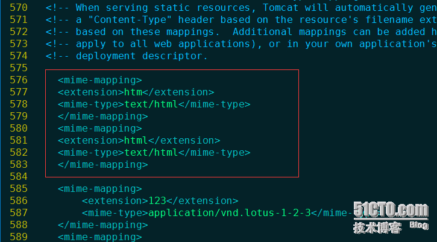

Tomcat安装完成之后默认可以打开index.jsp文件、但是如果你访问index.html会显示空白页、原因是：在$tomcat/conf/web.xml配置文件里、指定了什么类型的文件调用什么程序打开、但是默认没有配置html或htm、所以我们要手动加上就可以了、以此类推、doc、war、ppt等都是一样的方法。

[root@test ~]vim $tomcat/conf/web.xml
```
 <mime-mapping>  
 <extension>htm</extension>   
 <mime-type>text/html;charset=gb2312</mime-type>   
 </mime-mapping>  
 <mime-mapping>  
 <extension>html</extension>   
 <mime-type>text/html;charset=gb2312</mime-type>   
 </mime-mapping>
```
此段代码可以加在任意位置、重启后生效、如图所示：


如果还不能访问html、可以尝试进一步修改：


常用的文件类型：
```
<mime-mapping>  
    <extension>doc</extension>  
    <mime-type>application/vnd.ms-word</mime-type>  
</mime-mapping>  
<mime-mapping>  
    <extension>gif</extension>  
    <mime-type>image/gif</mime-type>  
</mime-mapping>  
<mime-mapping>  
    <extension>htm</extension>  
    <mime-type>text/html</mime-type>  
</mime-mapping>  
<mime-mapping>  
    <extension>html</extension>  
    <mime-type>text/html</mime-type>  
</mime-mapping>  
<mime-mapping>  
    <extension>jnlp</extension>  
    <mime-type>application/x-java-jnlp-file</mime-type>  
</mime-mapping>  
<mime-mapping>  
    <extension>jpeg</extension>  
    <mime-type>image/jpeg</mime-type>  
</mime-mapping>  
<mime-mapping>  
    <extension>jpg</extension>  
    <mime-type>image/jpeg</mime-type>  
</mime-mapping>  
<mime-mapping>  
    <extension>js</extension>  
    <mime-type>application/x-javascript</mime-type>  
</mime-mapping>  
<mime-mapping>  
    <extension>pdf</extension>  
    <mime-type>application/pdf</mime-type>  
</mime-mapping>  
<mime-mapping>  
    <extension>png</extension>  
    <mime-type>image/png</mime-type>  
</mime-mapping>  
<mime-mapping>  
    <extension>rar</extension>  
    <mime-type>application/x-rar-compressed</mime-type>  
</mime-mapping>  
<mime-mapping>  
    <extension>txt</extension>  
    <mime-type>text/plain</mime-type>  
</mime-mapping>  
<mime-mapping>  
    <extension>xls</extension>  
    <mime-type>application/vnd.ms-excel</mime-type>  
</mime-mapping>  
<mime-mapping>  
    <extension>xml</extension>  
    <mime-type>text/xml</mime-type>  
</mime-mapping>  
<mime-mapping>  
    <extension>xul</extension>  
    <mime-type>application/vnd.mozilla.xul-xml</mime-type>  
</mime-mapping>  
<mime-mapping>  
    <extension>zhtml</extension>  
    <mime-type>text/html</mime-type>  
</mime-mapping>  
<mime-mapping>  
    <extension>zip</extension>  
    <mime-type>application/x-zip</mime-type>  
</mime-mapping>  
<mime-mapping>  
    <extension>zul</extension>  
    <mime-type>text/html</mime-type>  
</mime-mapping>
```


其他常见的MIME类型：
- 超文本标记语言文本 .htm,.html text/html
- RTF文本 .rtf application/rtf
- 普通文本 .txt text/plain
- GIF图形 .gif image/gif
- JPEG图形 .ipeg,.jpg image/jpeg
- MIDI音乐文件 mid,.midi audio/midi,audio/x-midi
- au声音文件 .au audio/basic
- RealAudio音乐文件 .ra, .ram audio/x-pn-realaudio
- MPEG文件 .mpg,.mpeg video/mpeg
- GZIP文件 .gz application/x-gzip
- AVI文件 .avi video/x-msvideo
- TAR文件 .tar application/x-
