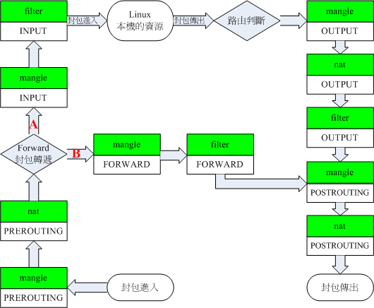

# docker需不需要防火墙软件？

其实这个问题之前一直困扰着我，在请教技术大牛以及自己探讨以后，得到了一个答案，那就是docker不需要防火墙软件（注意这里指的是firewalld，iptables等防火墙软件而不是iptables服务）。

# 防火墙软件是否对docker有影响？

docker引擎启动的时候会修改iptables规则，如果使用了防火墙软件，只要重启防火墙软件，则docker的规则就全部丢失，影响容器访问。

# 如果必须使用防火墙需要注意什么？

增删开放端口都必须通过动态命令添加，并且不应该重启防火墙。

如果使用防火墙，部署业务映射了宿主机的端口，是否应该开放该端口？

没有必要，因为不管你开不开放端口，都可以访问到服务。具体看下面的解释。

# Docker网络模式

Docker有多中网络模式，包括host，none,bridge ,overlay等。下面以Docker默认的bridge网络---Docker0来探讨Docker网络与iptables的关系。

Docker0网络是Docker搭建的一个虚拟桥接网络，默认网关地址是172.17.0.1。Docker默认的网络是Docker0网络，也就意味着Docker中所有没有指定网络的容器都会加入到这个桥接网络中，网络中的容器可以互相通信。

```
# ifconfig
docker0: flags=4163<UP,BROADCAST,RUNNING,MULTICAST>  mtu 1500
        inet 172.17.0.1  netmask 255.255.0.0  broadcast 0.0.0.0
        inet6 fe80::42:c0ff:febb:bb1e  
```

# 容器对外请求数据

如果Docker0中的容器请求外部的数据，那么他的数据包将会发送到网关172.17.0.1处。当数据包到达网关后，将会查询主机的路由表，确定数据包将从那个网卡发出。iptables负责对数据包进行snat转换，将原地址转为对应网卡的地址，因此容器对外是不可见的。

# 外部对容器请求数据

外部想要访问容器内的数据，首先需要将容器的端口映射到宿主机上。这时候docker会在iptables添加转发规则，把接收到的数据转发给容器。

# Docker数据在iptables中传递

下图是数据包在iptable的传递流程



# 创建一个端口映射的容器

接下来我们查看一下容器数据包在iptable中怎么传递的 创建一个redis容器，将映射容器6379端口到宿主机36379端口。
```
# docker run --name redistest -d -p 36379:6379 172.16.1.129/redis/3.0.7:v1.1
b4c3fc06cdaccc2080f9e4845ebb2d2b789632ddaecb6e7b2e3bdf863c416014
```

查看iptables的nat表
```
# iptables -t nat -L
Chain PREROUTING (policy ACCEPT)
target     prot opt source               destination         
DOCKER     all  --  anywhere             anywhere             ADDRTYPE match dst-type LOCAL    

Chain INPUT (policy ACCEPT)
target     prot opt source               destination         

Chain OUTPUT (policy ACCEPT)
target     prot opt source               destination         
DOCKER     all  --  anywhere            !loopback/8           ADDRTYPE match dst-type LOCAL

Chain POSTROUTING (policy ACCEPT)
target     prot opt source               destination         
CATTLE_NAT_POSTROUTING  all  --  anywhere             anywhere            
MASQUERADE  all  --  172.17.0.0/16        anywhere            
MASQUERADE  all  --  172.18.0.0/16        anywhere            
MASQUERADE  tcp  --  172.17.0.3           172.17.0.3           tcp dpt:6379

Chain DOCKER (2 references)
target     prot opt source               destination         
RETURN     all  --  anywhere             anywhere            
RETURN     all  --  anywhere             anywhere            
DNAT       tcp  --  anywhere             anywhere             tcp dpt:36379 to:172.17.0.3:6379
```
可以看到iptables的nat表中有一条Docker子链 里面有一条数据
```
DNAT       tcp  --  anywhere             anywhere             tcp dpt:36379 to:172.17.0.3:6379
这条数据就是负责宿主机tcp36379端口映射到172.17.0.3:6379上。
```

Docker子链被PREROUTING和OUTPUT链引用

 - PREROUTING：数据包到达防火墙时改变包的目的地址
 - OUTPUT：过滤所有本机产生的数据包（对源地址得数据包的过滤）

也就是说外部对宿主机36379访问的数据包在nat这里被进行snat和pnat转换，目的地址转为172.17.0.3:6379。

容器对外部访问的数据包也在这里进行dnat和pnat，将172.17.0.3:6379转为宿主机的36379端口

查看iptables的filter表
```
# iptables -L
Chain INPUT (policy ACCEPT)
target     prot opt source               destination         
ACCEPT     all  --  anywhere             anywhere             state RELATED,ESTABLISHED

Chain FORWARD (policy ACCEPT)
target     prot opt source               destination         
DOCKER-ISOLATION  all  --  anywhere             anywhere            
DOCKER     all  --  anywhere             anywhere            

DROP       all  --  anywhere             anywhere            

Chain OUTPUT (policy ACCEPT)
target     prot opt source               destination         


Chain DOCKER (2 references)
target     prot opt source               destination         
ACCEPT     tcp  --  anywhere             172.17.0.3           tcp dpt:6379

Chain DOCKER-ISOLATION (1 references)
target     prot opt source               destination         
DROP       all  --  anywhere             anywhere            
DROP       all  --  anywhere             anywhere            
RETURN     all  --  anywhere             anywhere            
```
里面同样有一个 DOCKER子链，被FORWARD链引用

 - FORWARD链：过滤所有路过本机的数据包（源地址和目标地址都不是本机的数据包）
也就是说经过nat切换地址以后，测试容器的数据包将会转发到172.17.0.3,而不是宿主机，过滤规则是Accept，也就是通过。

通过上面的分析，可以知道数据到达宿主机的防火墙，直接就forward到容器了，没有执行到input流程，所以容器映射的宿主机端口不需要开放。

# docker与防火墙软件同时使用注意事项

docker的部分网络功能是通过iptables转发来完成的，转发规则是docker进程启动后动态添加的，也就意味着如果你重启iptables，将会丢失docker的转发规则。

有两种解决办法：

## 动态添加iptables规则，然后保存到防火墙软件配置文件中
动态添加iptables规则可以使规则立即生效（重启失效）
```
sudo iptables -I INPUT 1 -p tcp --dport 46379 -j ACCEPT
```
这条命令会将规则添加到input规则的第一位 ,-I参数指定插入位置。不要使用-A参数，该参数会将规则添加到input的最后一条，一般原来的最后一条都是reject规则，所以新插入的规则无法生效。
```
sudo service iptables save
```

## 重启iptable后重新启动docker
影响：重启docker会导致全部容器重启，有可能造成短时间的业务故障。

此方法不建议使用，如果已经重启防火墙，导致docker业务故障，使用下面命令重启dcoker。
```
systemctl restart docker
```
