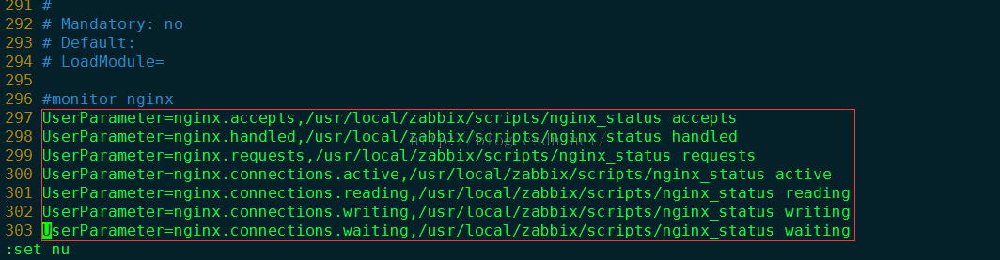

软件版本：zabbix2.4.4   nginx1.6.3

# 客户端操作
## 首先修改nginx配置文件
```
vim /usr/local/nginx/conf/nginx.conf
 39         location /nginxstatus {  
 40              stub_status on;  
 41              access_log off;  
 42              allow 127.0.0.1;       //本机IP
 43              allow 192.168.30.106;  //这个是我在windowsIP，方便测试  可以不写
 44              allow 192.168.0.167;   //zabbix服务端IP
 45              deny all;
 46              }
```
如下图：


保存后重启
```
/usr/local/nginx/sbin/nginx -s reload
```


nginx Status 说明：
```
Active connections:  对后端发起的活动连接数。
server accepts handled requests
   6      6       5  nginx 总共处理了6个连接，成功创建了6次握手，总共处理了5请求。
Reading: 0 Writing: 1 Waiting: 2       Reading: nginx 读取客户端的header数, Writing: nginx 返回给客户端的header数, Waiting: nginx 请求处理完成，正在等待下一 请求指令的连接。
```

## 创建监控脚本
创建监控脚本nginx_status(名字自定义)nging.txt(保存读取nginx的状态、如果不创建直接修改脚本 输出到/dev/null也可以)
```
mkdir  /usr/local/zabbix/scripts
cd /usr/local/zabbix/scripts
touch nginx.txt nginx_status
chown zabbix:zabbix nginx.txt nginx_status
chmod 755 nginx.txt nginx_status
vim /usr/local/zabbix/scripts/nginx_status
....................................................................................................................................
#!/bin/bash  
# Script to fetch nginx statuses for tribily monitoring systems   
# License: GPLv2
# Set Variables  
# Functions to return nginx stats
nginx=/usr/local/zabbix/scripts/nginx.txt
function active {
                curl "http://localhost/nginxstatus"&>$nginx && awk '/Active/{print $3}' $nginx
}
function reading {
                curl "http://localhost/nginxstatus"&>$nginx && awk '/Reading/{print $2}' $nginx
}
function writing {
                curl "http://localhost/nginxstatus"&>$nginx && awk '/Writing/{print $4}' $nginx
}
function waiting {
                curl "http://localhost/nginxstatus"&>$nginx && awk '/Waiting/{print $6}' $nginx
}
function accepts {
                curl "http://localhost/nginxstatus"&>$nginx && awk NR==6 $nginx| awk '{print $1}'
}
function handled {
                curl "http://localhost/nginxstatus"&>$nginx && awk NR==6 $nginx| awk '{print $2}'
}
function requests {
                curl "http://localhost/nginxstatus"&>$nginx && awk NR==6 $nginx| awk '{print $3}'
}
# Run the requested function  
case "$1" in
active)
        active
        ;;
reading)
        reading
        ;;
writing)
        writing
        ;;
waiting)
        waiting
        ;;
accepts)
        accepts
        ;;
handled)
        handled
        ;;
requests)
        requests
        ;;
*)
        echo "Usage: $0 {nginx_site_dicovery}"
                echo "Usage: $0 {active [host] | reading [host] | writing [host] | waiting [host] | accepts [host] | handled [host] | requests [host]}"
esac

....................................................................................................................................
```
## 配置zabbix_agentd
配置zabbix_agentd.cof
```
vim /usr/local/zabbix/etc/zabbix_agentd.conf
#monitor nginx  
UserParameter=nginx.accepts,/usr/local/zabbix/scripts/nginx_status accepts  
UserParameter=nginx.handled,/usr/local/zabbix/scripts/nginx_status handled  
UserParameter=nginx.requests,/usr/local/zabbix/scripts/nginx_status requests  
UserParameter=nginx.connections.active,/usr/local/zabbix/scripts/nginx_status active  
UserParameter=nginx.connections.reading,/usr/local/zabbix/scripts/nginx_status reading  
UserParameter=nginx.connections.writing,/usr/local/zabbix/scripts/nginx_status writing  
UserParameter=nginx.connections.waiting,/usr/local/zabbix/scripts/nginx_status waiting
```


服务端测试是否通过脚本获取到数据
```
/usr/local/zabbix/bin/zabbix_get -s 192.168.0.168 -p 10050 -k "nginx.accepts"
```

最后在zabbix WEB端创建item项目


