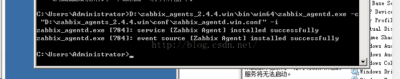
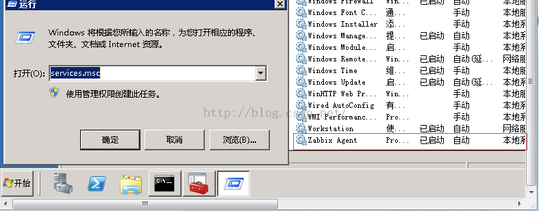

系统版本：windows2008R2_64

软件版本：zabbix2.4.4.win.zip


# 客户端
## 下载与解压
首先下载：http://www.zabbix.com/downloads/2.4.4/zabbix_agents_2.4.4.win.zip  //选择与服务端相应版本

解压zabbix_agents_2.4.4.win.zip  解压后zabbix下有conf bin两个文件夹  //这里解压到D盘

conf目录存放是agent配置文件 bin文件存放windows下32位和64位安装程序


## 配置安装
找到D盘zabbix下的配置文件zabbix_agentd.win.conf 修改LogFile、Server、Hostname这三个参数。
```
LogFile=d:\zabbix_agentd.log
Server=192.168.0.111  //服务器端IP
Hostname=test  //客户端HostName
```
在windows控制台下执行以下命令：  //如果是2008需要在开始菜单 cmd右键 使用管理员权限
D:\zabbix_agents_2.4.4.win\bin\win64\zabbix_agentd.exe -c "D:\zabbix_agents_2.4.4.win\conf\zabbix_agentd.win.conf" -i  


## 启动agent两种方式
### 使用命令:
```
D:\zabbix_agents_2.4.4.win\bin\win64\zabbix_agentd.exe -c "D:\zabbix_agents_2.4.4.win\conf\zabbix_agentd.win.conf" -s  
//如果出现错误-d试卸载再安装可解决
```


- -c    制定配置文件所在位置
- -i      是安装客户端
- -s     启动客户端
- -x    停止客户端
- -d    卸载客户端


### 使用图形窗口
在windows、运行窗口输入service.msc打开服务窗口，找到zabbix项 启动即可


netstat -ano  //查看是否开启10050端口
