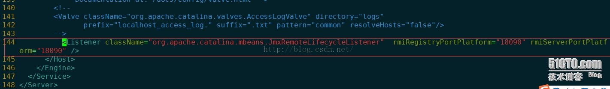
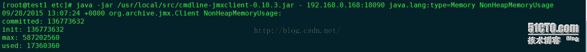
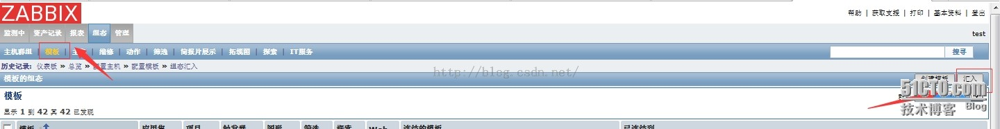
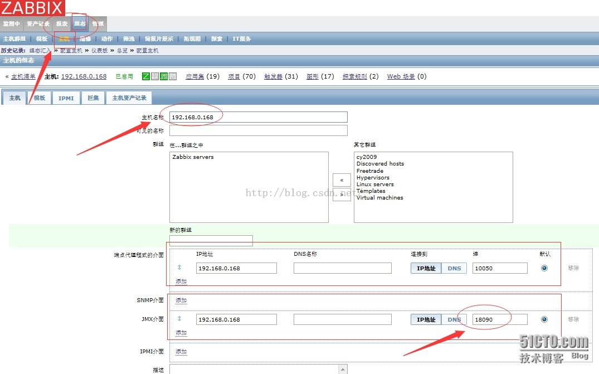
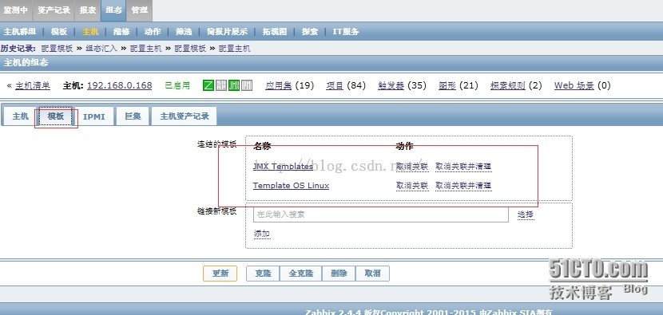
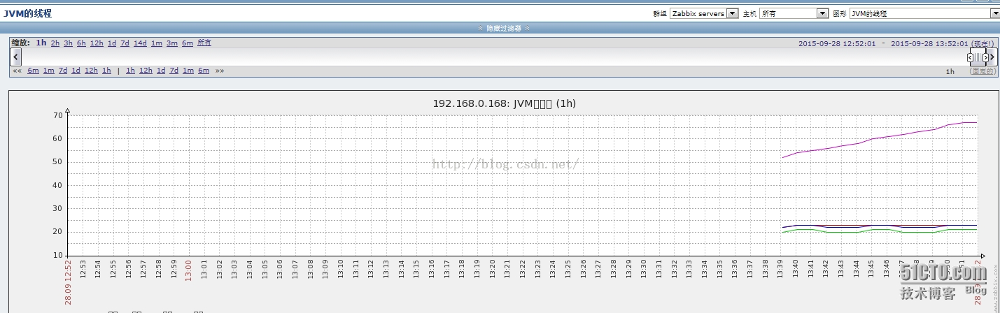
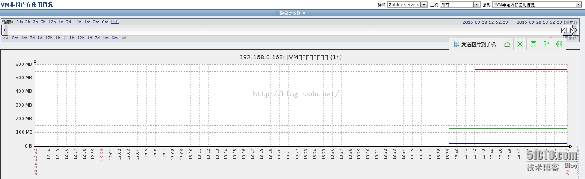

实验目的：
zabbix监控tomcat

实验环境：
```
zabbix2.4.4  
tomcat6.0.4.1
服务器端：已经安装好LAMP+zabbix_server
客户端：已经安装好zabbix_agentd tomcat
```

zabbix服务端配置：（重新编译zabbix_server）
```
yum -y install java java-devel
./configure --prefix=/usr/local/zabbix/ --enable-server --enable-agent --with-mysql --with-net-snmp --with-libcurl --with-libxml2 --enable-java
```
```
ls /usr/local/zabbix/sbin/zabbix_java
#查看编译--enable-java，编译成功会有以下5个文件
bin  lib  settings.sh  shutdown.sh  startup.sh
```
```
[root@test1 zabbix_java]# pwd
/usr/local/zabbix/sbin/zabbix_java

[root@test1 zabbix_java]# grep ^[^#] settings.sh  //修改zabbix_java参数如下
 9 LISTEN_IP="0.0.0.0"
17 LISTEN_PORT=10052
27 PID_FILE="/tmp/zabbix_java.pid"
35 START_POLLERS=5
```
```
vim /usr/local/zabbix/etc/zabbix_server.conf  //修改zabbix_server配置文件
 30 LogFile=/tmp/zabbix_server.log
 78 DBName=zabbix
 94 DBUser=zabbix
102 DBPassword=xxxxxx
109 DBSocket=/tmp/mysql.sock
198 JavaGateway=127.0.0.1
206 JavaGatewayPort=10052
214 StartJavaPollers=5
```

重启zabbix_server
```
service zabbix_server start
```

启动zabbix_java_Gateway   //zabbix_java_Gateway侦听10052端口
```
sh /usr/local/zabbix/sbin/zabbix_java/startup.sh
[root@test1 etc]# netstat -antlp|grep 10052
tcp        0      0 :::10052                    :::*                        LISTEN      27929/java
```

zabbix客户端（tomcat）配置：
```
yum -y install java java-devel
wget http://archive.apache.org/dist/tomcat/tomcat-8/v8.0.26/bin/extras/catalina-jmx-remote.jar
#下载tomcat对应的jmx版本放到$tomcat/lib/
```
```
vim /usr/local/tomcat/bin/catalina.sh
CATALINA_OPTS="-Dcom.sun.management.jmxremote -Dcom.sun.management.jmxremote.authenticate=false -Dcom.sun.management.jmxremote.ssl=false -Djava.rmi.server.hostname=客户端IP"
```


重启tomcat和zabbix_agentd

zabbix服务端测试

java -jar /usr/local/src/cmdline-jmxclient-0.10.3.jar - 192.168.0.168:18090 java.lang:type=Memory NonHeapMemoryUsage



如图所示、已经获取到数据

导入模板、添加主机：




关联模板：


出图：


