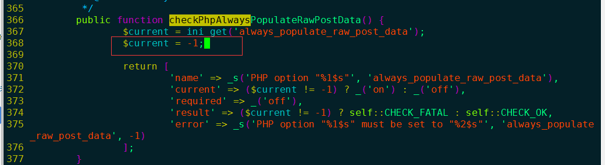
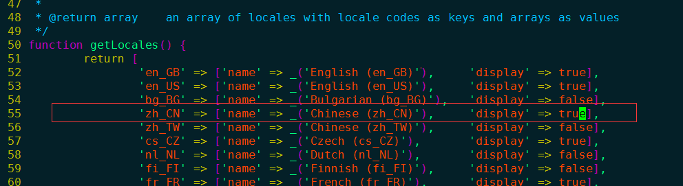
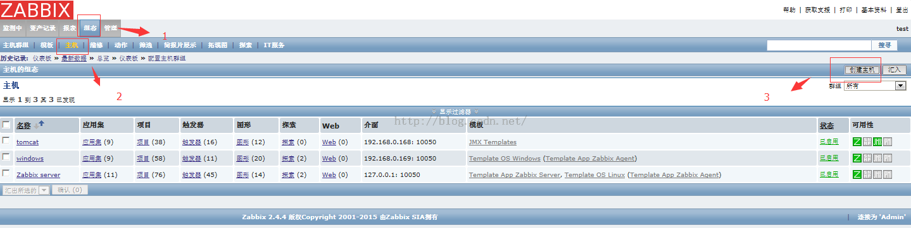
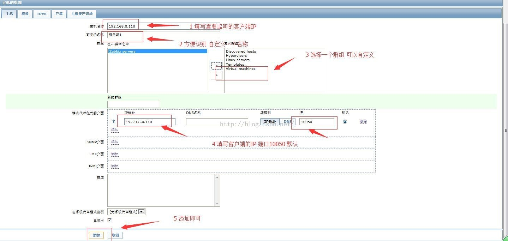
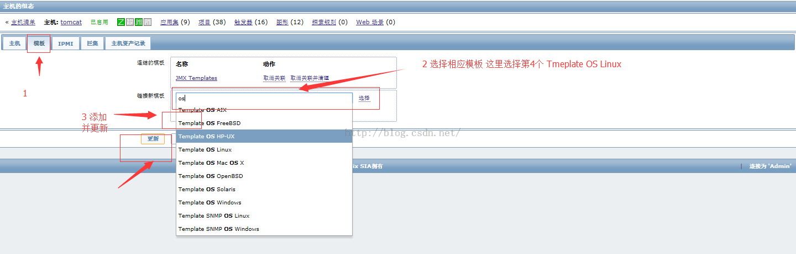
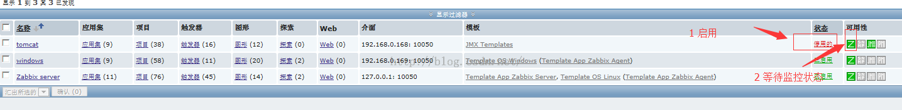

系统环境：CentOS6.6_64 Minimal

软件版本：zabbix2.4.4

下载地址：http://www.zabbix.com/download.php  //如果打不开网页，修复本地hosts可解决问题


# 编译安装zabbix
服务器端
```
cd /usr/local/src/
tar zxvf zabbix-2.4.4.tar.gz
cd zabbix-2.4.4
yum -y install java java-devel  //如果不需要监控tomcat，此条可省略
yum install -y net-snmp-devel mysql-devel curl-devel libcurl-devel libssh2-devel.x86_64 php-pecl-ssh2.x86_64
./configure --prefix=/usr/local/zabbix --enable-server --enable-agent --with-mysql --enable-ipv6 --with-net-snmp --with-libcurl --with-ssh2  --with-libxml2 --enable-java
make && make install
```

# 创建用户组
```
groupadd zabbix
useradd -M zabbix -g zabbix -s /sbin/nologin

vim /etc/my.cnf  //查看sock路径
ll /tmp/mysql.sock  //sock是否存在
```

# 配置数据库及权限
```
/usr/local/mysql/bin/mysqladmin -u "root" password "nihao123!"  //为默认用户设置密码
mysql -uroot -pnihao123! -e "create database zabbix default charset utf8"
mysql -uroot -pnihao123! -e "grant all on zabbix.* to 'zabbix'@'localhost' identified by 'zabbix123'"
mysql -uroot -pnihao123! --default-character-set=utf8 zabbix < /usr/local/src/zabbix-2.4.4/database/mysql/schema.sql
mysql -uroot -pnihao123! --default-character-set=utf8 zabbix < /usr/local/src/zabbix-2.4.4/database/mysql/images.sql
mysql -uroot -pnihao123! --default-character-set=utf8 zabbix < /usr/local/src/zabbix-2.4.4/database/mysql/data.sql
```

# 配置启动文件
```
复制zabbix_server/agentd启动文件并设置开机启动
cp misc/init.d/fedora/core/zabbix_server /etc/init.d/
vim /etc/init.d/zabbix_server   //修改22 BASEDIR=/usr/local/zabbix
chmod 755 /etc/init.d/zabbix_server
chkconfig --add zabbix_server
chkconfig zabbix_server on
cp misc/init.d/fedora/core/zabbix_agentd /etc/init.d/
vim /etc/init.d/zabbix_agentd   //修改22 BASEDIR=/usr/local/zabbix
chmod 755 /etc/init.d/zabbix_agentd
chkconfig --add zabbix_agentd
chkconfig zabbix_agentd on
```

# 拷贝zabbix服务端文件
```
复制zabbix 网页文件到apache目录下
cp -R frontends/php /usr/local/apache2/htdocs/zabbix
```

# 创建数据库用户
```
修改zabbix_server.conf 中的数据库用户密码
sed -i 's/^DBUser=.*$/DBUser=zabbix/g' /usr/local/zabbix/etc/zabbix_server.conf
sed -i 's/^. DBPassword=.*$/DBPassword=zabbix123/g' /usr/local/zabbix/etc/zabbix_server.conf
109 DBSocket=/tmp/mysql.sock    
198 JavaGateway=127.0.0.1
206 JavaGatewayPort=10052
214 StartJavaPollers=5
```

添加服务端口 //此步骤省略 仅供参考，当然加上也不会报错
```
cat >>/etc/services <<EOF
zabbix-agent 10050/tcp Zabbix Agent
zabbix-agent 10050/udp Zabbix Agent
zabbix-trapper 10051/tcp Zabbix Trapper
zabbix-trapper 10051/udp Zabbix Trapper
EOF
```

# 启动服务
```
service zabbix_server start;service zabbix_agentd start
ps aux |grep zabbix
netstat -lnp |grep 10050  //查看10050端口
```

# 修改php错误
网页安装 修改相关错误
```
http://IP/zabbix   //默认用户名密码 admin zabbix
sed -i 's/^post_max_size.*$/post_max_size = 16M/g' /usr/local/php/etc/php.ini
sed -i 's/^max_execution_time.*$/max_execution_time = 300/g' /usr/local/php/etc/php.ini
sed -i 's/^max_input_time.*$/max_input_time = 300/g' /usr/local/php/etc/php.ini
sed -i 's/^.date.timezone.*$/date.timezone = PRC/g' /usr/local/php/etc/php.ini
chmod 777 /usr/local/apache2/htdocs/zabbix/conf/
/usr/local/apache2/bin/apachectl restart
```
```
修改zabbix3.0.0php错误
vim /usr/local/apache2/htdocs/zabbix/include/classes/setup/CFrontendSetup.php
```


# 修改字体乱码
```
修改监控图形字体乱码(楷体)
cd /usr/local/src/
cp simsun.ttc /usr/local/apache2/htdocs/zabbix/fonts/DejaVuSans.ttf   //编译安装路径
mv simsun.ttc /usr/share/fonts/dejavu/DejaVuSans.ttf   //YUM安装路径

修改zabbix3.0.0支持中文
vim /usr/local/apache2/htdocs/zabbix/include/locales.inc.php
```



# 修改中文繁体为简体
```
修改中文繁体为简体
将Zabbix-3.0-zh_CN.zip拷贝到如下路径
[root@wwj ~]# /usr/local/apache2/htdocs/zabbix/locale/zh_CN/LC_MESSAGES
[root@wwj LC_MESSAGES]# ../../make_mo.sh frontend.po
```

# 修改监听端口
错误信息：
```
zabbix server is not running: the information displayed may not be curren
Can't connect to local MySQL server through socket '/var/lib/mysql/mysql.sock' (2)
netstat -lnp |grep 10051    //监听不到10051端口
解决办法：
sed -i 's/^. DBSocket=.*$/DBSocket=/tmp/mysql.sock/g' /usr/local/zabbix/etc/zabbix_server.conf
```

# 增加防火墙
```
添加iptables
vim /etc/sysconfi/iptables
-A INPUT -m state --state NEW -m tcp -p tcp --dport 80 -j ACCEPT        //apache端口号
-A INPUT -m state --state NEW -m tcp -p tcp --dport 10050 -j ACCEPT    //agentd端口号
-A INPUT -m state --state NEW -m tcp -p tcp --dport 10051 -j ACCEPT    //server端口号
-A INPUT -m state --state NEW -m tcp -p tcp --dport 3306 -j ACCEPT    //mysql端口号

service iptables restart
systemctl restart iptables.service    //centOS7重启防火墙
```

# 编译客户端
编译安装zabbix   //linux客户端
```
cd /usr/local/src/
tar zxvf zabbix-2.4.4.tar.gz
cd zabbix-2.4.4
groupadd zabbix
useradd -M zabbix -g zabbix -s /sbin/nologin
yum -y install java java-devel  //监控tomcat,同样不需要可以省略
./configure --prefix=/usr/local/zabbix/ --enable-agent
make && make install
vim /usr/local/zabbix/etc/zabbix_agentd.conf  //添加服务器IP server为被动模式 serverActive 为主动模式
 81 Server=服务器ＩＰ
cp misc/init.d/fedora/core/zabbix_agentd /etc/init.d/
vim /etc/init.d/zabbix_agentd   //修改22 BASEDIR=/usr/local/zabbix
chmod 755 /etc/init.d/zabbix_agentd
chkconfig --add zabbix_agentd
chkconfig zabbix_agentd on

修改防火墙
vim /etc/sysconfig/iptables
-A INPUT -m state --state NEW -m tcp -p tcp --dport 10050 -j ACCEPT
service iptables restart
```




