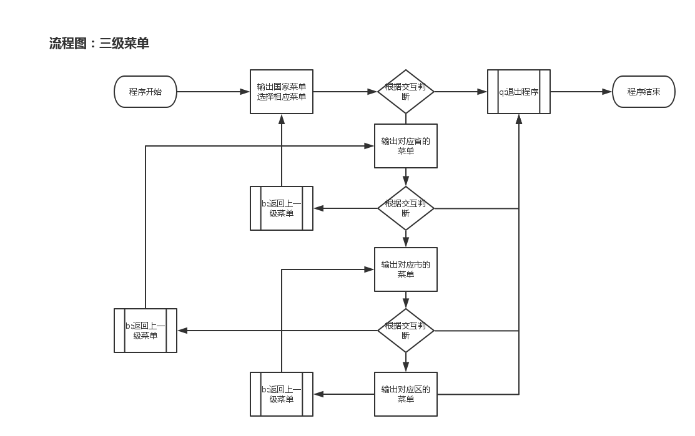

程序需求：
- 三级菜单;    国家--->省--->市--->区
- 可依次选择进入各子菜单；    各级菜单B返回上一级菜单、Q退出整个程序


程序流程图：


程序代码：
```
#!/usr/bin/env python
#  -*- coding:utf-8 -*-

dictionnary = {
    "华东":{
        "江苏":{"南京":{"鼓楼","秦淮","建邺"},"无锡":{"滨湖","梁溪","锡山"},"苏州":{"常熟","昆山","吴中"}},
        "安徽":{"合肥":{"蜀山","庐江","长丰"},"芜湖":{"新芜","鸠江","镜湖"},"蚌埠":{"淮上","禹会","蚌山"}},
        "浙江":{"宁波":{"海曙","江北","江东"},"绍兴":{"上虞","越城","诸暨"},"金华":{"义务","兰溪","婺城"}},
    },
    "华中":{
        "湖北":{"武汉":{"江岸","汉江","青山"},"宜昌":{"点军","夷陵","西陵"},"黄石":{"铁山","下陆","西塞"}},
        "湖南":{"长沙":{"芙蓉","天心","岳麓"},"衡阳":{"雁峰","石鼓","南岳"},"常德":{"武陵","鼎城","石门"}},
        "江西":{"南昌":{"东湖","西湖","青山"},"上饶":{"信州","广丰","上饶"},"九江":{"濂溪","浔阳","庐山"}},
    },
    "华南":{
        "广东":{"广州":{"番禺","花都","黄埔"},"深圳":{"罗湖","宝安","福田"},"珠海":{"香洲","斗门","金湾"}},
        "广西":{"南宁":{"良庆","兴宁","清秀"},"桂林":{"秀峰","七星","燕山"},"柳州":{"城中","鱼峰","柳江"}},
        "海南":{"海口":{"秀英","龙华","琼山"},"三亚":{"海棠","天涯","崖州"},"文昌":{"东阁","翁田","会文"}},
    },
}

while True:
    title1 = "中国大区"
    print(title1.center(50,"-"))
    for keys1 in dictionnary:
        print(keys1)
    print("按‘b’返回升一级菜单、按‘q’退出程序")
    select1 = input("请选择要进入的省市或者区域：")
    if select1 == 'q':
        exit()
    while True:
        if select1 in dictionnary.keys():
            for keys2 in dictionnary[select1]:
                print('\t',keys2)
            print("按‘b’返回升一级菜单、按‘q’退出程序")
            select2 = input("请选择要进入的省市或者区域：")
            if select2 == 'b':
                break
            elif select2 == 'q':
                exit()
            while True:
                if select2 in dictionnary[select1].keys():
                    for keys3 in dictionnary[select1][select2]:
                        print('\t\t',keys3)
                    print("按‘b’返回升一级菜单、按‘q’退出程序")
                    select3 = input("请选择要进入的省市或者区域：")
                    if select3 == 'b':
                        break
                    elif select3 == 'q':
                        exit()
                    while True:
                        if select3 in dictionnary[select1][select2].keys():
                            for keys4 in dictionnary[select1][select2][select3]:
                                print('\t\t\t',keys4)
                                print("按‘b’返回升一级菜单、按‘q’退出程序")
                                select3 = input("请选择要进入的省市或者区域：")
                                if select3 == 'b':
                                    break
                                elif select3 == 'q':
                                    exit()
```
