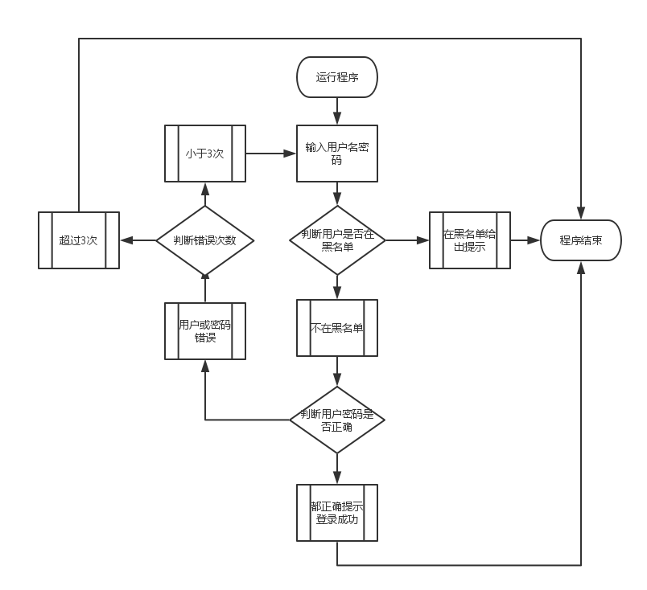

程序需求：
- 输入用户密码；
- 超过3次锁定；
- 锁定用户记录黑名单；


程序流程图：


程序代码：
```
#!/usr/bin/env python
#  -*- coding:utf-8 -*-
# #DESCRIPTION 输入用户密码、遍历用户是否在黑名单里、如果在黑名单、提示已经被锁退出、如果不在判断用户密码是否正确、正确给
# #出提示退出、不正确继续输入用户密码、超过3次锁定给出提示、可以继续输入其他用户。
# #AUTHOR WWJ
# #DATE 2016-09-07

import os,sys
name = "francis"
pwd = "nihao"
counter = 1

while True:
    username = input("Please input your name : ")
    userpasswd = input("Please intput your passwd : ")
    with open(r'D:\py_test\py_test\content.txt','r+') as blacklist:    # r是raw string的意思，即原始字符串，不进行任何转移，多用于正则
        for j in blacklist:
            if username == j.strip():
                print("This user has been locked!")
                exit()
            else:
                continue
        if counter < 3:
            if username == name and userpasswd == pwd:
                print("Welcome Login!")
                exit()
            else:
                print("Please input your password invalid、Enter again!")
                counter += 1
                continue
        else:
            print("Error more than 3、account is locked")
            blacklist.write(username+'\n')
        blacklist.close()
        counter = 0
```
