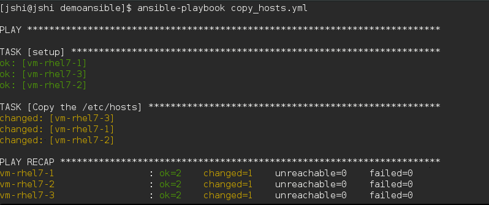

YML ansible的脚本语言，yaml有自己的格式
> Ansible官方提供了一些比较常用的、经过测试的Playbook例子：https://github.com//ansible//ansible-examples

> Playbook分享平台：https://galaxy.ansible.com//


# Playbook基本语法
```
$ ansible-playbook deploy.yml
查看输出的细节

ansible-playbook playbook.yml  --verbose
查看该脚本影响哪些hosts

ansible-playbook playbook.yml --list-hosts
并行执行脚本

ansible-playbook playbook.yml -f 10
完整的playbook脚本示例
```

## 最基本的playbook脚本分为三个部分
- 在什么机器上以什么身份执行
```
hosts
users
```

- 执行的任务是都有什么
```
tasks
```

- 善后的任务都有什么
```
handlers
```

deploy.yml文件
```
---
- hosts: webservers
  vars:
    http_port: 80
    max_clients: 200
  user: root
  tasks:
  - name: ensure apache is at the latest version
    yum: pkg=httpd state=latest
  - name: write the apache config file
    template: src=/srv/httpd.j2 dest=/etc/httpd.conf
    notify:
    - restart apache
  - name: ensure apache is running
    service: name=httpd state=started
  handlers:
    - name: restart apache
      service: name=httpd state=restarted
```

## 主机和用户（host&users）
| key | 含义 |
| :-- | :--- |
| hosts | 为主机的IP，或者主机组名，或者关键字all |
| user | 在远程以哪个用户身份执行。 |
| become | 切换成其它用户身份执行，值为yes或者no |
| become_method | 与became一起用，指可以为‘sudo’/’su’/’pbrun’/’pfexec’/’doas’ |
| become_user | 与bacome_user一起用，可以是root或者其它用户名 |

脚本里用became的时候，执行的playbook的时候可以加参数--ask-become-pass

ansible-playbook deploy.yml --ask-become-pass

## 执行的任务列表（Tasks）

tasks是从上到下顺序执行，如果中间发生错误，那么整个playbook会中止。你可以改修文件后，再重新执行。

每一个task的对module的一次调用。使用不同的参数和变量而已。

每一个task必须有一个name属性，这个是供人读的，然后会在命令行里面输出，提示用户执行情况。

### task的基本写法:
```
tasks:  
  - name: make sure apache is running
    service: name=httpd state=running
```
其中name是可选的可以直接 - service: name=httpd state=running
```
写name的task在playbook执行时，会显示对应的名字，信息更友好、丰富。写name是个好习惯！
TASK: [make sure apache is running] *************************************************************
changed: [yourhost]

没有写name的task在playbook执行时，直接显示对应的task语法!
TASK: [service name=httpd state=running] **************************************
changed: [yourhost]
```
参数太长可以分隔到多行
```
 tasks:
  - name: Copy ansible inventory file to client
    copy: src=/etc/ansible/hosts dest=/etc/ansible/hosts
              owner=root group=root mode=0644
```
 或者用yml的字典作为参数
```
 tasks:
  - name: Copy ansible inventory file to client
    copy:
      src: /etc/ansible/hosts
      dest: /etc/ansible/hosts
      owner: root
      group: root
      mode: 0644
```
### TASK的执行状态
task中每个action会调用一个module，在module中会去检查当前系统状态是否需要重新执行。 具体的判断规则由各个module自己实现。
- **如果本次执行了，那么action会得到返回值changed;**
- **如果不需要执行，那么action得到返回值ok**

"copy" module的判断方法是比较文件的checksum，代码如下：

[https://github.com/ansible/ansible-modules-core/blob/devel/files/copy.py](https://github.com/ansible/ansible-modules-core/blob/devel/files/copy.py)

状态示例

以一个copy文件的task为例子:
```
  tasks:
    - name: Copy the /etc/hosts
      copy: src=/etc/hosts dest=/etc/hosts
```
第一次执行,它的结果是这个样子的:


TASK的状态是changed

第二次执行是下面这个样子的:
TASK的状态是ok,由于第一次执行copy_hosts.yml的时候,已经拷贝过文件,那么ansible目标文件的状态避免重复执行. +


下面我更改vm-rhel7-1的\/etc\/hosts, 再次执行看看:


## 响应事件Handler

什么是handler?

每个主流的编程语言都会有event机制，那么handler就是playbook的event。

Handlers里面的每一个handler，也是对module的一次调用。而handlers与tasks不同，tasks会默认的按定义顺序执行每一个task，handlers则不会，它需要在tasks中被调用，才有可能被执行。

Tasks中的任务都是有状态的，changed或者ok。 **在Ansible中，只在task的执行状态为changed的时候，才会执行该task调用的handler，这也是handler与普通的event机制不同的地方。**

什么情况下使用handlers呢?


如果你在tasks中修改了apache的配置文件。需要重起apache。此外还安装了apache的插件。那么还需要重起apache。像这样的应该场景中，重起apache就可以设计成一个handler. +

一个handler最多只执行一次

在所有的任务里表执行之后执行，如果有多个task notify同一个handler,那么只执行一次。

在下面的例子里apache只执行一次

https://github.com/ansible-book/ansible-first-book-examples/blob/master/handlers_state.yml

```
---
- hosts: lb
  remote_user: root
  vars:
      random_number1: "{{ 10000 | random }}"
      random_number2: "{{ 10000000000 | random }}"
  tasks:
  - name: Copy the /etc/hosts to /tmp/hosts.{{ random_number1 }}
    copy: src=/etc/hosts dest=/tmp/hosts.{{ random_number1 }}
    notify:
      - call in every action
  - name: Copy the /etc/hosts to /tmp/hosts.{{ random_number2 }}
    copy: src=/etc/hosts dest=/tmp/hosts.{{ random_number2 }}
    notify:
      - call in every action

  handlers:
  - name: call in every action
    debug: msg="call in every action, but execute only one time"
```
action是Changed ,才会执行handler

只有当TASKS种的action的执行状态是changed时，才会触发notify handler的执行。

下面的脚本执行两次,执行结果是不同的:

第一次执行是，tasks的状态都是changed，会触发两个handler

第二次执行是,

第一个task的状态是OK，那么不会触发handlers"call by /tmp/hosts",

第二个task的状态是changed，触发了handler"call by /tmp/hosts.random_number"

测试代码见：

https://github.com/shijingjing1221/ansible-first-book-examples/blob/master/handlers_execution_time.yml
```
---
- hosts: lb
  remote_user: root

  vars:
      random_number: "{{ 10000 | random }}"
  tasks:
  - name: Copy the /etc/hosts to /tmp/hosts
    copy: src=/etc/hosts dest=/tmp/hosts
    notify:
      - call by /tmp/hosts
  - name: Copy the /etc/hosts to /tmp/hosts.{{ random_number }}
    copy: src=/etc/hosts dest=/tmp/hosts.{{ random_number }}
    notify:
      - call by /tmp/hosts.random_number

  handlers:
  - name: call by /tmp/hosts
    debug: msg="call first time"
  - name: call by /tmp/hosts.random_number
    debug: msg="call by /tmp/hosts.random_number"
```
按Handler的定义顺序执行

**handlers是按照在handlers中定义个顺序执行的，而不是安装notify的顺序执行的。**

下面的例子定义的顺序是1>2>3，notify的顺序是3>2>1，实际执行顺序：1>2>3.
```
---
- hosts: lb
  remote_user: root
  gather_facts: no
  vars:
      random_number1: "{{ 10000 | random }}"
      random_number2: "{{ 10000000000 | random }}"
  tasks:
  - name: Copy the /etc/hosts to /tmp/hosts.{{ random_number1 }}
    copy: src=/etc/hosts dest=/tmp/hosts.{{ random_number1 }}
    notify:
      - define the 3nd handler
  - name: Copy the /etc/hosts to /tmp/hosts.{{ random_number2 }}
    copy: src=/etc/hosts dest=/tmp/hosts.{{ random_number2 }}
    notify:
      - define the 2nd handler
      - define the 1nd handler

  handlers:
  - name: define the 1nd handler
    debug: msg="define the 1nd handler"
  - name: define the 2nd handler
    debug: msg="define the 2nd handler"
  - name: define the 3nd handler
    debug: msg="define the 3nd handler"
```
