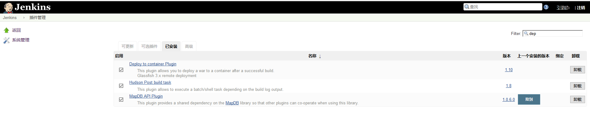
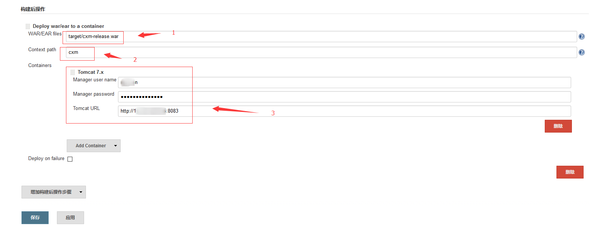
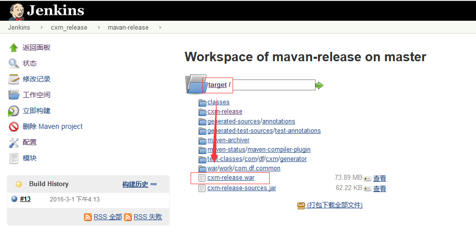

# tomcat
```
$ vim $tomcat/conf/tomcat-users.xml
<!--
  NOTE:  The sample user and role entries below are wrapped in a comment
  and thus are ignored when reading this file. Do not forget to remove
  <!.. ..> that surrounds them.
-->

  <role rolename="manager-script"/>
  <role rolename="admin-gui"/>
  <user username="abc123" password="abc123" roles="manager-script,admin-gui"/>
</tomcat-users>
```

# jenkins
## 需要安装的plugin-(Deploy to container Plugin)，如下图：


## 如图配置相关参数


### target/cxm-release.war查看工作空间如实填写即可


### 浏览器访问的名称：192.168.1.1/cxm，可以自定义
### tomcat配置的用户名密码以及访问路径端口
