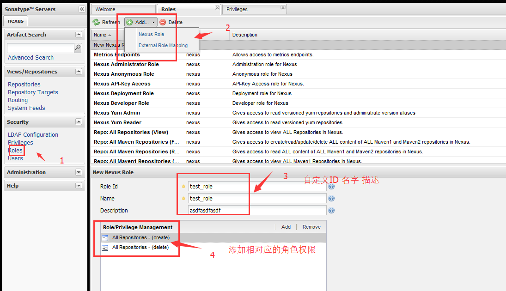

Nexus是基于权限做访问控制的，服务器的每一个资源都有对应的权限来控制，因此用户执行特定的操作时就必须拥有必要的权限。管理员必须以角色的方式将权限赋予Nexus用户。用户可以被赋予一个或者多个角色，角色可以包含一个或多个权限，角色还可以包含一个或者多个其他角色。

**Nexus上预定义了三个用户，用admin登录后，单击页面左边的User链接，看到如下图列表：**

- admin：该用户拥有Nexus的全部权限，默认密码为admin123;
- deployment：该用户能够访问Nexus，浏览仓库内容、搜索、上传部署构件，但是不能对Nexus进行任何配置，默认密码为deployment123;
- anonymous：该用户对应了所有未登录的匿名用户，它们可以浏览仓库并进行搜索;

**Nexus预定义了一些常用且重要的角色，如：**
- UI:Basic UI Privileges：包含了访问Nexus界面必须的最基本的权限;
- UI:Repository Browser：包含了浏览仓库页面所需要的权限;
- UI:Search：包含了访问快速搜索栏及搜索界面所需要的权限;
- Repo:All Repositories (Read)：给予用户读取所有仓库内容的权限。没有仓库的读权限用户将无法再仓库页面看到实际的仓库内容，也无法使用Maven从仓库下载构件;
- Repo:All Repositories (Full Control)：给予用户完全控制所有仓库内容的权限。用户不仅可以浏览、下载构件，还可以部署构件及删除仓库内容;

**为项目分配独立的仓库**
如果我们将所有项目的快照版本和发布版本构件都部署到同样的仓库，就有潜在的冲突以及安全问题。我们不想让项目A的部署影响到项目B，也不想让项目B的部署影响到项目A，那么解决方法就是为每个项目分配独立的仓库，并且只将仓库的部署、修改和删除权限赋予该项目的成员，其他用户只能拥有读取、下载和搜索该仓库内容的权限。步骤如下：

## 创建项目库
单击Nexus界面左边导航栏中的Repositories链接，在右边的面板中选择Add，在下拉菜单中选择Hosted Repository。接着在下面的面板中填写仓库的ID和名称，选择Repository Policy为Release，选择Deployment Policy为Allow Redeploy，其他的选项默认。点击Save按钮。

## 创建权限

有了仓库以后，就需要创建基于仓库的增、删、查、改权限了。Nexus中增删查改的权限是基于Repository Target建立的。单击Nexus界面导航栏中的Repository Targets链接，可以看到Repository Target的相关信息。
点击页面导航栏中“Security”->“Privileges”->单击Add按钮，选择“Repository Target Privilege”

 保存后在列表中看到相应的增、删、改、查权限、如下图：
 

## 创建角色
如果我们创建一个包含上述权限的角色的话就能更方便管理了。创建角色步骤如下：
从导航的“Roles”链接进入角色界面，单击上方的“Add按钮”选择“Nexus Role”。填写相关内容，并将fooReleases项目分配给角色。

 搜索权限并添加：
 

## 创建用户
点击导航的“Users”链接，进入用户界面，然后单击“Add”按钮并选择“Nexus User”。填写相关内容。并授予用户角色信息
 
同上步骤创建该项目的Snapshots库。

**Nexus的调度任务**
在第一次配置Nexus的时候，Maven索引怎么也下载不下来，然后在网上找了一些资料才知道有调度任务这个东西的存在。后来有在《Maven实战》中看到。摘录如下:
Nexus提供了一系列可配置的调度任务来方便用户管理系统。用户可以设定这些任务运行的方式，例如每天、每周等。调度任务会在适当的时候在后台运行。
要建立一个调度任务，单击左边导航菜单中的“Scheduled Tasks”，然后再右边的界面上单击Add按钮，按照页面上的提示填写相关内容。

**Nexus包含了以下几种类型的调度任务：**
- Download Indexs：为代理仓库下载远程索引。
- Empty Trash：清空Nexus的回收站，一些操作实际是将文件移到了回收站中。
- Evict Unused Proxied Items From Repository Caches：删除代理仓库中长期未被使用的构件缓存。
- Expire Repository Cache：Nexus为代理仓库维护了远程仓库的信息以避免不必要的网络流量，该任务清空这些信息以强制Nexus去重新获取远程仓库的信息。
- Publish Indexs：将仓库索引发布成可供m2eclipse和其他Nexus使用的格式。
- Purge Nexus Timeline：删除Nexus的时间线文件，该文件用于建立系统的RSS源。
- Rebuild Maven Metadata Files：基于仓库内容重新创建仓库元数据文件maven-metadata.xml，同时重新创建每个文件的校验和md5与sha1。
- ReIndex Repositories：为仓库编纂索引。
- Remove Snapshots From Repositories：以可配置的方式删除仓库的快照构件。
- Synchronize Shadow Repository：同步虚拟仓库的内容（服务基于Maven1）
