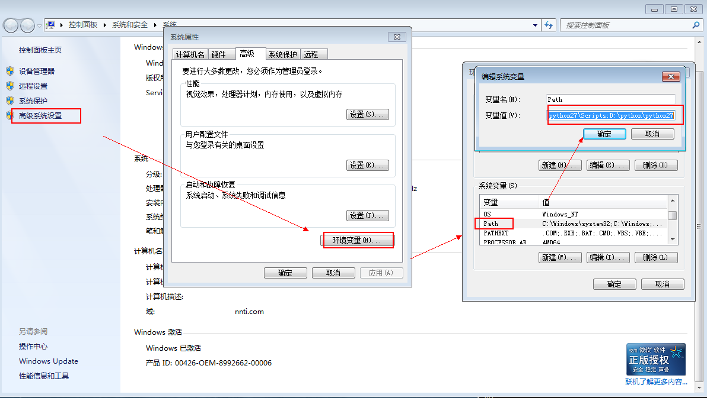
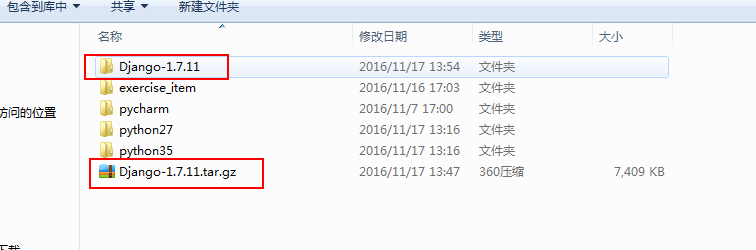
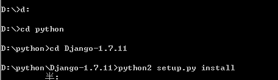
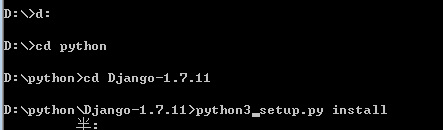
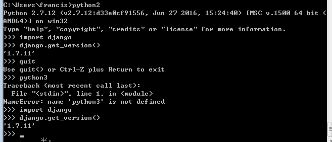

# python环境变量
## 环境变量里添加
```
D:\python\python35\Scripts;D:\python\python35;D:\python\python27\Scripts;D:\python\python27
```

## 修改对应文件
去python35/python27安装目录下 修改python.exe   为python2.exe       python3.ext


```
Django环境变量 windows下
1、下载环境变量：https://www.djangoproject.com/download/
2、解压至和python同级的根目录：如图
```


# 安装Django
Windows+R   cmd 进入命令行模式




# 配置环境变量
添加如下两条：
```
D:\python\python27\Lib\site-packages\Django-1.7.11-py2.7.egg
D:\python\python35\Lib\site-packages\Django-1.7.11-py3.5.egg
```

# 测试成功


**Django环境变量 linux下**
```
$ yum install setuptools
$ easy_install django
$ python >>import django
 >> import django
 >> django.VERSION (1, 6, 5, 'final', 0)
 >>> 我们可以看到输出了Django的版本号，说明安装成功。

pip 命令安装方法 pip install Django 源码安装方法下载源码包：https://www.djangoproject.com/download/ 输入以下命令并安装：
```
tar xzvf Django-X.Y.tar.gz # 解压下载包
cd Django-X.Y # 进入 Django 目录
python setup.py install # 执行安装命令安装成功后 Django 位于 Python 安装目录的 site-packages 目录下。
```
