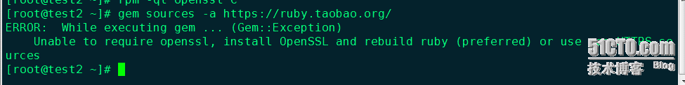
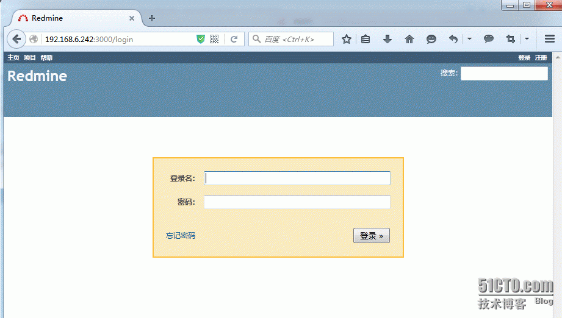

Redmine是一款项目管理系统，基于Web方式的BUG管理平台.Redmine是用Ruby（编程语言）语言下的ROR框架开发的基于web的项目管理软件。Redmine建立在Ruby on Rails的框架之上，它可以夸平台和数据库。ROR=Ruby on Rails,ROR用于编写网络应用程序的框架redmine优点：支持多种数据库，自己独特的功能，例提供线路图、甘特图、wiki、新闻台，邮件发送等。也集成其他版本管理系统和BUG跟踪系统，SVN、CVS、TD等等。

# 系统环境
Linux-CentOS6.6-X86_64-minimal

**一定要先安装LAMP环境、因为下边操作需要安装LAMP时候的一些依赖包**

软件版本：
- ruby-2.1.5.tar.gz
- rubygems-2.4.5.tgz
- rails-3.2
- redmine-2.6.0.tar.gz

版本确认：Redmine需要考虑Ruby版本兼容性问题

| Redmine version | Supported Ruby versions | Rails version used |
| :--- | :--- | :--- |
| current trunk | ruby 1.9.33, 2.0.02, 2.1, 2.21 | Rails 4.20
| 3.0 | ruby 1.9.33, 2.0.02, 2.1, 2.21 | Rails 4.20
| 2.6 | ruby 1.8.74, 1.9.2, 1.9.33, 2.0.02, 2.1, 2.2, jruby-1.7.6 | Rails 3.2

详情参考官网：http://www.redmine.org/projects/redmine/wiki/RedmineInstall


**这个文档是做完试验写的、很多命令都是手动敲的、如果执行错误首先检查命令、此外本人在做本次试验的时候遇到太多的错误、可能小伙伴们按照我的操作会没有错误、但是我还是把我在试验时候的所有错误信息都描述出来、希望你们少走弯路、另外提醒一下、有些命令必须在相应目录才可以的、注意路径**

**安装ruby的2中方法（1、编译安装；2、通过RVM工具安装）本实验编译安装、RVM略作介绍**

# 编译安装
## 安装依赖
```
[root@test2 ~]# cd /usr/local/src/
[root@test2 ~]# wget http://cache.ruby-lang.org/pub/ruby/2.1/ruby-2.1.5.tar.gz
[root@test2 src]# tar zxvf ruby-2.1.5.tar.gz
[root@test2 src]# cd ruby-2.1.5
[root@test2 ruby-2.1.5] rpm -ql openssl    //查看openssl安装位置、编译的时候需要指定
[root@test2 ruby-2.1.5]# ./configure --prefix=/usr/local/ruby --with-openssl=/usr/share/doc/openssl-1.0.1e   
[root@test2 ruby-2.1.5]# make && make install
[root@test2 ruby-2.1.5]# echo $?
0
[root@test2 src]# vim /etc/profile        //配置环境变量
export PATH=/usr/local/ruby/bin:$PATH     //第77行
```

```
[root@test2 src]# source /etc/profile
[root@test2 src]# ruby -v        //查看ruby版本号
ruby 2.1.5p273 (2014-11-13 revision 48405) [x86_64-linux]

[root@test2 src]# ruby -version
ruby 2.1.5p273 (2014-11-13 revision 48405) [x86_64-linux]
-e:1:in `<main>': undefined local variable or method `rsion' for main:Object (NameError)
```
ruby -v和ruby -version的结果不一样、ruby -version会报错、原因如下：

百度给出的答案：大概的意思就是说两个参数执行方式不一样

If you run 'ruby -version’.since you only use a single dash,the word 'version' isn't treated as a single flag but instead as a list of flags. in this case,it picks up the -v flag.which prints the version information.Then it tries to process the a flag.which basically says "the rest of this line is a ruby script to execute".So ruby faithfully attempts to parse "rsion",which is where you're getting the NameError.

```
#Ruby Version Manager简称RVM,是一款非常好用的ruby版本管理以及安装工具的命令行工具，可以提供#一个便捷的多版本ruby环境的管理和切换。
#安装RVM，RVM用于安装ruby。
#curl -L https://get.rvm.io | bash -s stable
#指定RVM路径
#source ~/.rvm/scripts/rvm
#确认RVM版本
#rvm -v
#参考结果：
#rvm 1.22.17 (stable) by Wayne E. Seguin <wayneeseguin@gmail.com>, Michal Papis <mpapis@gmail.com> [https://rvm.io/]
#安装ruby 2.0.0，注意，如果你用yum或apt安装的话，很可能会低于这个版本，这样的话，后续步骤可能就不一样了。
#rvm install 2.0.0
#设置ruby默认版本
#rvm 2.0.0 --default
```

## 安装rails并测试
安装gem(gem是一种文件组织的包，一般的ruby的很多插件都有由这种各种的包提供)
```
[root@test2 ~]# cd /usr/local/src/
[root@test2 ~]# wget http://production.cf.rubygems.org/rubygems/rubygems-2.4.5.tgz
[root@test2 src]# tar zxvf rubygems-2.4.5.tgz
[root@test2 src]# cd rubygems-2.4.5
[root@test2 rubygems-2.4.5]# ruby setup.rb
[root@test2 rubygems-2.4.5]# gem -v    //查看gem版本
2.4.5
[root@test2 rubygems-2.4.5]# which gem
/usr/local/ruby/bin/gem
```

在做第一次试验的时候   which gem 显示的路径是/usr/local/bin 继续往下做 gem install的时候会报错、具体原因我也不清楚、重新做了一遍就好了、后几次的试验一直没出现过这个问题

gem安装rails3.2版本
由于国内网络原因（你懂的），导致rubygems.org存放 Amazon S3上面的资源文件间歇性连接失败。所以你会与遇到gem install rack或bundle install的时候半天没有响应，具体可以用gem install rails -V来查看执行过程。下面替换成淘宝的GEM镜像站：      
感谢马云大叔  感谢马云大叔 感谢马云大叔 重要的事情说3遍！！！~

详情参考：https://ruby.taobao.org/

gem更换阿里源
```
[root@test2 rubygems-2.4.5] cd /usr/local/src
[root@test2 src] gem sources -l    //查看源、可以看到现在是ruby官方源
*** CURRENT SOURCES ***
https://rubygems.org/
[root@test2 src] gem sources --remove https://rubygems.org/    //移除ruby源
https://rubygems.org/ removed from sources
[root@test2 src] gem sources --add https://rubygems.org/    //添加阿里源
https://rubygems.org/ removed from sources
错误提示：
```

```
解决办法：gem sources -a https://ruby.taobao.org/
[root@test2 src] gem sources -l    //更换阿里源成功！
*** CURRENT SOURCES ***
https://ruby.taobao.org/
#gem sources -u    //刷新源使其生效、默认不用执行这条语句就生效
#我选择安装Redmine-2.6版本，根据版本兼容性rails需要安装3.2版本
#rails所有版本的下载地址：https://rubygems.org/gems/rails/versions
[root@test2 src] gem install rails -v=3.2
[root@test2 src] rails -v
Rails 3.2.19
```

如果是在LAMP环境下不会出现问题、否则linux-Minmal默认没有zlib-devel依赖包、即便现在安装也会报错、原因应该是安装ruby的时候就需要编译进去、错误如下：
``````
ERROR:  Loading command: install (LoadError)  
no such file to load — zlib  
ERROR:  While executing gem … (NameError)  
uninitialized constant Gem::Commands::InstallCommand
```

如果在编译ruby的时候不指定openssl到这gem安装的时候会报错、如下图：



## 安装redmine并配置
```
[root@test2 src]# wget http://www.redmine.org/releases/redmine-2.6.0.tar.gz
[root@test2 src]# tar zxvf redmine-2.6.0.tar.gz
[root@test2 src]# mv redmine-2.6.0 /usr/local/redmine
[root@test2 src]# cd /usr/local/redmine
#创建redmine数据库、并赋予redmine用户权限
[root@test2 redmine]# mysql -uroot -p密码 -e "create database redmine character set utf8;"
[root@test2 redmine]# mysql -uroot -p密码 -e "GRANT ALL PRIVILEGES ON redmine.* TO 'redmine'@'localhost' IDENTIFIED BY 'redmine';"
#gem安装mysql2提高性能
[root@test2 redmine]# gem install mysql2
#复制一份redmine的数据配置文件并修改相关配置
#[注意路径在$redmine/config、本次试验redmine根目录/usr/local/redmine]
[root@test2 redmine]# cd config
[root@test2 config]# pwd
/usr/local/redmine/config
[root@test2 config]# cp database.yml.example database.yml
[root@test2 config]# vim database.yml
#根据实际环境修改相应模块、本次试验修改生产环境、数据库在本机、默认3306端口、所以只需要修改username、password、
#############################################################
production:
  adapter: mysql2
  database: redmine
  host: localhost
#  prot: 3306    //如果修改过mysql端口、那么要添加这一行、默认不写就是3306
  username: redmine
  password: "redmine"
  encoding: utf8
#############################################################
如下图：
```


安装redmine依赖的所有ruby包、这里会用到一个工具bundler、介绍如下：

bundler是用来管理ruby的包依赖的工具使用Ruby语言写的，通过跟踪和安装运行Ruby项目所需要的确切的gem和版本,为Ruby项目提供了完整的可运行环境。

Bundler跳出了复杂的环境依赖，并且确保下载你在development, staging, and productionBundler这三个阶段所需要的gem源。开始一个项目的工作只需要一个简单的命令：bundle install

Bundler是一种有用的工具，它能使你更方便地跟踪某个应用程序所依赖的gem（以及这些gem的版本）。它通过安装应用程序的Gemfile中的所有gem来做到这一点。

bundle使用方法，在redmine根目录直接执行bundle 会以特殊颜色提示你、需要安装的依赖包
```
[root@test2 config]# cd ..
[root@test2 redmine]# gem install bundle    //gem install bundler 加不加r 都可以 匪夷所思。。。
[root@test2 redmine]# bundle install --without development test rmagick
#这里需要注意如果bundele install的时候连接出错、错误如下：
```


那么需要修改 bundle 的源
```
[root@test2 redmine]# bundle config mirror.https://rubygems.org https://ruby.taobao.org   
```
继续执行bundel install就可以了 时间稍长 等一会就好了

如果你安装了 ImageMagick（redmine会调用它处理图片，pdf文件）
```
#[root@test2 redmine]# yum install  ImageMagick
#[root@test2 redmine]# bundle install --without development test
```

为Rails生成cookies秘钥
```
[root@test2 redmine]# rake generate_secret_token
```

创建数据库结构
```
[root@test2 redmine]# RAILS_ENV=production rake db:migrate
```

生成缺省数据,设置语言为zh

```
[root@test2 redmine]# RAILS_ENV=production REDMINE_LANG=zh rake redmine:load_default_data
```

需要创建：附件存储目录 public/plugin_assets，图片/pdf目录等。并修改redmine根目录用户，以便于和apache或nginx整合
```
[root@test2 redmine]# mkdir -p tmp tmp/pdf public/plugin_assets
```

这个步骤可以省略、本次试验用的apache默认用户是daemon、根据实际情况设置权限
```
#[root@test2 redmine]# chown -R www:www /usr/local/$apache/htdos or $nginx/wwwroot
```

在WEBrick服务上测试Redmine是否安装成功(WEBrick是Ruby标准库带的一个小型的HTTP服务器程序、默认端口3000)
```
[root@test2 redmine]# ruby script/rails server webrick -e production
```
如下图：


浏览器效果：http://IP:3000 默认：login: admin    password: admin


如果验证成功、ctrl+c 结束程序


## 整合redmin和apache
```
[root@test2 redmine]# gem install passenger//时间稍长一些、慢慢等待
[root@test2 redmine]# passenger-install-apache2-module
```
一路回车、看以看到如下图所示、提示你需要安装的依赖包、这些依赖包有的是安装了、但是没检测到路径而已、例如：httpd我试安装了的

```
[root@test2 redmine]# yum install -y libcurl-devel httpd-devel apr-devel apr-util-devel
[root@test2 redmine]# passenger-install-apache2-module
```


如上图所示、可以看到 我这样貌似安装重复了、按照提示我再次执行passenger-install-apache2-module但是需要指定apache2.2.16的路径和apr-devel的配置文件
```
[root@test2 redmine]#  passenger-install-apache2-module --apxs2-path=/usr/local/apache2/bin/apxs --apr-config-path=/usr/bin/apr-1-config
```


这次可以看到、没有错误了、Y 确认安装（这个地方有点麻烦了、可能是因为我安装依赖包的时候有安装了一次httpd、感觉直接指定httpd2.2.16就可以安装）


根据提示、把这段代码粘贴到/usr/local/apache2/conf/httpd.conf的任意位置、并指定DocumentRoot
```
108 DocumentRoot "/usr/local/redmine/public"
```

修改后ENTER确认、如下图：


重启apache、可以去浏览器访问了


我的出现了Forbidden、所以我更改了一下directory


大功告成。。。。。。。。。。。。。。。。。。。。。
