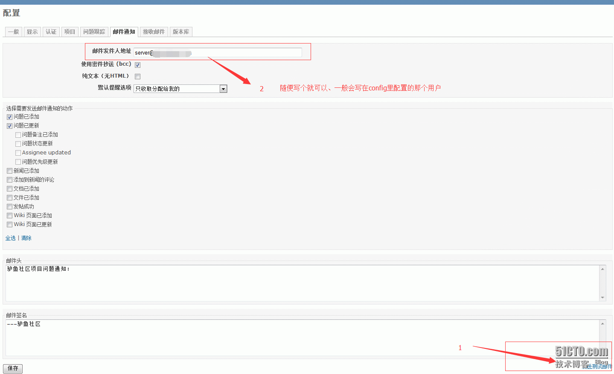

redmine当创建问题指派给某人的时候、为了能及时通知到、所以这个邮件功能还是非常管用的、而且配置起来非常简单。

1、打开redmine的配置文件
默认是没有配置文件的、所以需要你复制一份
```
$ cd $redmine/config
$ cp configuration.yml.example configureation.yml
$ vim $redmine/config/
# ==== SMTP server at example.com using LOGIN authentication and checking HELO for foo.co    m
#  email_delivery:
   delivery_method: :smtp    //默认
   smtp_settings:    //默认
     address: smtp.exmail.qq.com    //修改为腾讯或者其他邮件服务器地址
     port: 25    //25或者443
     authentication: :login    //默认
     domain: exmail.qq.com    //域名按需填写
     user_name: "server@qq.com"    //邮箱账号
     password: "sdfasdf"    //邮箱密码
```


登录redmine、测试并配置发邮件

