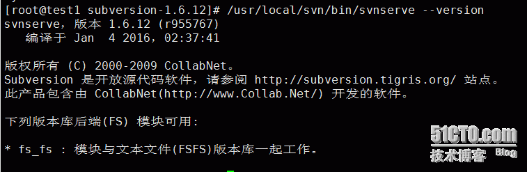
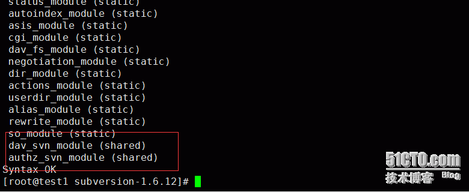
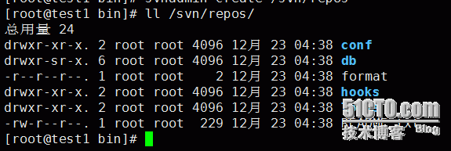
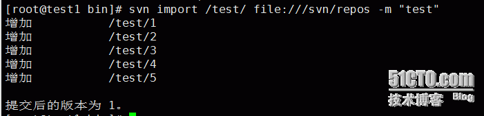
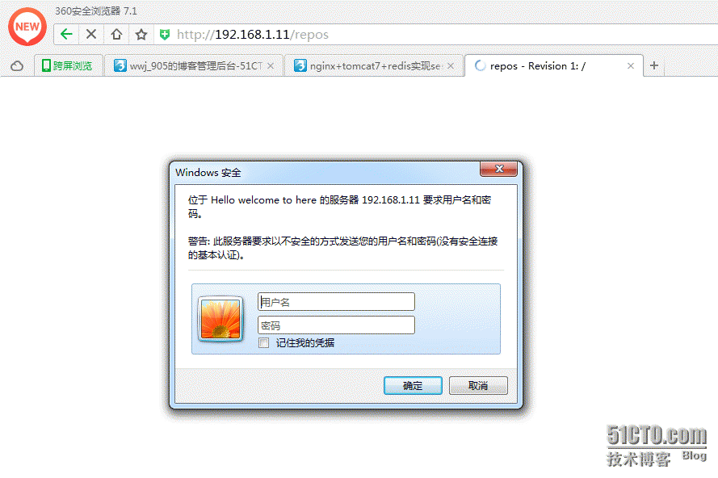
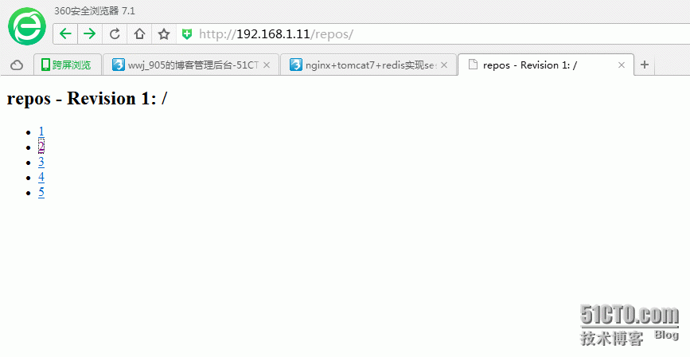

# 关于mod_dav_svn模块
由于Subversion需要版本化的控制，因此标准的HTTP协议不能满足需求。要让Apache与Subversion协同工作，就要使用WebDAV（Web-based Distributed Authoring and Versiong）Web分布式创作和版本控制协议。WebDAV是HTTP 1.1的扩展，关于WebDAV的规范和工作原理，可以参考IETF RFC 2518。

mod_dav_san模块就是作为Subversion与Apache之间的接口，通过它，Apache就可以访问版本库，并且可以让客户端也使用HTTP的扩展协议WebDAV/DeltaV进行访问。

# 实验环境
CentOS6.5-x86-64-minimal

所需软件包：
- apr-1.2.12.tar.gz
- apr-util-1.2.12.tar.gz
- httpd-2.2.16.tar.gz
- neon-0.30.1.tar.gz
- subversion-1.6.12.tar.gz
- subversion-deps-1.6.12.tar.gz

本次实验关闭防火墙及selinux、yum安装过Development tools包

# 安装
## 编译安装apr、apr-util
```
[root@test1 src]# pwd
/usr/local/src
[root@test1 src] tar zxvf apr-1.2.12.tar.gz
[root@test1 src] cd apr-1.2.12
[root@test1 apr-1.2.12]# ./configure
[root@test1 apr-1.2.12]# make && make install
[root@test1 apr-1.2.12]# cd ..
[root@test1 src]# tar zxvf apr-util-1.2.12.tar.gz
[root@test1 src]# cd apr-util-1.2.12
[root@test1 apr-util-1.2.12]# ./configure --with-apr=/usr/local/apr
[root@test1 apr-util-1.2.12]# make && make install
[root@test1 apr-util-1.2.12]# cd ..
[root@test1 src] tar zxvf httpd-2.2.16.tar.gz
```

## 编译安装httpd
```
[root@test1 src] cd httpd-2.2.16
[root@test1 httpd-2.2.16]# ./configure --prefix=/usr/local/apache --with-apr=/usr/local/apr/bin/apr-1-config --with-apr-util=/usr/local/apr/bin/apu-1-config --enable-so --enable-dav --enable-mainta  --enable-iner-mode --enable-rewrite
[root@test1 httpd-2.2.16]# make && make install
[root@test1 httpd-2.2.16]# ps aux |grep httpd
[root@test1 httpd-2.2.16]# /usr/local/apache/bin/apachectl start
```

## 编译安装subversion
```
[root@test1 httpd-2.2.16]# cd ..
[root@test1 src]# tar zxvf subversion-1.6.12.tar.gz
[root@test1 src]# tar zxvf subversion-deps-1.6.12.tar.gz //两个包解压到一个目录
[root@test1 src]# cd subversion-1.6.12
[root@test1 subversion-1.6.12]# ./configure --prefix=/usr/local/svn --with-apxs=/usr/local/apache/bin/apxs --with-apr=/usr/local/apr/bin/apr-1-config --with-apr-util=/usr/local/apr/bin/apu-1-config --with-ssl --with-zlib=/usr/share/doc/zlib-1.2.3 --enable-maintainer-mode
```

1> configure: error: could not find library containing RSA_new
```
yum install openssl-devel
```

2> configure: error: no XML parser was found: expat or libxml 2.x required

```
yum install expat-devel
[root@test1 subversion-1.6.12]# make && make install
```
3> make的时候出现 undefined reference to SSL_SESSION_cmp

安装subversion.1.6.11时，如果对应的neon版本为 neon-0.25.5.tar.gz，就会出现这个错误，根据网上的资料得知，在neon的高版本上已经修复这个错误，于是到其官方网站http://www.webdav.org/neon/ 下载最新版的neon-0.29.3，将其解压到subversion的源码目录中，并改名为neon，再次编译，成功！
```
[root@test1 subversion-1.6.12]# /usr/local/svn/bin/svnserve --version  \
```

```
[root@test1 subversion-1.6.12]# /usr/local/apache/bin/apachectl -M
```

```
[root@test1 subversion-1.6.12]# cd /usr/local/svn/bin
```

## 建立版本仓库
```
[root@test1 bin]# mkdir /svn    //为了好区分目录、创建了一个svn的目录
[root@test1 bin]# svnadmin create /svn/repos    //创建一个仓库名字为repos
[root@test1 bin]# ll /svn/repos/   //如果多了一些文件则说明版本库已经创建好  
```


导入项目文件到版本库

把路径/test下的测试项目文件导入到你创建的/svn/repos仓库中去，提交后的修订版为1

建立/test/1到5个测试文件
```
[root@test1 bin]# mkdir /test
[root@test1 bin]# touch /test/1 2 3 4 5
[root@test1 svn]# svn import /test/ file:///svn/repos -m "testzhushi"
```


## 创建用户账号并分配权限
创建svn账户user1 -c 表示创建文件 第二个用户取消-c 否则覆盖之前的用户 文件名自定义
```
[root@test1 bin]# /usr/local/apache/bin/htpasswd -c /svn/passwd user1
[root@test1 bin]# /usr/local/apache/bin/htpasswd  /svn/passwd user2
```

## 创建svn权限配置文件 文件名自定义
```
[root@test1 bin]# vim /svn/authz
[groups]
admin = user1，user2
user = user3,user4


[/]
* = rw    //全部用户在仓库的根目录具有读写权限
@admin = rw    //admin组在仓库的根目录具有读写权限


[repos:/]    //定义仓库下repos目录的权限
user3 = rw    user3具有读写权限
@user = w
```

## 配置apache支持svn
```
[root@test1 bin]# vim /usr/local/apache/conf/httpd.conf

<Location /repos>    //指定访问svn仓库的路径
        DAV svn    //定义标签
        SVNPath /svn/repos    //仓库的真实路径
        AuthType Basic    //认证方式为基本认证
        AuthName "Hello welcome to here"    //访问提示语
        AuthUserFile /svn/passwd    //用户文件位置
        AuthzSVNAccessFile /svn/authz    //权限文件位置
        Require valid-user    //设置需要认证才能访问
</Location>
```

## 为svn目录分配适合的权限、启动并测试
源码编译的httpd默认用户为daemon、yum的默认为apache、为了安全可以自行更改
```
[root@test1 bin]# chown -R daemon:daemon /svn/
[root@test1 bin]# chmod -R 700 /svn
[root@test1 bin]#  /usr/local/svn/bin/svnserve -d -r /svn/repos
[root@test1 bin]#  /usr/local/apache/bin/apachetcl restart


[root@test1 bin]# ps aux |grep svn
root     129174  0.0  0.0 138860   632 ?        Ss   04:54   0:00 /usr/local/svn/bin/svnserve -d -r /svn/repos/
root     129212  0.0  0.0 103248   884 pts/1    S+   05:14   0:00 grep svn
```


