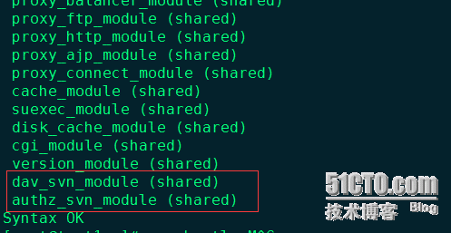
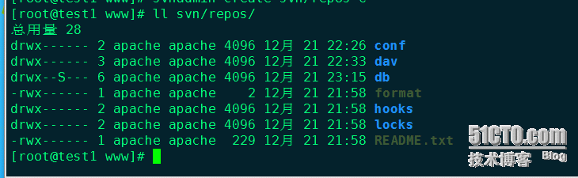
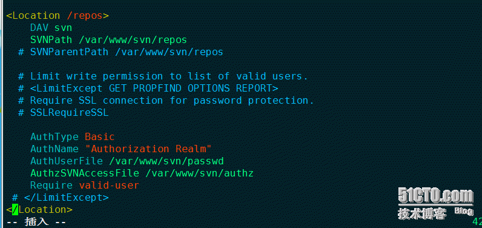
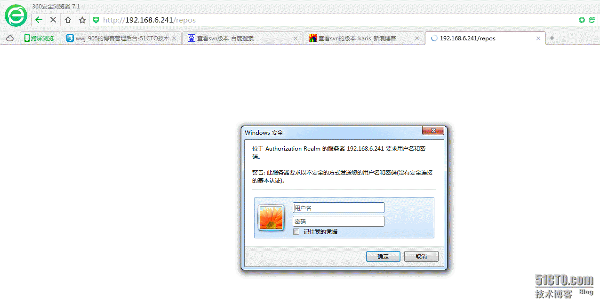
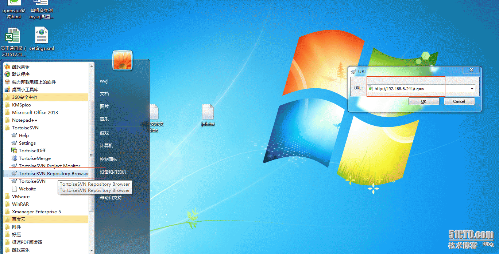

系统环境：CentOS6.5_x86_64 minimal

# 安装前检查
检查是否安装了httpd、mod_dav_svn(实现apache+svn的一个模块)、subversion(默认是安装的、需要yum remove subversion卸载掉)
```
[root@test3 ~]# rpm -ql httpd
package httpd is not installed
[root@test3 ~]# rpm -ql mod_dav_svn
package mod_dav_svn is not installed
[root@test3 ~]# rpm -ql subversion
/etc/bash_completion.d
/etc/bash_completion.d/subversion
[root@test3 ~]# yum remove -y subversion
[root@test3 ~]# rpm -ql subversion
package subversion is not installed
```

# yum安装并查看版本信息
```
[root@test3 ~]# yum install -y httpd mod_dav_svn subversion
[root@test1 ~]# httpd -v
Server version: Apache/2.2.15 (Unix)
Server built:   Dec 15 2015 15:50:14
[root@test1 ~]# svnversion --version
svnversion，版本 1.6.11 (r934486)
   编译于 Aug 17 2015，08:37:43
版权所有 (C) 2000-2009 CollabNet。
Subversion 是开放源代码软件，请参阅 http://subversion.tigris.org/ 站点。
此产品包含由 CollabNet(http://www.Collab.Net/) 开发的软件。
```

# 查看是否加载了相关模块
```
[root@test1 ~]# apachectl -M
```


# 创建svn目录以及仓库repos
目录svn以及仓库名字repos全部自定义、没有限制
```
[root@test1 ~]# cd /var/www
[root@test1 www]# mkdir svn
[root@test1 www]# svnadmin create svn/repos
```
如果创建成功 可以看到多了如下几个文件


# 创建svn用户及分配权限
```
[root@test1 www]# htpasswd -c svn/passwd user1
```
创建用户user1、svn/passwd这个路径自定义、创建成功后可以看到passwd里边多了相关信息、如下
```
user1:ukpIogZXWR2.Q
user2:dRUEj532Oa04Q
```
创建权限文件、svn/authz全部自定义
```
[root@test1 www]# vim svn/authz     //内容如下、根据需求填写
[groups]
admin = user1,user2    //admin是组名、名字也是自定义的
user = user3,user4     //这里创建了2个组、admin当做管理员组 user当做普通用户组
[/]    //表示根目录
* = rw    //表示针对所有用户给予读写quanxian
[item:/]    //一下权限设定、只针对item这个目录
@admin = rw       //admin组 具有读写权限
@user = r    
user5 = w
```

# 配置apache支持svn
/etc/httpd/conf以及/etc/httpd/conf.d/这两个配置下边有httpd.conf  subversion.conf还有其他的配置文件、用哪个都可以
```
[root@test1 ~]# vim /etc/httpd/conf/httpd.conf
<Location /repos>
    DAV svn
    SVNPath /var/www/svn/repos
  # SVNParentPath /var/www/svn/repos


  # Limit write permission to list of valid users.
  # <LimitExcept GET PROPFIND OPTIONS REPORT>
  # Require SSL connection for password protection.
  # SSLRequireSSL


    AuthType Basic
    AuthName "Authorization Realm"
    AuthUserFile /var/www/svn/passwd
    AuthzSVNAccessFile /var/www/svn/authz
    Require valid-user
 # </LimitExcept>
</Location>
```


# 分配目录权限、启动svn、测试成功
```
[root@test1 www]# chmod -R 700 /var/www/svn/    //对权限进行收缩
[root@test1 www]# chown -R apache:apache /var/www/svn/    //apache默认是apache用户、生产环境建议更改apache用户、并给svn仓库分配权限
[root@test1 www]# svnserve -d -r /svn/repos    //启动svn
```

# 测试结果、web和小乌龟都没问题


