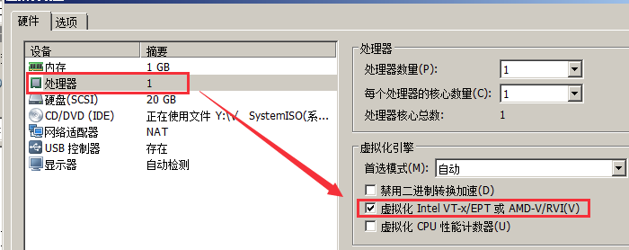
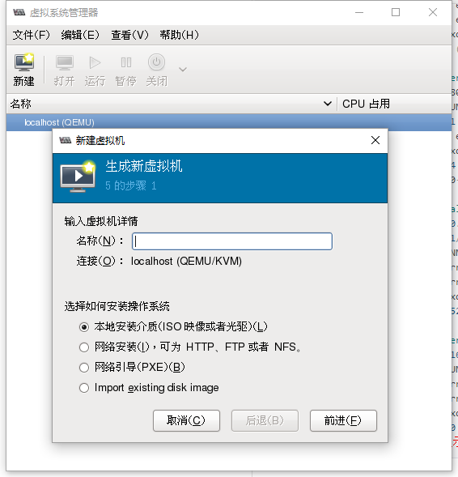

本文采用Centos6.4X64操作系统，也可以采用RHEL/CentOS6.x。

# 操作系统安装
## 查看系统版本、内核版本
```
#查看系统版本-centos
[root@lvyu1 ~]# cat /etc/issue
CentOS release 6.6 (Final)

#查看系统版本-redhat
[root@KVM ~]# cat /etc/redhat-release
CentOS release 6.4 (Final)

#查看内核版本
[root@lvyu1 ~]# uname -a
Linux lvyu1 2.6.32-504.el6.x86_64 #1 SMP Wed Oct 15 04:27:16 UTC 2014 x86_64 x86_64 x86_64 GNU/Linux
注: 2.6.20以下的内核需要升级。
```

## 关闭selinux，iptables，重启后生效

# 虚拟化环境配置
## VMware内的Centos开启虚拟化  


说明:半虚拟化是不能运行与安装KVM虚拟机的。

## 查看系统是否支持KVM虚拟
```
egrep "(vmx|svm)" /proc/cpuinfo
```
```
[root@lvyu1 ~]#  grep -E -o 'vmx|svm' /proc/cpuinfo
vmx
vmx
vmx
vmx

# 如果输出的结果包含 vmx，它是 Intel处理器虚拟机技术标志;如果包含 svm，它是 AMD处理器虚拟机技术标志;。如果你甚么都得不到，那应你的系统并没有支持虚拟化的处理 ，不能使用kvm。另外Linux 发行版本必须在64bit环境中才能使用KVM。若实际环境没有, 需要到主板BIOS中开启Virtual Technolege(VT, 虚拟化技术)
```

## 安装kvm软件包
```
[root@KVM ~]# yum -y install kvm python-virtinst libvirt tunctl bridge-utils virt-manager qemu-kvm-tools virt-viewer virt-v2v libguestfs-tools qemu-kvm gcc*

配置开机启动
systemctl enable libvirtd.service
systemctl start libvirtd.service
```

# 查看虚拟化环境
## 查看虚拟机环境
```
[root@lvyu1 ~]# /etc/init.d/libvirtd start
[root@lvyu1 ~]# virsh -c qemu:///system list
 Id    名称                         状态
 ----------------------------------------------------
```

## 查看kvm模块支持
```
[root@lvyu1 ~]# lsmod |grep kvm
kvm_intel              55496  0
kvm                   337772  1 kvm_intel
```

## 查看虚拟工具版本
```
[root@lvyu1 ~]# virsh --version
0.10.2

[root@lvyu1 ~]# virt-install --version
0.600.0

[root@lvyu1 ~]# ln -s /usr/libexec/qemu-kvm /usr/bin/qemu-kvm
[root@lvyu1 ~]# qemu-kvm --version
QEMU PC emulator version 0.12.1 (qemu-kvm-0.12.1.2-2.479.el6_7.4), Copyright (c) 2003-2008 Fabrice Bellard
```

# 手动配置虚拟网桥
kvm上网有两种配置:
## default方式
一种是default，它支持主机与虚拟机的互访，同时也支持虚拟机访问互联网，但不支持外界访问虚拟机。
```
[root@lvyu1 network-scripts]# vim /var/lib/libvirt/network/default.xml
<network>
  <name>default</name>  <uuid>447c371e-2a25-4d19-923c-d522b4d7cd7e</uuid>
  <forward mode='nat'/>
  <bridge name='virbr0' stp='on' delay='0' />
  <mac address='52:54:00:0E:87:3C'/>
  <ip address='192.168.122.1' netmask='255.255.255.0'>
   <dhcp>
    <range start='192.168.122.2' end='192.168.122.254' />
  </dhcp>
</ip></network>    
```

## bridge方式
- 另外一种方式是bridge方式，可以使用虚拟机成为网络中具有独立IP的主机。

### 创建br0网k、复制eth0并进行更改
```
[root@lvyu1 network-scripts]# cd /etc/sysconfig/network-scripts/
[root@lvyu1 network-scripts]# cp ifcfg-eth0 ifcfg-br0
[root@lvyu1 network-scripts]# vim ifcfg-eth0
DEVICE=eth0
HWADDR=40:F2:E9:9E:E4:4A
TYPE=Ethernet
UUID=e507c0b1-4e2f-49c6-a13c-82dc3d1b1ada
ONBOOT=yes
NM_CONTROLLED=yes
BOOTPROTO=static
#IPADDR=192.168.6.251
#NETMASK=255.255.255.0
#GATEWAY=192.168.6.1
#DNS1=8.8.8.8
BRIDGE=br0

注:网桥模式需要在真机eth0配置文件中添加 BRIDGE="br0",否则真机与虚拟机无法互通.
```
```
[root@lvyu1 network-scripts]# vim ifcfg-br0
DEVICE=br0
ONBOOT=yes
NM_CONTROLLED=yes
BOOTPROTO=static
IPADDR=192.168.6.251
NETMASK=255.255.255.0
GATEWAY=192.168.6.1
DNS1=8.8.8.8
TYPE=bridge    
```

### 重启network服务
```
[root@lvyu1 network-scripts]# service network restart
正在关闭接口 eth0：    [确定]
关闭环回接口：         [确定]
弹出环回接口：         [确定]
弹出界面 br0： 设备 br0 似乎不存在, 初始化操作将被延迟。                    [失败]
弹出界面 eth0： Determining if ip address 192.168.6.251 is already in use for device eth0...
                      [确定]
```

### 查看网桥br0
```
[root@lvyu1 ~]# ifconfig
br0       Link encap:Ethernet  HWaddr 40:F2:E9:9E:E4:4A
          inet addr:192.168.6.251  Bcast:192.168.6.255  Mask:255.255.255.0
          inet6 addr: fe80::42f2:e9ff:fe9e:e44a/64 Scope:Link
          UP BROADCAST RUNNING MULTICAST  MTU:1500  Metric:1
          RX packets:383 errors:0 dropped:0 overruns:0 frame:0
          TX packets:144 errors:0 dropped:0 overruns:0 carrier:0
          collisions:0 txqueuelen:0
          RX bytes:53290 (52.0 KiB)
          TX bytes:14256 (13.9 KiB)

eth0      Link encap:Ethernet  HWaddr 40:F2:E9:9E:E4:4A
          inet6 addr: fe80::42f2:e9ff:fe9e:e44a/64 Scope:Link
          UP BROADCAST RUNNING MULTICAST  MTU:1500  Metric:1
          RX packets:5881 errors:0 dropped:0 overruns:0 frame:0
          TX packets:781 errors:0 dropped:0 overruns:0 carrier:0
          collisions:0 txqueuelen:1000
          RX bytes:758814 (741.0 KiB)  TX bytes:92000 (89.8 KiB)
          Memory:c4580000-c459ffff

lo        Link encap:Local Loopback
          inet addr:127.0.0.1  Mask:255.0.0.0
          inet6 addr: ::1/128 Scope:Host
          UP LOOPBACK RUNNING  MTU:65536  Metric:1
          RX packets:8 errors:0 dropped:0 overruns:0 frame:0
          TX packets:8 errors:0 dropped:0 overruns:0 carrier:0
          collisions:0 txqueuelen:0
          RX bytes:520 (520.0 b)  TX bytes:520 (520.0 b)

virbr0    Link encap:Ethernet  HWaddr52:54:00:0E:87:3C
          inet addr:192.168.122.1  Bcast:192.168.122.255  Mask:255.255.255.0
          UP BROADCAST RUNNING MULTICAST  MTU:1500  Metric:1
          RX packets:0 errors:0 dropped:0 overruns:0 frame:0
          TX packets:0 errors:0 dropped:0 overruns:0 carrier:0
          collisions:0 txqueuelen:0
          RX bytes:0 (0.0 b)  TX bytes:0 (0.0 b)
配置完毕后eth0口则不会显示地址信息,新配置的br0口会代替eth0.口成为真机网口,装好的虚拟机eth0口将于真机br0口互通
```

### 查看网桥
```
[root@lvyu1 network-scripts]# brctl show
bridge name	bridge id		STP enabled	interfaces
virbr0		8000.5254000e873c	yes		virbr0-nic
```

到此kvm虚拟化环境安装完毕。可以通过virt-manager安装虚拟机了...
```
[root@lvyu1 ~]# virt-manager
```

