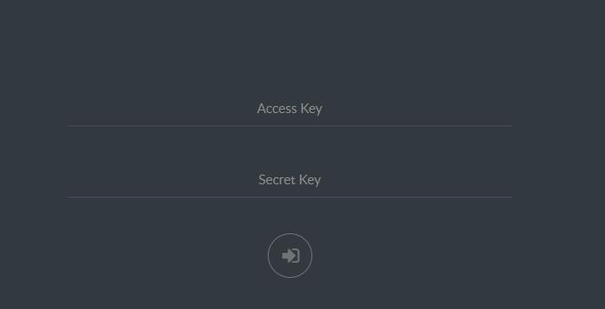
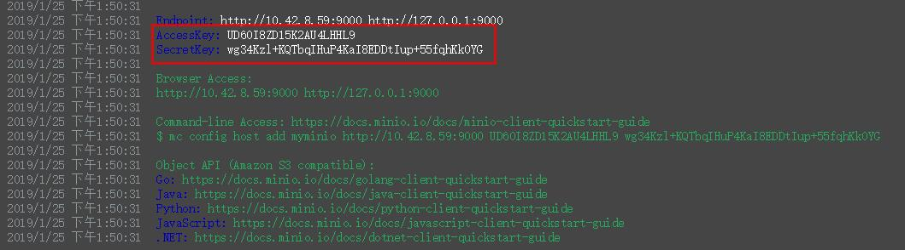
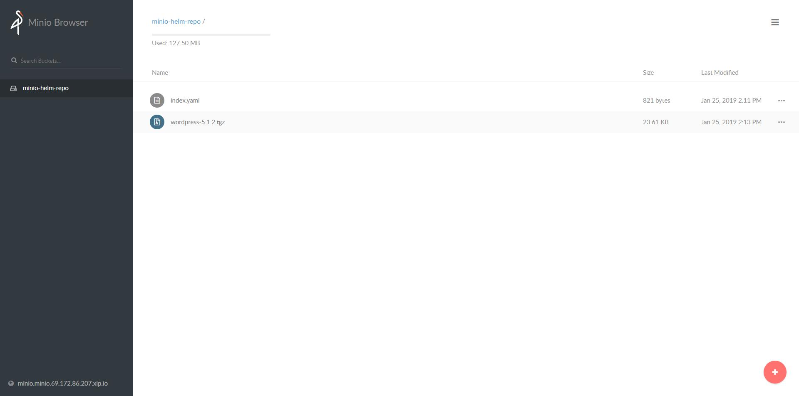
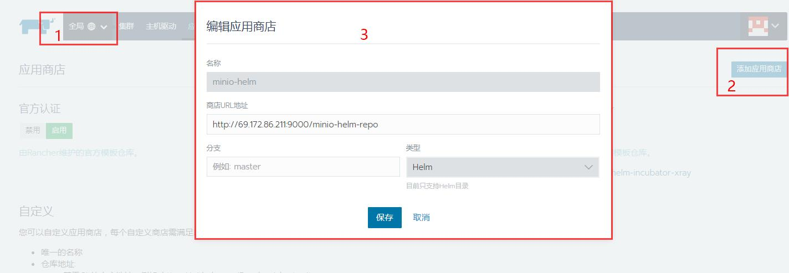
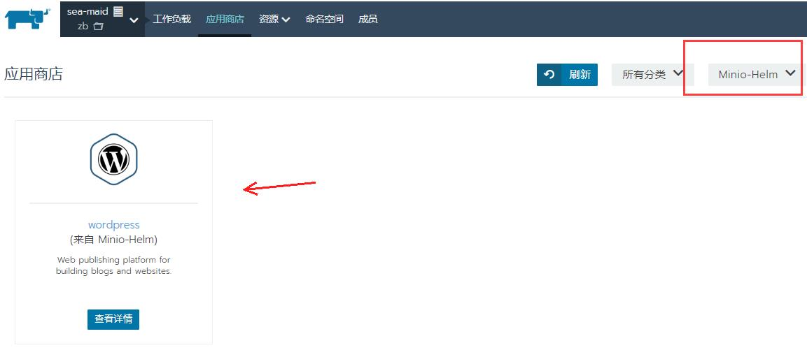

# Minio部署Helm私有仓库
需求：通过minio建立一个企业私有的存放charts仓库。方便集中化管理charts，为rancher提供私有的应用商店

## Minio介绍

Minio提供对象存储服务。应用场景被设定在了非结构化的数据的存储之上了。
众所周知，非结构化对象诸如图像/音频/视频/log文件/系统备份/镜像文件…等等保存起来管理总是不那么方便，size变化很大，类型很多，再有云端的结合会使得情况更加复杂，minio就是解决此种场景的一个解决方案。
Minio号称其能很好的适应非结构化的数据，支持AWS的S3，非结构化的文件从数KB到5TB都能很好的支持。

Minio的使用比较简单，只有两个文件，服务端minio,客户访问端mc,比较简单。

## 服务端配置
```
docker run -p 9000:9000 minio/minio server /export
```
> 访问web页面网址：http://ip:9000 AccessKey与Secret Key可以查看server端的启动日志




> 只有两个功能
- create bucket
- upload file



右下角的“+”进行操作


## 客户端配置
```
# 下载网址：https://dl.minio.io/client/mc/release/linux-amd64/

# 下载后给执行权限
chmod +x mc  

# 客户端加入security与token信息，方便客户端使用
mc config host add myminio http://<server_ip>:9000 UD60I8ZD15K2AU4LHHL9 wg34Kzl+KQTbqIHuP4KaI8EDDtIup+55fqhKk0YG

# 创建bucket
mc mb myminio/minio-helm-repo

# 设置权限
mc policy download myminio/minio-helm-repo

# 下载一个charts
mkidr /charts
helm fetch stable/wordpress

# 创建index.yaml文件
helm repo index ./ --url http://minio.minio.69.172.86.207.xip.io/minio-helm-repo

# 上传相关文件到minio
mc cp /charts/index.yaml myminio/minio-helm-repo
mc cp /charts/wordpress-5.1.2.tgz myminio/minio-helm-repo
```

## Rancher配置


