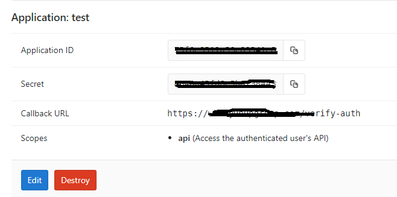
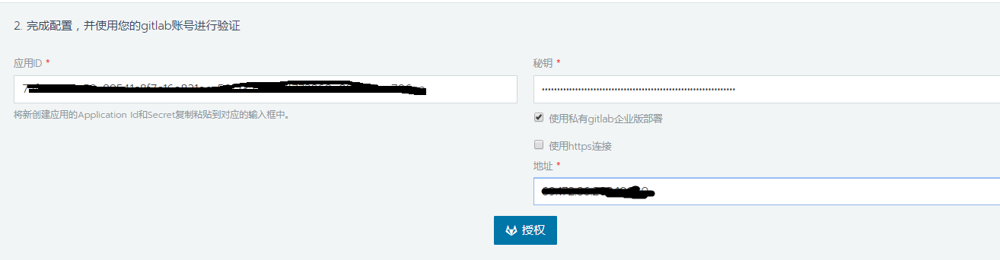
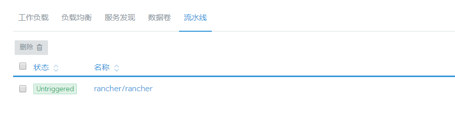
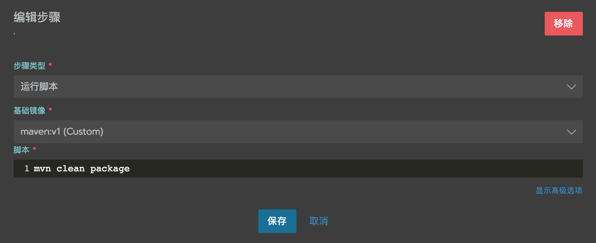
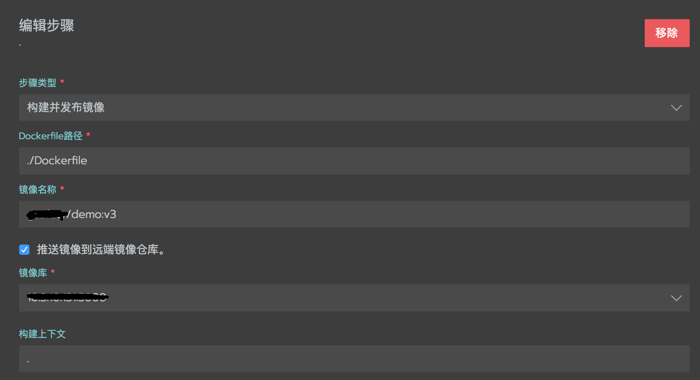
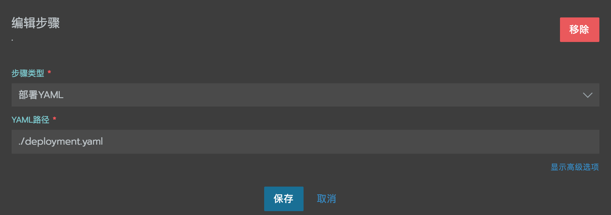
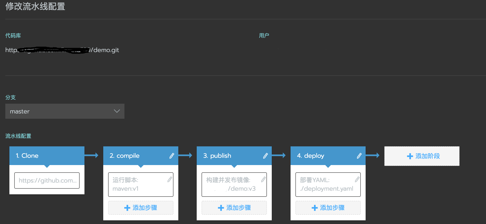

## Rancher pipeline
> Rancher2 针对CI/CD进行了新的升级，带来了更好用的pipeline,使用Rancher pipeline来做SpringBoot工程的CI/CD.

### 演示代码工程准备
> 首先创建一个SpringBoot的demo工程，push到gitlab上

### Rancher设置代码库
> 首先需要设置代码仓库的认证，使用gitlib需要创建自己的app,获取Client ID和Client Secret.

>在流水线模块选择设置代码库，选择认证&同步代码库，填入申请的Client ID和Client Secret.

>然后启用你需要做CI/CD的代码库


### 添加compile阶段
> 编辑步骤，使用maven镜像作为编译阶段的基础镜像。使用mvn clean package命令编译打包SpringBoot工程。


### 添加publish阶段
> 编辑步骤，将maven打包得到得可执行jar包，构建为docker镜像

dockerfile如下：
```yaml
FROM java:8
ADD target/demo-0.0.1-SNAPSHOT.jar /app.jar
EXPOSE 8080
ENTRYPOINT ["java","-Xmx300m","-Dserver.port=8080","-jar","app.jar"]
```
然后推送到镜像仓库，这里使用了自己内部部署得harbor镜像仓库。

### 添加deploy阶段
> 编辑步骤，部署刚刚构建好的镜像。

使用的deploy.yml如下：
```yaml
apiVersion: extensions/v1beta1
kind: Deployment
metadata:
  name: demo-deployment
spec:
  replicas: 1
  template:
    metadata:
      labels:
        app: demo
        track: stable
    spec:
      containers:
      - name: demo
        image: xx.xx.xx.xxx/test/demo:v3
        ports:
        - containerPort: 8080
apiVersion: v1
kind: Service
metadata:
  name: demo-svc
spec:
  type: NodePort
  selector:
    app: demo
  ports:
  - protocol: TCP
    port: 8080
    targetPort: 8080
```
> rancher的pileline会在代码工程里创建对应的配置文件.rancher-pipeline.yml完整的pipeline配置文件如下:
```yaml
stages:
- name: compile
  steps:
  - runScriptConfig:
      image: maven:v1
      shellScript: mvn clean package
- name: publish
  steps:
  - publishImageConfig:
      dockerfilePath: ./Dockerfile
      buildContext: .
      tag: test/demo:v3
      pushRemote: true
      registry: xx.xx.xx.xx:xxx
    env:
      PLUGIN_DEBUG: "true"
      PLUGIN_INSECURE: "true"
- name: deploy
  steps:
  - applyYamlConfig:
      path: ./deployment.yaml
timeout: 60
branch:
  include:
  - master
```
从rancher的面板上看就是如下图所示：

