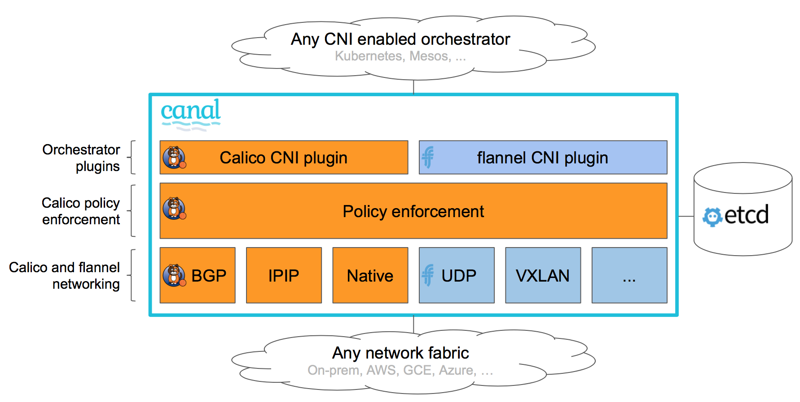

## Rancher是什么？
> Rancher是一套容器管理平台，它可以帮助组织在生产环境中轻松快捷的部署和管理容器。 Rancher可以轻松地管理各种环境的Kubernetes，满足IT需求并为DevOps团队提供支持。

> Kubernetes不仅已经成为的容器编排标准，它也正在迅速成为各类云和虚拟化厂商提供的标准基础架构。Rancher用户可以选择使用Rancher Kubernetes Engine(RKE)创建Kubernetes集群，也可以使用GKE，AKS和EKS等云Kubernetes服务。 Rancher用户还可以导入和管理现有的Kubernetes集群。

> Rancher支持各类集中式身份验证系统来管理Kubernetes集群。例如，大型企业的员工可以使用其公司Active Directory凭证访问GKE中的Kubernetes集群。IT管​​理员可以在用户，组，项目，集群和云中设置访问控制和安全策略。 IT管​​理员可以在单个页面对所有Kubernetes集群的健康状况和容量进行监控。

> Rancher为DevOps工程师提供了一个直观的用户界面来管理他们的服务容器，用户不需要深入了解Kubernetes概念就可以开始使用Rancher。 Rancher包含应用商店，支持一键式部署Helm和Compose模板。Rancher通过各种云、本地生态系统产品认证，其中包括安全工具，监控系统，容器仓库以及存储和网络驱动程序。下图说明了Rancher在IT和DevOps组织中扮演的角色。每个团队都会在他们选择的公共云或私有云上部署应用程序。


> 早期的Rancher1.X版本是基于Docker以Cattle为调度引擎的容器管理平台。在Rancher1.X成功和经验的基础上，基于Kubernetes基础上重新设计Rancher2.0版本。 Rancher2.0保留了1.6版的友好功能，如UI和应用商店。但是，2.0包含许多新功能，例如:
> - 内置CI/CD;
> - 告警和日志收集;
> - 多集群管理;
> - Rancher Kubernetes Engine (RKE);
> - 与云Kubernetes服务(如GKE，EKS和AKS)集成;

## 架构设计

### Docker
> Docker是容器打包和runtime标准。开发人员从Dockerfiles构建容器镜像，并从Docker镜像仓库中分发容器镜像。Docker Hub是最受欢迎的公共镜像仓库，许多组织还设置私有Docker镜像仓库。Docker主要用于管理各个节点上的容器。
Note:
虽然Rancher 1.6支持Docker Swarm集群技术，但由于Rancher2.0基于Kubernetes调度引擎，所以Rancher2.0不再支持Docker Swarm。

### Kubernetes
> Kubernetes已成为容器集群管理标准，通过YAML文件来管理配置应用程序容器和其他资源。Kubernetes执行诸如调度，扩展，服务发现，健康检查，密文管理和配置管理等功能。
> 一个Kubernetes集群由多个节点组成:
> - etcd database
通常在一个节点上运行一个etcd实例服务，但生产环境上，建议通过3个或5个(奇数)以上的节点来创建ETCD HA配置。
> - Master nodes
主节点是无状态的，用于运行API Server，调度服务和控制器服务。
> - Worker nodes
工作负载在工作节点上运行。
默认情况下Master节点也会有工作负载调度上去， 可通过命令设置其不加入调度

### Rancher
> 大多数Rancher2.0软件运行在Rancher Server节点上,Rancher Server包括用于管理整个Rancher部署的所有组件。
> 下图说明了Rancher2.0的运行架构。该图描绘了管理两个Kubernetes集群的Rancher server安装:一个由RKE创建，另一个由GKE创建。


### Rancher API 服务器

> Rancher API server建立在嵌入式Kubernetes API服务器和etcd数据库之上。它实现了以下功能:
> - Rancher API服务器
Rancher API server管理与外部身份验证提供程序(如Active Directory或GitHub)对应的用户身份
>- 认证授权
Rancher API server管理访问控制和安全策略
> - 项目
项目是集群中的一组多个命名空间和访问控制策略的集合
>- 节点
Rancher API server跟踪所有集群中所有节点的标识。

### 集群控制和Agent
> 集群控制器和集群代理实现管理Kubernetes集群所需的业务逻辑:
> - 集群控制器实现Rancher安装所需的全局逻辑。它执行以下操作:
>   - 为集群和项目配置访问控制策略
>   - 通过调用以下方式配置集群:
>     - 所需的Docker machine驱动程序
>     - 像RKE和GKE这样的Kubernetes引擎
> - 单独的集群代理实例实现相应集群所需的逻辑。它执行以下活动:
>   - 工作负载管理，例如每个集群中的pod创建和部署
>   - 绑定并应用每个集群全局策略中定义的角色
>   - 集群与Rancher Server之间的通信:事件，统计信息，节点信息和运行状况

### 认证代理
> 该认证代理转发所有Kubernetes API调用。它集成了身份验证服务，如本地身份验证，Active Directory和GitHub。在每个Kubernetes API调用中，身份验证代理会对调用方进行身份验证，并在将调用转发给Kubernetes主服务器之前设置正确的Kubernetes模拟标头。Rancher使用服务帐户与Kubernetes集群通信。

### CNI
#### 什么是CNI？
> CNI（Container Network Interface）是一个云原生计算基础项目，包含一个规范和库，用于编写插件以配置Linux容器中的网络接口，以及许多受支持的插件。CNI仅关注容器的网络连接并在删除容器时删除分配的资源。
Kubernetes使用CNI作为网络提供商和Kubernetes pod网络之间的接口。
#### 在CNI中使用哪些网络模型？
> CNI提供商使用诸如虚拟可扩展LAN（VXLAN）之类的封装网络模型或诸如边界网关协议（BGP）之类的未封装网络模型来实现其网络结构。
#####  什么是封装网络？
> 该网络模型提供了一个逻辑第2层（L2）网络，该网络封装在跨越Kubernetes集群节点的现有第3层（L3）网络拓扑上。使用此模型，您可以在不需要路由分发的情况下为容器建立隔离的L2网络，所有这些都是以处理方面的最小开销和增加的IP包大小为代价的，后者来自覆盖封装生成的IP头。封装信息由Kubernetes工作者之间的UDP端口分发，交换有关如何到达MAC地址的网络控制平面信息。在这种网络模型中使用的常见封装是VXLAN，Internet协议安全（IPSec）和IP-in-IP。

> 简单来说，这个网络模型生成了一种在Kubernetes工作者之间扩展的网桥，其中连接了pod。
> 当扩展L2网桥是首选时，使用该网络模型。该网络模型对于Kubernetes工作人员的L3网络延迟是明智的。如果数据中心位于不同的地理位置，请确保它们之间的延迟较低，以避免最终的网络分段。

> 使用该网络模型的CNI提供商包括Flannel, Canal 和 Weave。

##### 什么是未封装网络？
> 此网络模型提供L3网络以在容器之间路由数据包。此模型不会生成孤立的L2网络，也不会产生开销。这些好处是以Kubernetes work 必须管理任何需要的路线分配为代价的。该网络模型使用Kubernetes工作者之间的网络协议来分配路由信息以到达诸如BGP之类的 pod，而不是使用IP报头进行封装。

> 简单来说，这个网络模型生成了一种在Kubernetes工作者之间扩展的网络路由器，它提供了有关如何到达pod的信息。
当首选路由L3网络时使用此网络模型。此模式为Kubernetes工作人员动态更新操作系统级别的路由。它对延迟不太敏感。

> 使用该网络模型的CNI提供商包括Calico和Romana。


#### Rancher支持哪些CNI提供商？
> 开箱即用，Rancher为Kubernetes集群支持三种不同的CNI供应商：Canal，Flannel和Calico。您可以在从Rancher创建新的Kubernetes群集时选择CNI。

##### Canal
> Canal是一家CNI供应商，为您提供最好的 Flannel和Calico。它允许用户将Calico和Flannel网络轻松部署为统一网络解决方案，将Calico的网络策略实施与Calico（未封装）和/或Flannel（封装）网络连接选项的丰富超集相结合。
在Rancher中，Canal是默认的CNI提供商，结合了Flannel和VXLAN封装。
Kubernetes工作人员应该打开UDP端口8472（VXLAN）和TCP端口9099（healthcheck）。


##### flannel
> flannel是一种简单易用的配置L3网络结构的方法，专为Kubernetes设计。Flannel在每个主机上运行名为flanneld的单个二进制代理，负责从更大的预配置地址空间向每个主机分配子网租约。Flannel直接使用Kubernetes API或etcd来存储网络配置，分配的子网和任何辅助数据（例如主机的公共IP）。使用多个后端机制之一转发数据包，默认封装为VXLAN。
> 默认情况下，封装流量未加密。因此，f;annel提供了加密的实验后端IPSec，它利用strongSwan在Kubernetes工作者之间建立加密的IPSec隧道。
> Kubernetes工作人员应该打开UDP端口8472（VXLAN）和TCP端口9099（healthcheck）。


##### Calico
> Calico在云中的Kubernetes集群中实现网络和网络策略。Calico使用纯粹的，未封装的IP网络结构和策略引擎为您的Kubernetes工作负载提供网络。工作负载能够使用BGP通过云基础架构和内部部署进行通信。
Calico还提供无状态IP-in-IP封装模式，必要时可以使用。Calico还提供策略隔离，允许您使用高级入口和出口策略保护和管理您的Kubernetes工作负载。
Kubernetes工作者应该打开TCP端口179（BGP）。


#### 应该使用哪个CNI提供商？
> 这取决于您的项目需求。有许多不同的提供商，每个提供商都有各种功能和选项。没有一家提供商满足每个人的需求。目前，Rancher v2.0支持3个CNI提供商。
从Rancher v2.0.7开始，Canal是默认的CNI提供商。它为Flannel的容器提供封装网络，同时添加可以在网络方面提供项目/命名空间隔离的Calico网络策略。

### 相关术语

#### 全局层
>全局层主要对Rancher服务器自身的基础配置，比如Rancher Server URL，登录认证等。
>1. 集群
>全局层的集群菜单，用于列出集群中所有的K8S集群。
>2. 主机驱动
>用于与三方云平台API对接的中间件程序。
>3. 应用商店 - 全局
>全局层的应用商店，负责应用商店的开关与添加。
>4. 用户
>添加或者删除用户，或者修改用户的权限。
>5. 系统设置
>全局下系统的基础配置，比如系统默认镜像仓库。
>6. 安全
>    - 角色
>一组权限的集合
>    - Pod安全策略
>Pod安全设置
>    - 登录认证
> 用户的登录访问认证
#### 集群层
> 1. 集群
集群仪表盘，显示当前集群的资源状态
> 2. 主机
当前集群中添加的所有主机
> 3. 存储
存储类
持久卷
> 4. 项目与命名空间
此集群拥有的项目和命名空间
> 5. 集群成员
> 6. 工具
>    - 告警
>    - 通知
>    - 日志
>    - CI/CD
#### 项目层
> 1. 工作负载
>    - 工作负载服务
>    - 负载均衡
>    - 服务发现
>    - 数据卷
>    - CI/CD
> 2. 应用商店-项目
> 3. 资源
>    - 告警
>    - 证书
>    - 配置映射
>    - 日志收集
>    - 镜像库
>    - 密文
> 4. 命名空间
> 5. 项目成员
#### 其他 (右上角登录菜单)
> 1. API Keys
> 2. 主机模板
> 3. 喜好设定

### 快速入门
> 注意:
本入门指南的目的是让你快速的运行一个Rancher2.0环境，它不适用于生产。
#### 入门须知
> - 熟悉Linux基础命令；
> - 了解SSH使用方法，了解公钥/私钥工作原理；
> - 熟悉Docker基本使用方法及基础命令，比如：容器日志查看；
> - 了解SSL证书使用方法；
> - 了解负载均衡工作原理(L4/L7)；
> - 了解域名解析原理；
> - 了解K8S基本概念
#### 配置Linux主机
> 通过配置Linux主机开始创建自定义集群。你的主机可以是:
> - 云主机
> - 本地虚拟机
> - 本地物理机

>注意:
在使用云主机时，你需要允许TCP/80和TCP/443入站通信端口。请查阅你的云主机文档以获取有关端口配置的信息。

> 根据以下要求配置主机:
> - Ubuntu 16.04 +(64位)
> - Centos/RedHat Linux 7.5+(64位)
> - RancherOS 1.3.0+(64位)
> - Ubuntu操作系统有Desktop和Server版本，选择安装server版本.

##### 硬件需求:
> CPU: 2C
> 内存: 4GB > 注意: 此配置仅为满足小规模测试环境的最低配置。如用于生产，请参考基础配置要求。
##### 软件需求:
> 软件: Docker
> 支持的Docker版本:
> - 1.12.6
> - 1.13.1
> - 17.03.2

> 注意:
有关Docker安装说明,请访问其文档。软件需求要应用于所有节点。

#### 安装Rancher
> 要想在主机上安装Rancher,需要先登录到主机上，接着进行以下步骤:
> 通过shell工具(例如PuTTy或远程终端连接)登录到主机
> 在shell中执行以下命令:
```bash
  sudo docker run -d --restart=unless-stopped -p 80:80 -p 443:443 rancher/rancher
```
