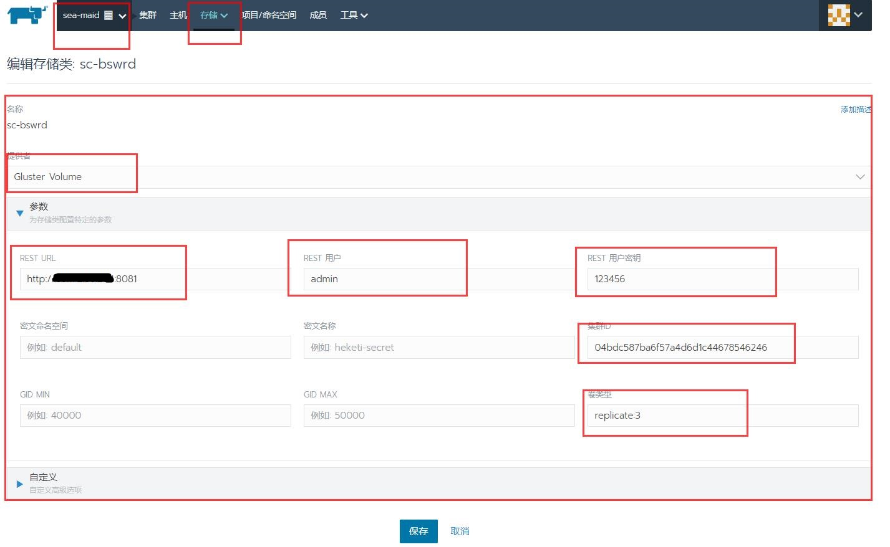
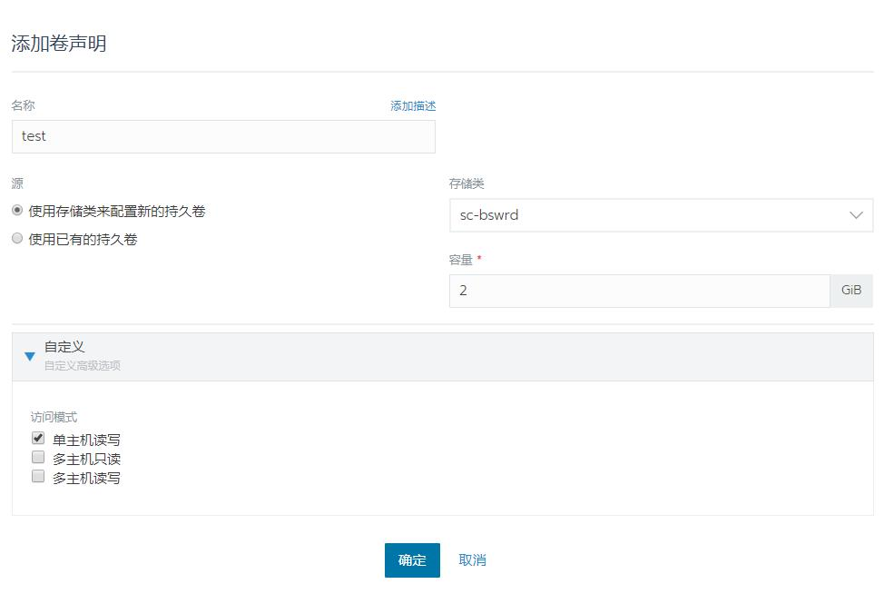
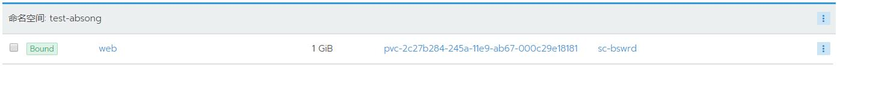

## Rancher添加GlusterFS存储类

> GlusterFS 是个开源的分布式文件系统，而 Heketi 在其上提供了 REST 形式的 API，二者协同为 Kubernetes 提供了存储卷的自动供给能力。按照官方的  persistent-volume-provisioning 示列，这里需要配置 Heketi 提供了一个管理 GlusterFS 集群的 RESTTful 服务，提供 API 接口供 Kubernetes 调用 。

### 至少两服务器安装glusterfs-server
```bash
yum install centos-release-gluster -y
yum install glusterfs-server -y
systemctl enable glusterd
systemctl start glusterd
```

### 一台Heketi安装
```bash
yum install epel-release -y
yum install heketi heketi-client -y
```
### 修改配置Heketi
```bash
vim /etc/heketi/heketi.json
# 端口修改（默认8080可能被占用）
  "port": "8081",

 # 允许认证
  "use_auth": true,

# admin的key
  "admin": {
      "key": "123456"
    },

# 配置ssh的所需证书，对集群中的机器免密登陆
  "executor": "ssh",  
  "sshexec": {
      "keyfile": "/etc/heketi/heketi_key",
      "user": "root",
      "port": "22",
      "fstab": "/etc/fstab"
    },

# 定义数据文件位置  
  "db": "/var/lib/heketi/heketi.db",

# 日志级别
  "loglevel" : "info"  
```

### 创建集群
```bash
# 启动服务
systemctl restart heketi

# 查看集群，初始为空
heketi-cli --server http://localhost:8081 --user admin --secret "23456" cluster list
```
```json
# 创建模板文件
vim rancher-gfs.json
{
    "clusters": [
        {
            "nodes": [
                {
                    "node": {
                        "hostnames": {
                            "manage": [
                                "172.16.111.204"
                            ],
                            "storage": [
                                "172.16.111.204"
                            ]
                        },
                        "zone": 1
                    },
                    "devices": [
                        "/dev/sdb1"
                    ]
                },
                {
                    "node": {
                        "hostnames": {
                            "manage": [
                                "172.16.111.205"
                            ],
                            "storage": [
                                "172.16.111.205"
                            ]
                        },
                        "zone": 2
                    },
                    "devices": [
                        "/dev/sdb1"
                    ]
                },
                {
                    "node": {
                        "hostnames": {
                            "manage": [
                                "172.16.111.206"
                            ],
                            "storage": [
                                "172.16.111.206"
                            ]
                        },
                        "zone": 3
                    },
                    "devices": [
                        "/dev/sdb1"
                    ]
                }
            ]
        }
    ]
}
```
```bash
#创建cluster
heketi-cli --server http://localhost:8081 --user admin --secret "123456" topology load --json=rancher-gfs.json

#创建vlolume（测试）
heketi-cli --server http://localhost:8081 --user admin --secret "123456" volume create --size=10 --replica=2

#登录gluster中的一台机器，查看状态
[shell执行]  gluster peer status
Number of Peers: 2

Hostname: rancher-master-205
Uuid: c6c2e9a0-ad2e-48dc-af75-61f0d576e6c8
State: Peer in Cluster (Connected)
Other names:
172.16.111.205

Hostname: rancher-master-206
Uuid: 4b09a365-bb83-4ee6-86c3-68353c540a79
State: Peer in Cluster (Connected)
Other names:
172.16.111.206
```
### Rancher上添加存储类

### 创建数据卷测试

### 绑定成功

